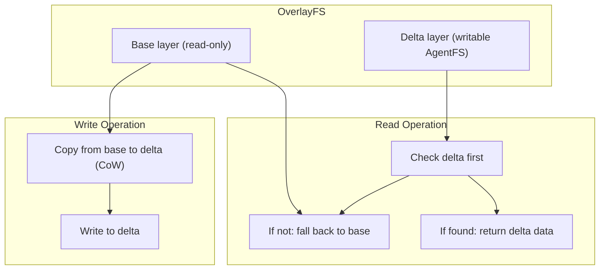
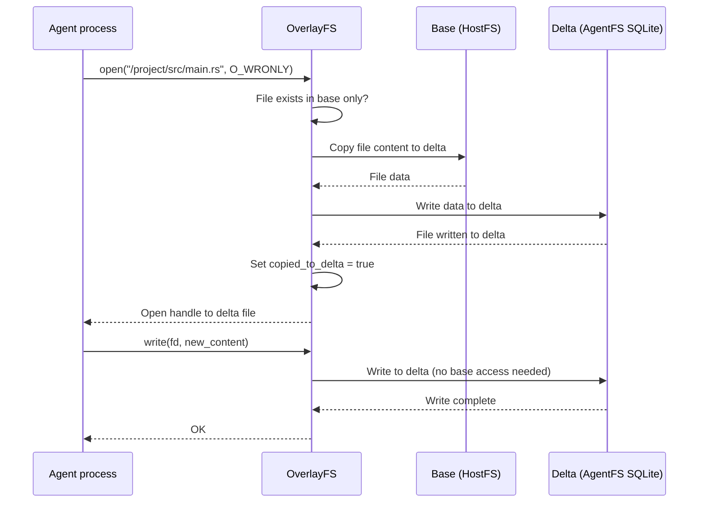

# OverlayFS — Copy-on-Write Implementation

**AgentFS OverlayFS combines a read-only base layer with a writable delta layer, enabling sandboxed agents that can't modify the base project files.**

## Overlay Architecture

Source: `sdk/rust/src/filesystem/overlayfs.rs` (1,795 lines)



## Copy-on-Write Flow



**Aha:** The `copied_to_delta` atomic flag ensures copy-on-write happens exactly once per file. Subsequent writes go directly to the delta without re-copying. This is critical for performance — a 100MB file copied once, then modified incrementally.

## Stacking

OverlayFS can nest:

```
OverlayFS {
    base: OverlayFS {
        base: HostFS { "/project" },       ← Original project files
        delta: AgentFS { "layer1.db" }     ← First modification layer
    },
    delta: AgentFS { "layer2.db" }         ← Current working layer
}
```

Reads walk from innermost delta outward. Writes always go to the outermost delta.

## Whiteouts

When a file is deleted in the delta, OverlayFS stores a **whiteout marker** — a special entry that shadows the base file. Reads see the whiteout and return ENOENT.

## What's Next

- [05 — SDK](05-sdk.md) — TypeScript, Python, Rust SDKs
- [01 — SQLite VFS](01-sqlite-vfs.md) — Return to SQLite VFS
- [00 — Overview](00-overview.md) — Return to overview
