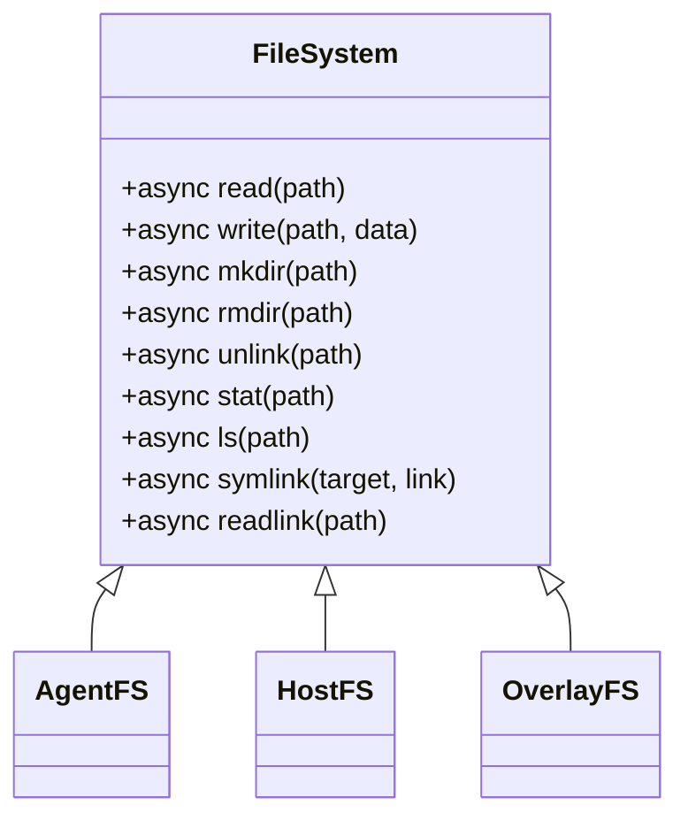
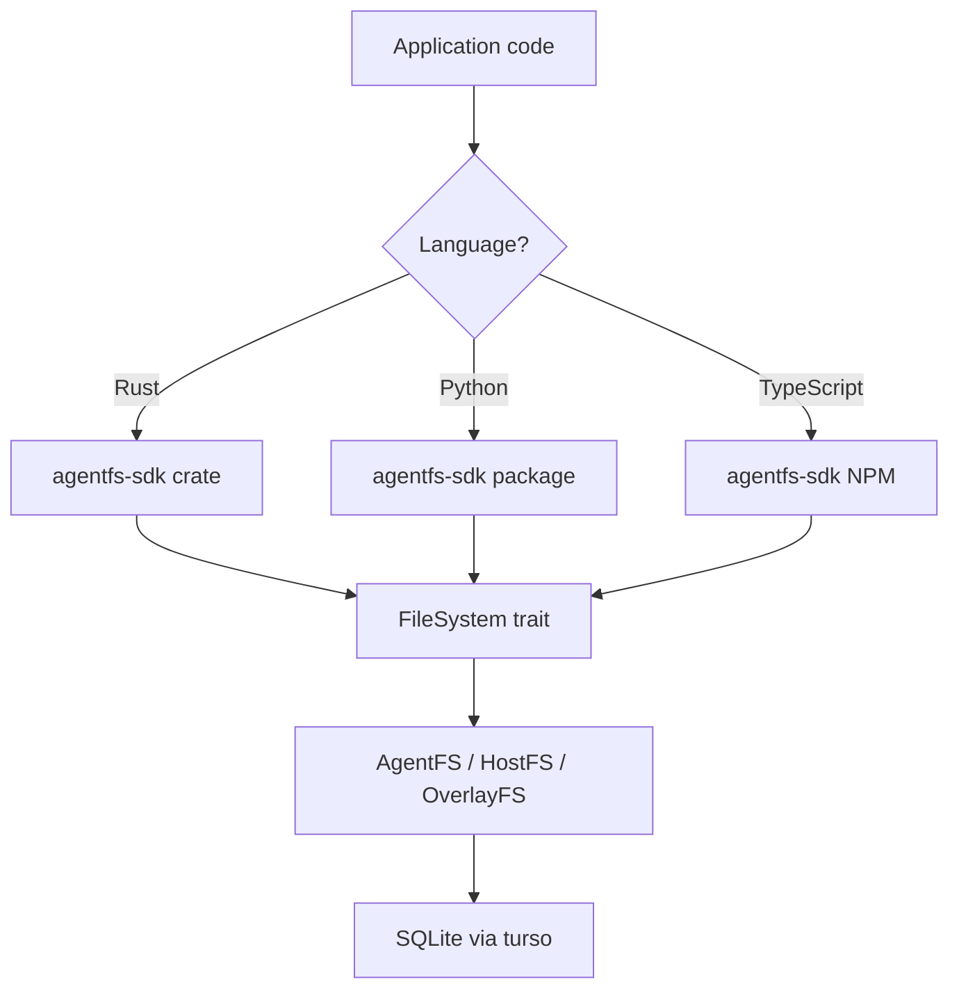

# SDK — TypeScript, Python, Rust APIs

**AgentFS provides SDKs in three languages, all implementing the same FileSystem trait pattern.**

## FileSystem Trait (Rust)

Source: `sdk/rust/src/filesystem/mod.rs` (212 lines)



## SDK Comparison

| Feature | Rust SDK | Python SDK | TypeScript SDK |
|---------|----------|------------|---------------|
| **Package** | `agentfs-sdk` on crates.io | `agentfs-sdk` on PyPI | `agentfs-sdk` on NPM |
| **Async** | tokio (async/await) | asyncio | native async |
| **Filesystem** | AgentFS, HostFS, OverlayFS | AgentFS | AgentFS |
| **KV Store** | Yes | Yes | Yes |
| **Toolcalls** | Yes | Yes | Yes |

## SDK Architecture



## Usage Examples

### Rust
```rust
use agentfs_sdk::filesystem::{AgentFS, FileSystem};

let mut fs = AgentFS::new("agent.db").await?;
fs.write("/hello.txt", b"world").await?;
let content = fs.read("/hello.txt").await?;
```

### Python
```python
from agentfs_sdk import AgentFS

fs = AgentFS("agent.db")
fs.write("/hello.txt", b"world")
content = fs.read("/hello.txt")
```

### TypeScript
```typescript
import { AgentFS } from 'agentfs-sdk';

const fs = new AgentFS('agent.db');
await fs.write('/hello.txt', Buffer.from('world'));
const content = await fs.read('/hello.txt');
```

## KV Store

Source: `sdk/rust/src/kvstore.rs` (122 lines)

Simple key-value store backed by SQLite:

| Operation | SQL |
|-----------|-----|
| `get(key)` | `SELECT value FROM kv_store WHERE key = ?` |
| `set(key, value)` | `INSERT OR REPLACE INTO kv_store` |
| `delete(key)` | `DELETE FROM kv_store WHERE key = ?` |

## Toolcall Audit Trail

Source: `sdk/rust/src/toolcalls.rs` (502 lines)

Records every tool invocation:

| Field | Purpose |
|-------|---------|
| `id` | Unique toolcall ID |
| `name` | Tool name (e.g., "read_file") |
| `input` | Tool input (JSON) |
| `output` | Tool output (JSON) |
| `timestamp` | When the tool was called |
| `duration` | How long it took |

**Aha:** The toolcall audit trail is what makes AgentFS uniquely suited for debugging AI agents. You can query: "Show me every file the agent read in the last hour" or "What tools failed and why?"

## What's Next

- [06 — Cross-Cutting](06-cross-cutting.md) — Mount strategies, dependencies
- [03 — VFS Setup Comparison](03-vfs-setup-comparison.md) — Return to VFS comparison
- [00 — Overview](00-overview.md) — Return to overview
