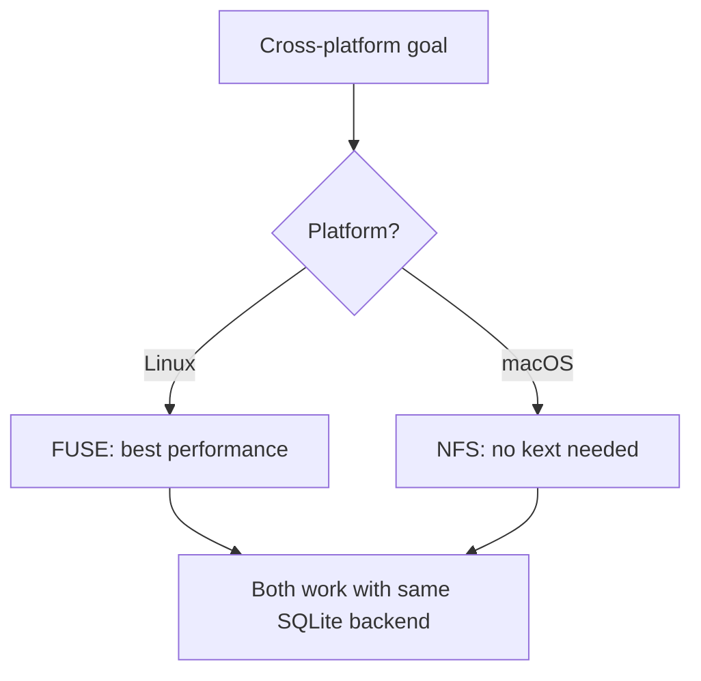

# Cross-Cutting — Mount Strategies, Dependencies, Testing

**This document covers cross-platform mounting, dependencies, and testing strategy.**

## Cross-Platform Mounting

**Aha:** On macOS, AgentFS uses NFS v3 over loopback TCP instead of FUSE because Apple's security model makes kernel extensions (kexts) impractical. NFS is a userspace protocol — no kernel modifications needed. This is a pragmatic tradeoff: slightly higher latency than FUSE, but zero installation friction.



| Platform | Mechanism | Crate | Why |
|----------|-----------|-------|-----|
| Linux | FUSE | `fuser` | Native kernel support, best performance |
| macOS | NFS | `nfsserve` | No kext required, works with Apple security |
| Windows | (Future) | Dokan/WinFsp | Would require driver installation |

## Rust SDK Dependencies

| Dependency | Purpose |
|------------|---------|
| `turso` | SQLite-compatible in-process database |
| `async-trait` | Async trait support |
| `anyhow/thiserror` | Error handling |
| `serde/serde_json` | Serialization |
| `libc` | Syscall constants |

## CLI Dependencies

| Dependency | Purpose |
|------------|---------|
| `fuser` | FUSE mount (Linux) |
| `nfsserve` | NFS server (macOS) |
| `reverie` | Syscall interception (sandbox) |
| `clap` | CLI argument parsing |
| `tokio` | Async runtime |

## Sandbox Dependencies

```mermaid
flowchart LR
    A[reverie] --> B[ptrace syscall interception]
    C[MountTable] --> D[AgentFS (SQLite)]
    C --> E[BindVfs (host)]
    B --> C
    D --> F[turso SQLite]
    E --> G[Host filesystem]
```

| Dependency | Purpose |
|------------|---------|
| `reverie` | Syscall interception framework |
| `turso` | SQLite database |
| `libc` | Syscall constants |
| `nix` | Unix utilities |

## Testing Strategy

| Test Type | Location | Purpose |
|-----------|----------|---------|
| Unit tests | SDK `tests/` | FileSystem operations |
| Integration tests | CLI `tests/` | Mount, sandbox, full workflow |
| Syscall tests | CLI `tests/syscall/` | Intercepted syscall behavior |
| Benchmarks | SDK `benches/` | OverlayFS performance |

## What's Next

- [00 — Overview](00-overview.md) — Return to overview
- [02 — Syscall Interception](02-syscall-interception.md) — Return to interception
- [03 — VFS Setup Comparison](03-vfs-setup-comparison.md) — Return to VFS comparison
