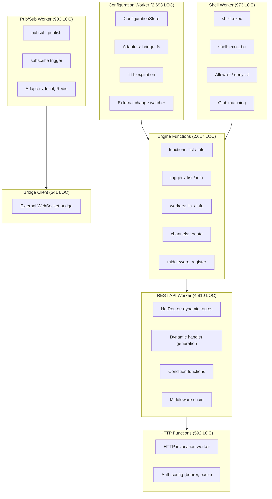
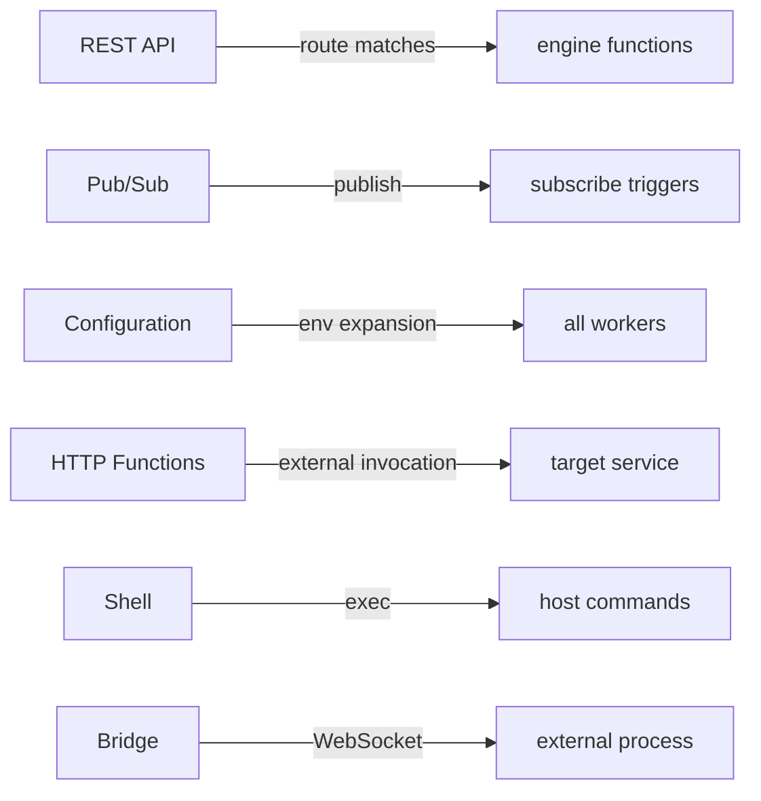

# Engine Workers — In-Process Workers Deep Dive

**The iii engine includes 7 in-process workers that provide core infrastructure — configuration store, function registry, REST API, pub/sub messaging, HTTP invocation, shell execution, and bridge client.**

## Architecture Overview

## Worker Relationship Flow

**Aha:** These workers are compiled directly into the engine binary — they communicate via direct function calls, not WebSocket. This means zero serialization overhead for internal operations.

## What's Next

- [01 — Configuration](01-configuration.md) — Config store, adapters, TTL, watchers
- [02 — Engine Functions](02-engine-functions.md) — Built-in function registry
- [03 — REST API](03-rest-api.md) — Hot-reloadable routes, dynamic handlers
- [04 — Pub/Sub](04-pubsub.md) — Messaging with local and Redis adapters
- [05 — HTTP Functions](05-http-functions.md) — HTTP invocation
- [06 — Shell](06-shell.md) — Shell execution with security controls
- [07 — Bridge Client](07-bridge-client.md) — External WebSocket bridge
