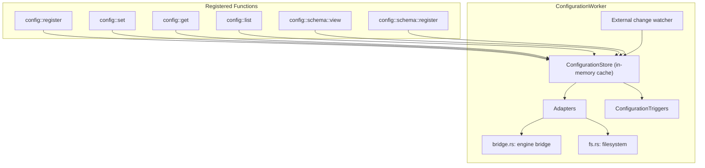
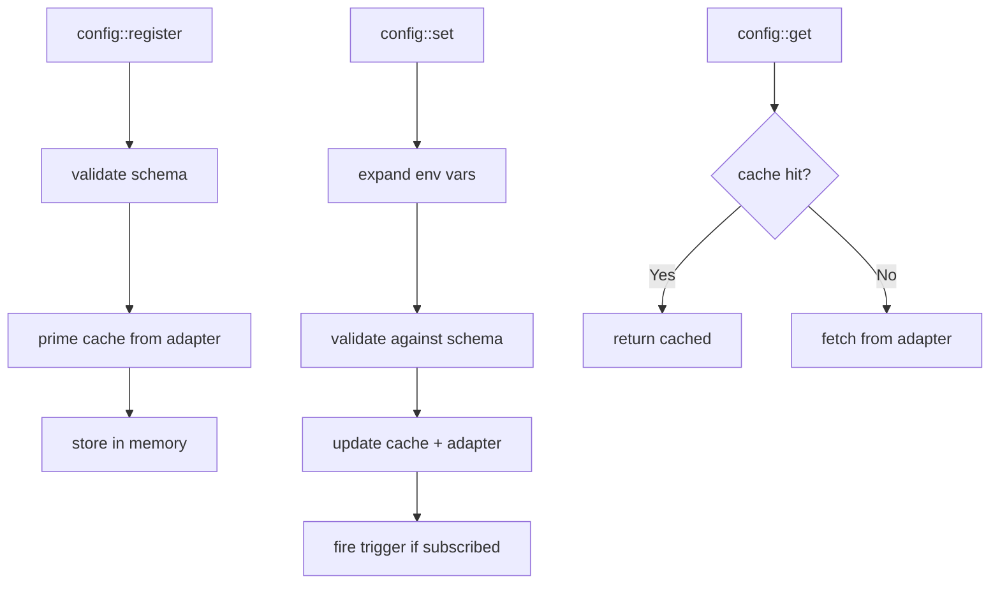

# Configuration Worker — Config Store, Adapters, TTL

**The Configuration Worker provides a JSON configuration store with schema validation, TTL expiration, environment variable expansion, and pluggable adapters (filesystem, bridge).**

## Architecture

Source: `workers/configuration/` (2,693 LOC)



## ConfigurationStore

Source: `workers/configuration/store.rs`

Lazy-loaded in-memory cache with adapter-backed persistence:

| Feature | Implementation |
|---------|---------------|
| Cache | `HashMap<String, ConfigurationEntry>` |
| Persistence | Pluggable `ConfigurationAdapter` |
| Validation | JSON Schema via `jsonschema` crate |
| Env expansion | `${VAR:default}` syntax |
| TTL | Per-entry expiration in seconds |

### Environment Variable Expansion

Source: `store.rs:30-43`

```rust
pub fn expand_value(v: &Value) -> Value {
    match v {
        Value::String(s) => Value::String(EngineConfig::expand_env_vars(s)),
        Value::Array(items) => Value::Array(items.iter().map(expand_value).collect()),
        Value::Object(map) => { ... }  // recursive
        other => other.clone(),
    }
}
```

**Aha:** Environment variable expansion is applied recursively to all string leaves in the JSON value tree. This means nested config objects like `{"database": {"url": "${DB_URL:localhost}"}}` are automatically expanded on every `get` operation.

## Adapters

### Bridge Adapter

Source: `workers/configuration/adapters/bridge.rs`

Persists configuration via the engine bridge (external connections).

### Filesystem Adapter

Source: `workers/configuration/adapters/fs.rs`

Persists configuration to the local filesystem as JSON files.

## External Change Watcher

Source: `workers/configuration/trigger.rs`

Watches for external configuration changes and fans out events to registered triggers:

```rust
// ExternalChange events trigger notifications
pub enum ExternalChange {
    Registered { id: String, kind: RegisterKind },
    Set { id: String },
    Removed { id: String },
}
```

## Trigger Type

Source: `workers/configuration/trigger.rs`

The `configuration` trigger type fires when config entries change:

```rust
pub const TRIGGER_TYPE: &str = "configuration";
```

Subscribers receive `ConfigurationEventData` with the event type (registered, set, removed) and entry data.

## Configuration Lifecycle



## What's Next

- [02 — Engine Functions](02-engine-functions.md) — Built-in function registry
- [00 — Overview](00-overview.md) — Return to overview
- [03 — REST API](03-rest-api.md) — Hot-reloadable routes
