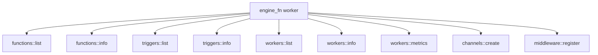
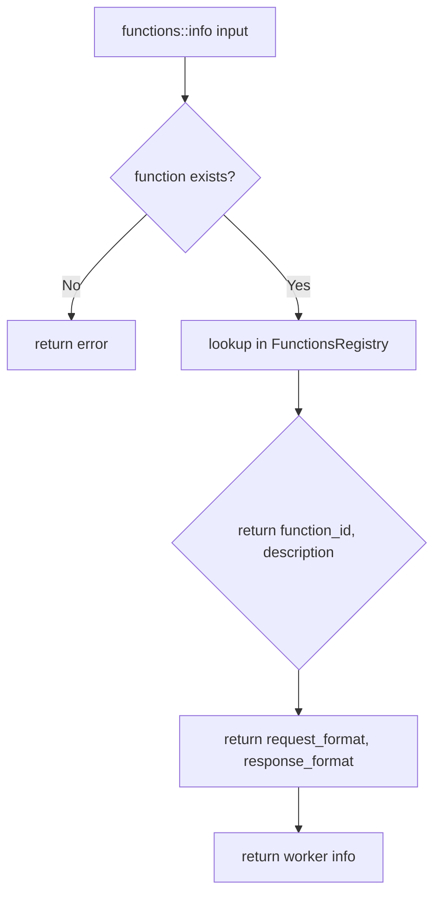

# Engine Functions — Built-in Function Registry

**The engine_fn worker (2,617 LOC) provides built-in functions for introspecting the engine — listing functions, triggers, workers, and creating channels.**

## Registered Functions

Source: `workers/engine_fn/mod.rs`



### Function Listing

Source: `engine_fn/mod.rs:50-66`

```rust
pub struct FunctionsListInput {
    pub search: Option<String>,      // Case-insensitive substring match
    pub prefix: Option<String>,      // Exact prefix match on function_id
    pub worker: Option<String>,      // Exact worker name match
    pub include_internal: Option<bool>, // Include engine::* functions
}
```

**Aha:** The `include_internal` flag defaults to false — engine-internal functions (`engine::*` prefix) are hidden from listing by default. This prevents cluttering the function list with infrastructure functions that users shouldn't invoke directly.

### Trigger Listing

```rust
pub struct TriggersListInput {
    pub search: Option<String>,
    pub prefix: Option<String>,
}
```

The trigger list returns a `config_summary` truncated to 80 characters for readability.

### Worker Listing

Returns `RuntimeWorkerInfo` with:
- Worker name and ID
- Connected WebSocket connection
- Registered functions
- Metrics (calls, errors, latency)

### Channel Creation

```rust
pub struct CreateChannelInput {
    pub buffer_size: Option<usize>,  // Channel buffer size (default: 64)
}

pub struct CreateChannelOutput {
    pub writer: StreamChannelRef,
    pub reader: StreamChannelRef,
}
```

Channels are used for streaming data between workers — the writer pushes data, the reader consumes it.

## Function Info Response



## Engine Triggers

The worker registers two engine-level triggers:

| Trigger | Purpose |
|---------|---------|
| `engine::functions-available` | Fires when new functions are registered |
| `engine::workers-available` | Fires when new workers connect |

## What's Next

- [03 — REST API](03-rest-api.md) — Hot-reloadable routes
- [01 — Configuration](01-configuration.md) — Return to configuration
- [00 — Overview](00-overview.md) — Return to overview
