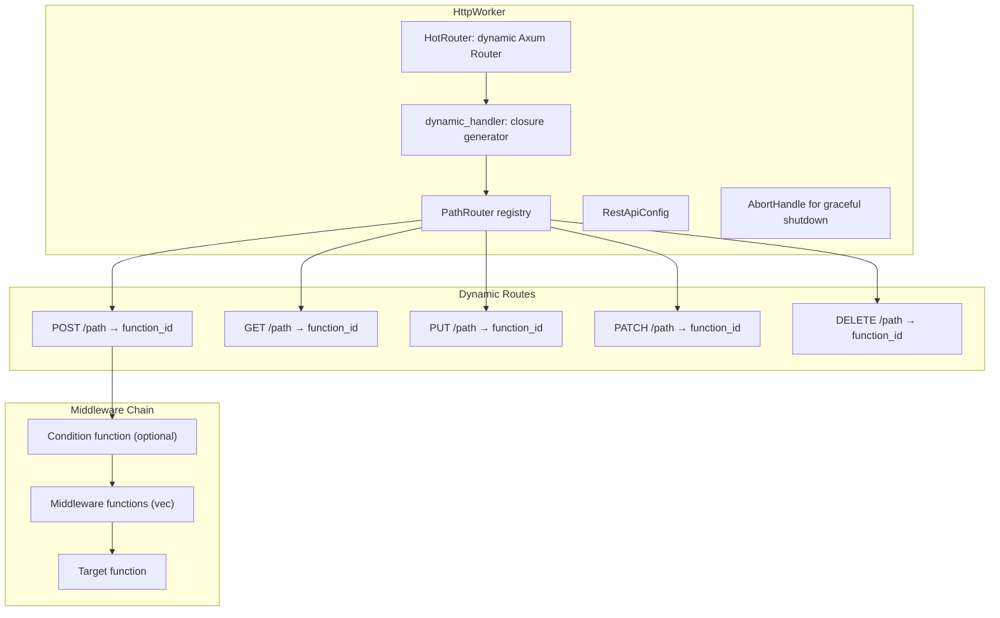
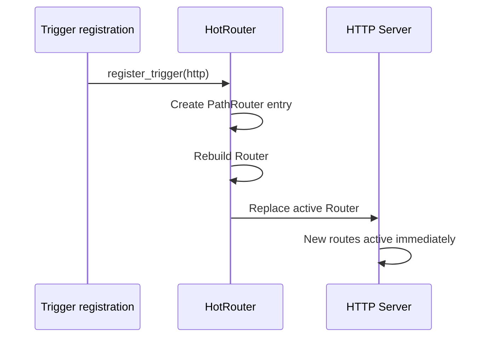

# REST API Worker — Hot-Reloadable Routes

**The REST API worker (4,810 LOC) is the largest in-process worker — it runs an axum HTTP server with dynamically-generated routes that map HTTP endpoints to engine functions.**

## Architecture

Source: `workers/rest_api/` (4,810 LOC)



## PathRouter

Source: `workers/rest_api/api_core.rs:39-63`

```rust
pub struct PathRouter {
    pub http_path: String,
    pub http_method: String,
    pub function_id: String,
    pub condition_function_id: Option<String>,
    pub middleware_function_ids: Vec<String>,
}
```

When an HTTP request arrives:
1. **Condition function** (if set) — runs first, can reject the request
2. **Middleware functions** — run in order, can modify the request
3. **Target function** — the actual handler

## HotRouter

Source: `workers/rest_api/hot_router.rs`

The `HotRouter` wraps an axum `Router` and supports hot route updates without server restart:



**Aha:** The router is rebuilt on every trigger registration/unregistration. The old router is atomically swapped out — existing requests complete on the old router, new requests hit the new router. Zero downtime.

## Dynamic Handler Generation

Source: `workers/rest_api/views.rs` (2,644 lines)

The `dynamic_handler` function generates a closure that:
1. Extracts path params and query string
2. Parses request body as JSON
3. Invokes the condition function (if set)
4. Invokes middleware functions in order
5. Invokes the target function
6. Returns the result as JSON

## Server Configuration

Source: `workers/rest_api/config.rs`

```rust
pub struct RestApiConfig {
    pub port: u16,
    pub cors_origins: Vec<String>,
    pub timeout_ms: Option<u64>,
    pub concurrency_limit: Option<usize>,
}
```

Default timeout: 30 seconds. Default concurrency: unlimited.

## What's Next

- [04 — Pub/Sub](04-pubsub.md) — Messaging with local and Redis adapters
- [02 — Engine Functions](02-engine-functions.md) — Return to engine functions
- [00 — Overview](00-overview.md) — Return to overview
