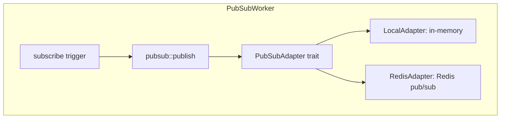
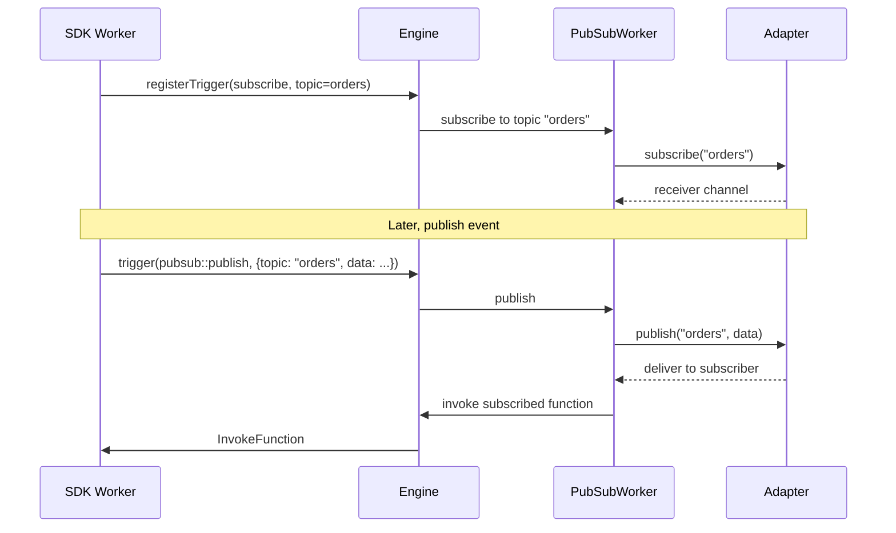

# Pub/Sub Worker — Messaging with Local and Redis Adapters

**The Pub/Sub worker (903 LOC) provides topic-based publish/subscribe messaging with pluggable adapters — in-memory local and Redis.**

## Architecture

Source: `workers/pubsub/` (903 LOC)



## PubSubAdapter Trait

Source: `workers/pubsub/adapters/mod.rs`

```rust
#[async_trait]
pub trait PubSubAdapter: Send + Sync {
    async fn publish(&self, topic: &str, data: Value) -> anyhow::Result<()>;
    async fn subscribe(&self, topic: &str) -> anyhow::Result<tokio::sync::mpsc::Receiver<Value>>;
    async fn unsubscribe(&self, topic: &str) -> anyhow::Result<()>;
}
```

## Local Adapter

Source: `workers/pubsub/adapters/local_adapter.rs`

In-memory pub/sub using tokio broadcast channels:

| Operation | Implementation |
|-----------|---------------|
| `publish` | Send to broadcast channel |
| `subscribe` | Create receiver from broadcast channel |
| `unsubscribe` | Drop receiver |

## Redis Adapter

Source: `workers/pubsub/adapters/redis_adapter.rs`

Redis pub/sub for distributed messaging:

| Operation | Redis Command |
|-----------|--------------|
| `publish` | `PUBLISH topic data` |
| `subscribe` | `SUBSCRIBE topic` |
| `unsubscribe` | `UNSUBSCRIBE topic` |

## Trigger Registration



Source: `workers/pubsub/pubsub.rs:70-`

The `subscribe` trigger type connects a topic to a function:

```rust
// When a message is published to a topic, all subscribed functions are invoked
pub const TRIGGER_TYPE: &str = "subscribe";
```

**Aha:** The pub/sub worker uses the `ConfigurableWorker` trait, meaning the adapter (local vs Redis) is selected at runtime via config — no code changes needed to switch from in-memory to distributed messaging.

## What's Next

- [05 — HTTP Functions](05-http-functions.md) — HTTP invocation
- [03 — REST API](03-rest-api.md) — Return to REST API
- [00 — Overview](00-overview.md) — Return to overview
