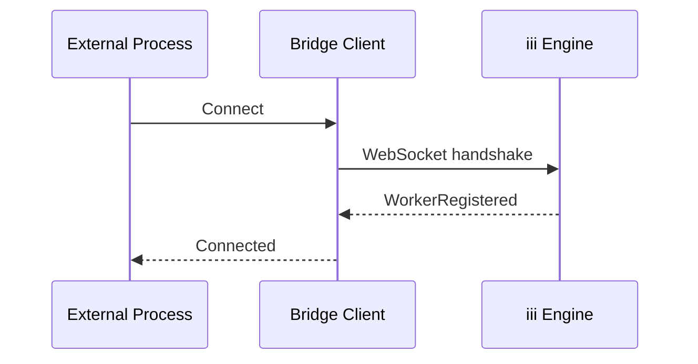

# HTTP Functions, Shell, Bridge Client

**These three smaller workers handle HTTP invocation, shell execution with security controls, and external bridge connections.**

## HTTP Functions Worker

Source: `workers/http_functions/` (592 LOC)

Handles HTTP function invocations — when a function is registered with an `invocation` field pointing to an external HTTP endpoint:

```mermaid
flowchart LR
    A[InvokeFunction] --> B[HttpWorker]
    B --> C[Build HTTP request]
    C --> D[Apply auth (bearer/basic)]
    D --> E[Send to external endpoint]
    E --> F[Parse response]
    F --> G[Return InvocationResult]
```

### Authentication

Source: `workers/http_functions/config.rs`

| Auth Type | Implementation |
|-----------|---------------|
| Bearer token | `Authorization: Bearer <token>` |
| Basic auth | `Authorization: Basic <base64>` |
| API key header | Custom header with key from env var |

## Shell Worker

Source: `workers/shell/` (973 LOC)

Provides shell execution within the engine — different from the external shell worker, this is the in-process variant:

| Function | Purpose |
|----------|---------|
| `shell::exec` | Run command, wait, return output |
| `shell::exec_bg` | Spawn background job |
| `shell::status` | Poll job status |
| `shell::list` | List background jobs |
| `shell::kill` | Terminate job |

### Security: Glob Matching

Source: `workers/shell/glob_exec.rs`

Command allowlist uses glob pattern matching:

```rust
// "*.sh" matches "build.sh", "deploy.sh"
// "cargo*" matches "cargo", "cargo build"
```

**Aha:** The glob matching is applied to the full command string, not just the binary name. This means `cargo test --features=sqlite` matches `cargo*` but `python script.py` does not match `python*` if the denylist blocks it.

## Bridge Client

Source: `workers/bridge_client/` (541 LOC)

Provides a bridge connection for external processes to connect to the engine:



The bridge client:
1. Connects to the engine via WebSocket
2. Registers as a worker
3. Forwards messages between the external process and engine
4. Handles reconnection on disconnect

## What's Next

- [00 — Overview](00-overview.md) — Return to overview
- [01 — Configuration](01-configuration.md) — Return to configuration
- [03 — REST API](03-rest-api.md) — Return to REST API
