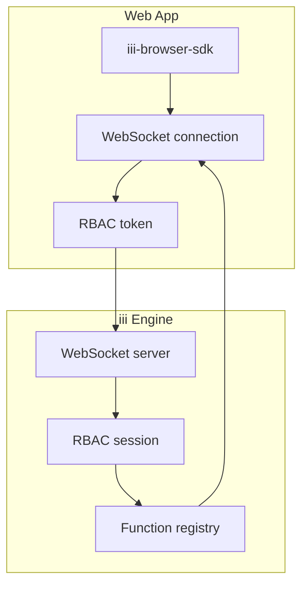
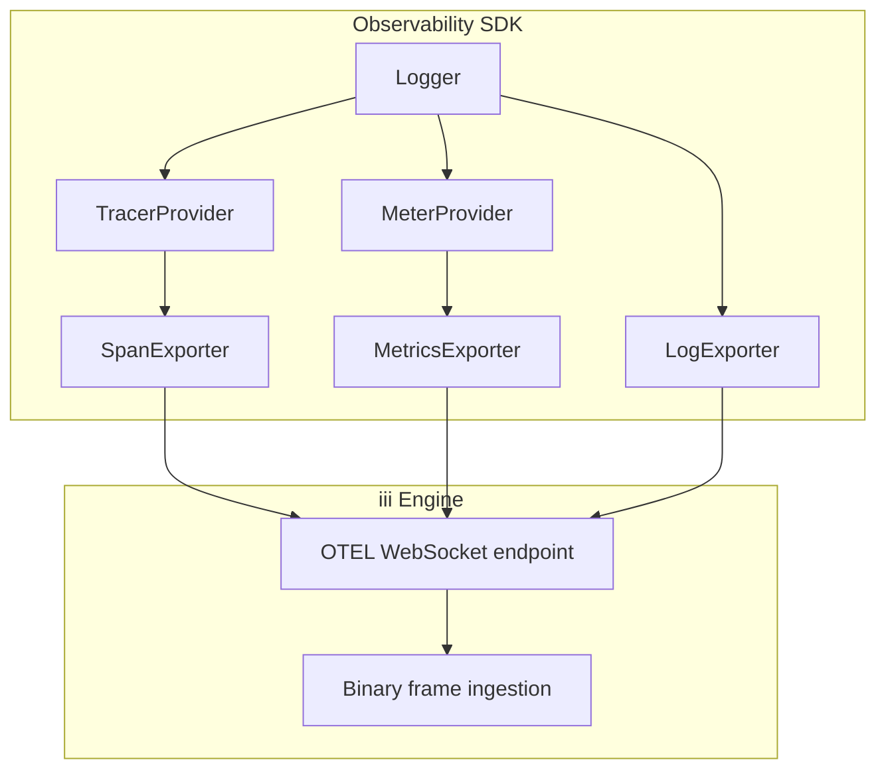

# iii Browser SDK + Observability SDK

**The Browser SDK connects to iii from web apps with no Node.js dependencies. The Observability SDK provides OpenTelemetry and logging primitives shared across all iii SDKs.**

## Browser SDK Architecture

**Aha:** The browser SDK deliberately excludes OpenTelemetry and Node.js dependencies — it's designed for web apps where bundle size matters. OTEL is available separately through the Observability SDK when needed.

## Observability SDK Architecture

## Package Comparison

| Feature | Browser SDK | Observability SDK |
|---------|------------|------------------|
| Package | `iii-browser-sdk` | `@iii-dev/observability` |
| OTEL | No | Yes |
| Node.js deps | No | Yes |
| WebSocket | Yes | Yes (for OTEL) |
| Logger | No | Yes |
| Bundle size | Minimal | Larger (OTEL libs) |
| Use case | Web apps, interactive UI | Server-side workers, full observability |

## What's Next

- [01 — Browser SDK](01-browser-sdk.md) — Core SDK, WebSocket, RBAC
- [02 — Observability SDK](02-observability-sdk.md) — Logger, OTEL setup
- [03 — Telemetry System](03-telemetry-system.md) — Exporters, instrumentation
