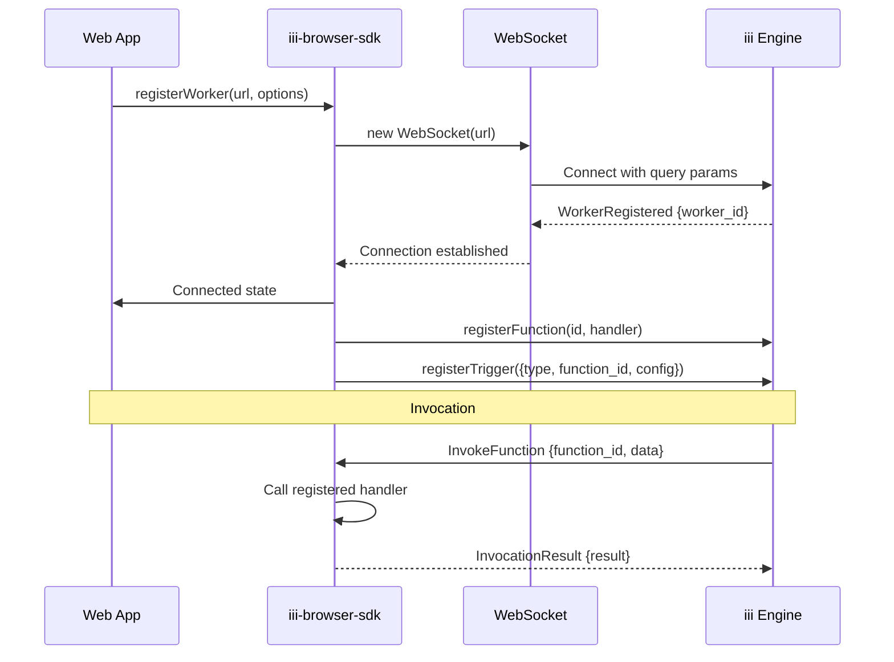
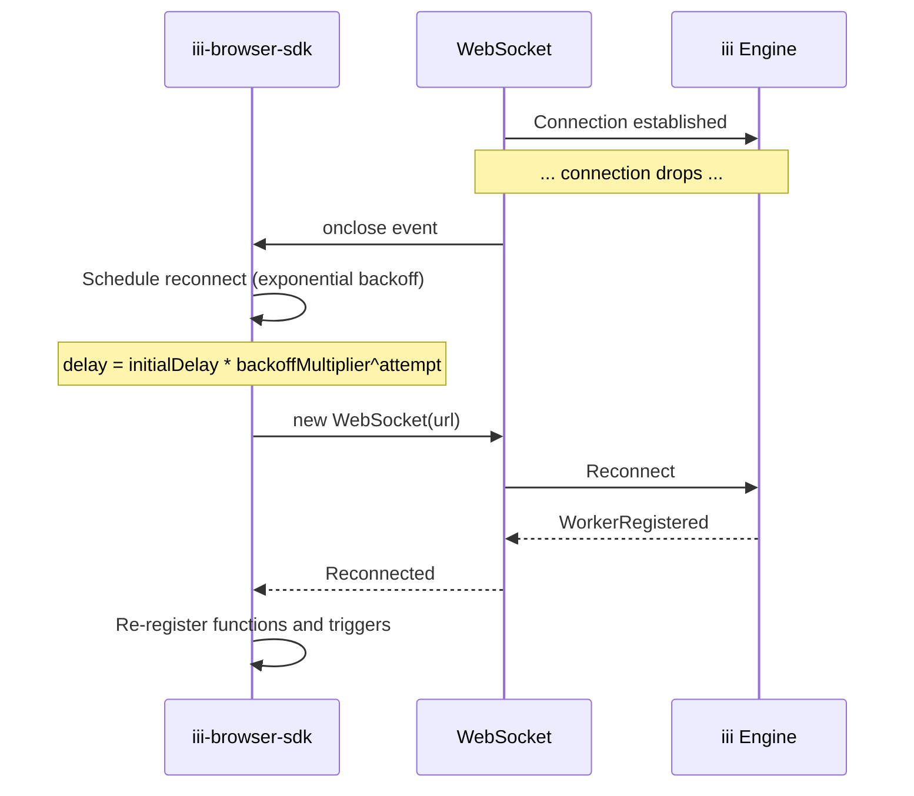

# Browser SDK — WebSocket, RBAC, Reconnection

**The Browser SDK (`iii-browser-sdk`) connects web apps to the iii engine via WebSocket — with RBAC protection, automatic reconnection, and no Node.js dependencies.**

## Core SDK

Source: `iii-browser/src/iii.ts` (789 lines)

```typescript
import { registerWorker } from 'iii-browser-sdk'

const iii = registerWorker('wss://api.example.com/worker?token=session-token', {
  invocationTimeoutMs: 10000,
  reconnectionConfig: { maxRetries: 5 },
})
```

### InitOptions

| Option | Default | Purpose |
|--------|---------|---------|
| `invocationTimeoutMs` | 30,000 | Timeout for `trigger()` calls |
| `reconnectionConfig` | auto | WebSocket reconnection behavior |
| `headers` | — | Not supported in browser WebSocket |

### Connection Lifecycle



**Aha:** Browser WebSockets don't support custom headers — authentication must use query parameters or cookies. This is a browser limitation, not an iii design choice.

## Reconnection

The SDK automatically reconnects on WebSocket disconnect:

| Parameter | Default | Purpose |
|-----------|---------|---------|
| `maxRetries` | Infinity | Maximum reconnection attempts |
| `initialDelay` | 1000ms | Initial delay before first retry |
| `maxDelay` | 30000ms | Maximum delay between retries |
| `backoffMultiplier` | 2 | Multiplier for exponential backoff |

## RBAC Protection

Browser connections require RBAC session tokens:

```typescript
// Token passed via query parameter
const iii = registerWorker('wss://api.example.com/worker?token=session-token')
```

| Security Rule | Purpose |
|--------------|---------|
| No secrets in browser | Keep API keys server-side |
| RBAC listener | Engine validates browser session |
| Function restrictions | Browser can only invoke allowed functions |

## Reconnection Flow



## Channels

Source: `iii-browser/src/channels.ts` (255 lines)

```typescript
const { reader, writer } = await iii.createChannel()
// reader: ChannelReader - receives data
// writer: ChannelWriter - sends data
```

## State Operations

Source: `iii-browser/src/state.ts` (119 lines)

| Method | Purpose |
|--------|---------|
| `state::get` | Get value from state scope |
| `state::set` | Set value in state scope |
| `state::delete` | Delete value from state scope |
| `state::list` | List all values in scope |

## Stream Operations

Source: `iii-browser/src/stream.ts` (310 lines)

| Method | Purpose |
|--------|---------|
| `stream::set` | Set stream value |
| `stream::get` | Get stream value |
| `stream::push` | Append to stream |
| `stream::subscribe` | Subscribe to stream updates |

## What's Next

- [02 — Observability SDK](02-observability-sdk.md) — Logger, OTEL setup
- [00 — Overview](00-overview.md) — Return to overview
- [03 — Telemetry System](03-telemetry-system.md) — Return to telemetry
