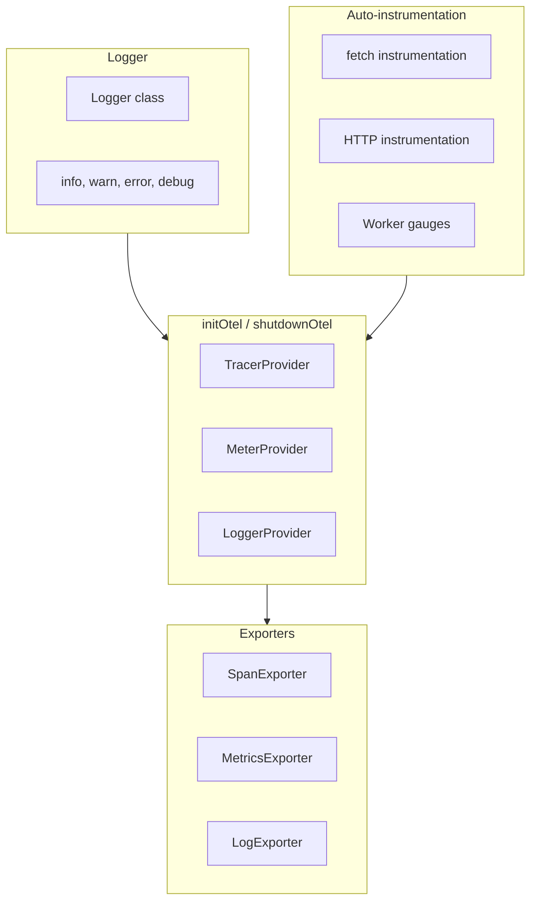
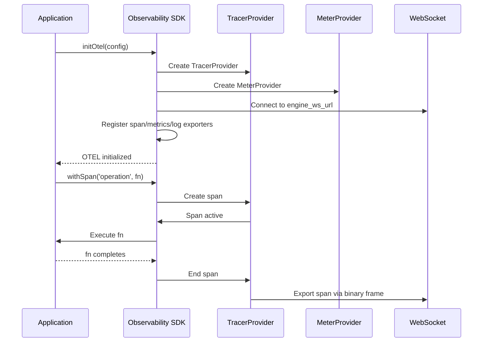

# Observability SDK — Logger, OTEL Setup, Instrumentation

**The Observability SDK (`@iii-dev/observability`) provides OpenTelemetry and logging primitives shared across all iii SDKs.**

## Core Exports

Source: `observability/src/index.ts`



## Logger

Source: `observability/src/logger.ts` (174 lines)

```typescript
import { Logger } from '@iii-dev/observability'

const logger = new Logger()
logger.info('starting operation', { userId: '123', action: 'validate' })
logger.error('operation failed', { error: err.message })
```

| Method | Severity | Use Case |
|--------|----------|---------|
| `debug` | Debug | Detailed diagnostic info |
| `info` | Info | Normal operation |
| `warn` | Warning | Potential issues |
| `error` | Error | Operation failures |

## OTEL Initialization

```typescript
import { initOtel, OtelConfig } from '@iii-dev/observability'

const config: OtelConfig = {
  enabled: true,
  service_name: 'my-worker',
  service_version: '1.0.0',
  engine_ws_url: 'ws://localhost:49134',
}

initOtel(config)
```

### OtelConfig

| Field | Purpose | Default |
|-------|---------|---------|
| `enabled` | Enable/disable OTEL | `true` |
| `service_name` | Service identifier | Required |
| `service_version` | Version string | — |
| `engine_ws_url` | Engine WebSocket for OTEL export | — |

**Aha:** The Observability SDK is designed to be shared across all iii SDKs — the Node.js SDK, browser SDK, and Python SDK all use the same OTEL primitives. This ensures consistent trace context propagation regardless of which SDK the worker uses.

## OTEL Initialization Flow



## Tracing

### withSpan

```typescript
import { withSpan } from '@iii-dev/observability'

const result = await withSpan('validate-order', async (span) => {
  span.setAttribute('order.id', orderId)
  return await validateOrder(orderId)
})
```

### executeTracedRequest

```typescript
import { executeTracedRequest } from '@iii-dev/observability'

const response = await executeTracedRequest('fetch-external-data', async () => {
  return fetch('https://api.example.com/data')
})
```

## Baggage Propagation

| Function | Purpose |
|----------|---------|
| `setBaggageEntry(key, value)` | Set baggage entry |
| `getBaggageEntry(key)` | Get baggage entry |
| `getAllBaggage()` | Get all baggage entries |
| `removeBaggageEntry(key)` | Remove baggage entry |
| `extractBaggage(headers)` | Extract from HTTP headers |
| `injectBaggage(headers)` | Inject into HTTP headers |

## What's Next

- [03 — Telemetry System](03-telemetry-system.md) — Exporters, instrumentation details
- [01 — Browser SDK](01-browser-sdk.md) — Return to browser SDK
- [00 — Overview](00-overview.md) — Return to overview
