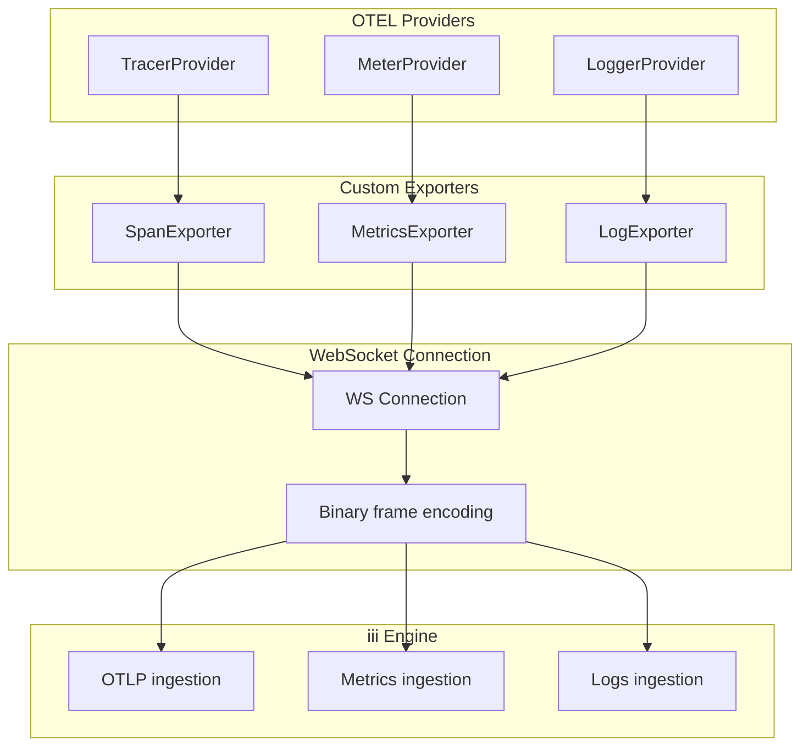
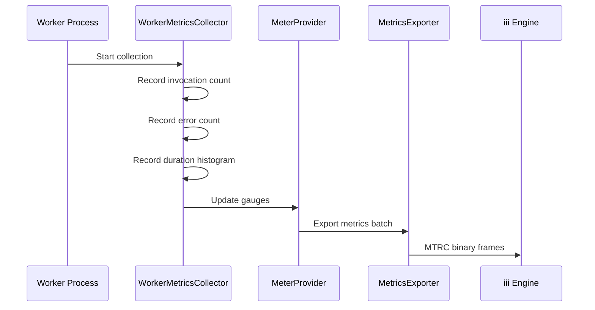

# Telemetry System — Exporters, Instrumentation, Worker Metrics

**The telemetry system exports traces, metrics, and logs to the iii engine via WebSocket — with auto-instrumentation for fetch and HTTP.**

## Exporter Architecture

Source: `observability/src/telemetry-system/`



## Span Exporter

Source: `telemetry-system/span-exporter.ts` (107 lines)

Exports spans to the engine via WebSocket binary frames with `OTLP` prefix:

```typescript
// Span → JSON → "OTLP" + JSON → WebSocket
const frame = OTLP_PREFIX + JSON.stringify(spanData)
ws.send(frame)
```

## Metrics Exporter

Source: `telemetry-system/metrics-exporter.ts` (113 lines)

Exports metrics with `MTRC` prefix:

```typescript
const frame = MTRC_PREFIX + JSON.stringify(metricData)
ws.send(frame)
```

## Log Exporter

Source: `telemetry-system/log-exporter.ts`

Exports logs with `LOGS` prefix:

```typescript
const frame = LOGS_PREFIX + JSON.stringify(logData)
ws.send(frame)
```

## Binary Frame Format

```mermaid
flowchart LR
    A[Span/Metric/Log data] --> B[JSON.stringify]
    B --> C[Prepend prefix]
    C --> D["OTLP + JSON" or "MTRC + JSON" or "LOGS + JSON"]
    D --> E[WebSocket.send binary frame]
    E --> F[Engine receives frame]
    F --> G[Prefix determines handler]
```

## Worker Metrics Collection Flow



## Fetch Instrumentation

Source: `telemetry-system/fetch-instrumentation.ts` (152 lines)

Auto-instruments `fetch()` calls:

```typescript
import { patchGlobalFetch } from '@iii-dev/observability'

patchGlobalFetch()  // All fetch calls now create spans
// ... your code ...
unpatchGlobalFetch()  // Remove instrumentation
```

| Feature | Purpose |
|---------|---------|
| `patchGlobalFetch` | Instrument all `fetch()` calls |
| `unpatchGlobalFetch` | Remove instrumentation |
| `executeTracedRequest` | Trace a single request |

## Worker Gauges

Source: `telemetry-system/otel-worker-gauges.ts` (151 lines)

Registers worker-specific gauges:

| Gauge | Purpose |
|-------|---------|
| `iii.worker.status` | Worker running/stopped |
| `iii.worker.connections` | Active WebSocket connections |
| `iii.worker.invocations` | Active invocations |

## Worker Metrics Collector

Source: `telemetry-system/worker-metrics.ts` (154 lines)

Collects and exports worker metrics:

| Metric | Type | Description |
|--------|------|-------------|
| `iii.function.invocations` | Counter | Total function invocations |
| `iii.function.errors` | Counter | Total function errors |
| `iii.function.duration` | Histogram | Invocation latency |
| `iii.worker.connections` | Gauge | Active connections |

## Context Propagation

Source: `telemetry-system/context.ts` (125 lines)

| Function | Purpose |
|----------|---------|
| `extractContext(headers)` | Extract trace context from HTTP headers |
| `extractTraceparent(headers)` | Extract W3C traceparent |
| `injectTraceparent(headers)` | Inject W3C traceparent |
| `currentTraceId()` | Get current trace ID |
| `currentSpanId()` | Get current span ID |
| `currentSpanIsRecording()` | Check if span is recording |
| `withSpan(name, fn)` | Execute function in a span |

## Redaction

Source: `telemetry-system/payload.ts`

| Function | Purpose |
|----------|---------|
| `redact(value)` | Redact sensitive data from traces |
| `redactAndTruncate(value, maxBytes)` | Redact + truncate |
| `REDACTED_PLACEHOLDER` | Placeholder for redacted values |

**Aha:** The binary frame encoding (`OTLP`, `MTRC`, `LOGS` prefixes) is the same format the engine uses for telemetry ingestion from workers. This means the browser SDK can send OTEL data through the same WebSocket connection that carries function invocations — no separate OTEL endpoint needed.

## What's Next

- [04 — Cross-Cutting](04-cross-cutting.md) — Testing, bundling, browser compatibility
- [00 — Overview](00-overview.md) — Return to overview
- [01 — Browser SDK](01-browser-sdk.md) — Return to browser SDK
