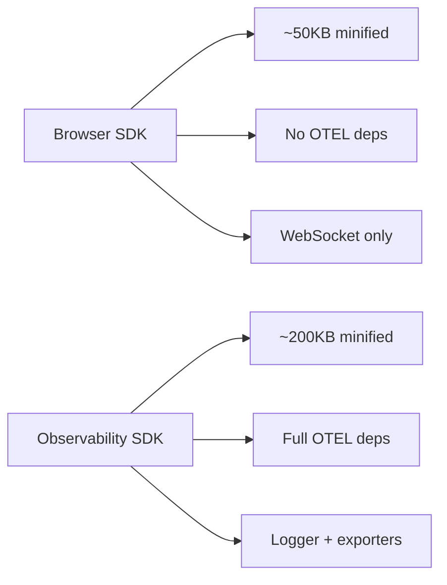
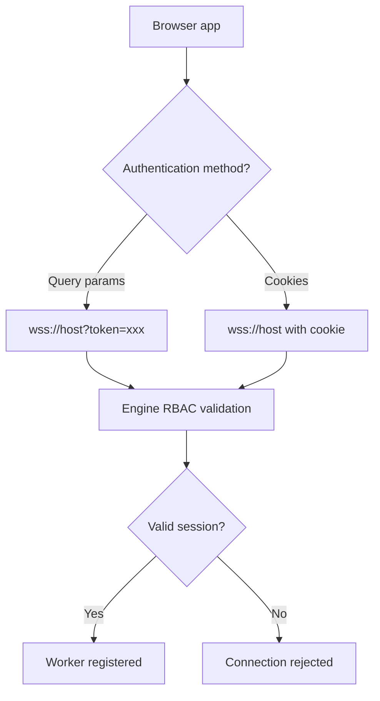

# Cross-Cutting — Testing, Bundling, Browser Compatibility

**This document covers testing strategy, bundling for distribution, and browser compatibility for both SDKs.**

## Bundle Size Comparison

## Security Architecture

## Browser SDK Testing

Source: `iii-browser/vitest.config.ts`

| Test Type | Files | Coverage |
|-----------|-------|----------|
| Unit tests | Inline in source files | Core SDK, channels, state |
| Integration tests | `vitest.integration.config.ts` | WebSocket connection |

### Key Test Areas

| Area | Tests |
|------|-------|
| Connection | WebSocket connect, disconnect, reconnect |
| Registration | Function and trigger registration |
| Invocation | Function invocation, timeout handling |
| Channels | Channel reader/writer |
| State | State operations (get, set, delete, list) |
| Streams | Stream operations |

## Observability SDK Testing

Source: `observability/src/` — test files alongside source

| Test File | Coverage |
|-----------|----------|
| `logger.test.ts` | Logger output, severity levels |
| `http-instrumentation.test.ts` | Fetch auto-instrumentation |
| `context.test.ts` | Context propagation |

## Bundling

### Browser SDK

Source: `iii-browser/tsdown.config.ts`

| Output | Format | Purpose |
|--------|--------|---------|
| `index.js` | ESM | Modern bundlers |
| `index.cjs` | CommonJS | Node.js compatibility |
| `index.d.ts` | Types | TypeScript support |

**Aha:** The browser SDK is bundled with `tsdown` (not webpack or esbuild) — a TypeScript-native bundler that preserves type information while producing minimal output. No OTEL libraries are included, keeping the bundle small for browser use.

### Observability SDK

Source: `observability/tsdown.config.ts`

| Output | Format | Purpose |
|--------|--------|---------|
| `dist/index.mjs` | ESM | Modern bundlers |
| `dist/index.cjs` | CommonJS | Node.js |
| `dist/index.d.ts` | Types | TypeScript support |

## Browser Compatibility

| Feature | Support | Notes |
|---------|---------|-------|
| WebSocket | ✅ All modern browsers | No custom headers (use query params) |
| Fetch | ✅ All modern browsers | Auto-instrumentation available |
| OTEL | ⚠️ Via Observability SDK | Adds bundle size |
| Channels | ✅ | WebSocket data channels |
| State/Stream | ✅ | Via engine WebSocket |

## Security Considerations

| Concern | Mitigation |
|---------|-----------|
| No secrets in browser | RBAC session tokens, query params |
| Custom headers not supported | Use cookies or query params for auth |
| Bundle size | Browser SDK excludes OTEL by default |
| RBAC enforcement | Engine validates browser session |

**Aha:** The Observability SDK is an opt-in dependency — the browser SDK works without it, and developers who need OTEL can add `@iii-dev/observability` separately. This keeps the browser SDK minimal for apps that don't need observability.

## What's Next

- [00 — Overview](00-overview.md) — Return to overview
- [01 — Browser SDK](01-browser-sdk.md) — Return to browser SDK
- [02 — Observability SDK](02-observability-sdk.md) — Return to observability
