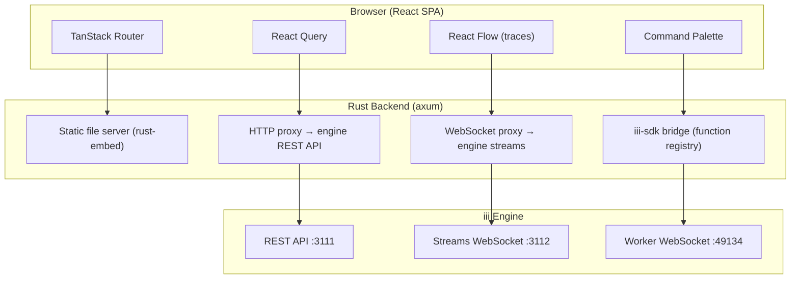

# iii-console — Developer Console for the iii Engine

**iii-console is the developer UI for the iii engine — a React SPA served by a Rust axum server that proxies HTTP and WebSocket connections to the engine.**

## What It Does



## Frontend Route Map

```mermaid
flowchart LR
    A[/] --> B[/functions]
    A --> C[/triggers]
    A --> D[/workers]
    A --> E[/traces]
    A --> F[/logs]
    A --> G[/streams]
    A --> H[/queues]
    A --> I[/states]
    A --> J[/dead-letter]
    A --> K[/config]
```

**Aha:** The console runs on a single port (default 3113) and serves both the React SPA AND proxies all engine traffic. No CORS issues — the SPA and engine API share the same origin.

## Architecture Overview

### Backend (Rust, 2,395 LOC)

| Module | LOC | Purpose |
|--------|-----|---------|
| `server.rs` | 244 | Axum router, static files, CORS, runtime config |
| `bridge/functions.rs` | 1,570 | Engine function registry via iii-sdk |
| `bridge/triggers.rs` | 155 | Trigger registration |
| `proxy/http.rs` | 129 | HTTP reverse proxy to engine REST API |
| `proxy/ws.rs` | 102 | WebSocket bidirectional proxy |
| `main.rs` | 150 | Entry point, CLI args, OTEL config |

### Frontend (TypeScript/React, 16,376 LOC)

| Module | LOC | Purpose |
|--------|-----|---------|
| `routes/` | ~8,000 | Page routes (functions, triggers, workers, traces, logs, etc.) |
| `components/traces/` | ~2,500 | Trace visualization (FlameGraph, WaterfallChart, FlowView) |
| `api/` | ~1,500 | API client, WebSocket connection, React Query hooks |
| `hooks/` | ~1,000 | useTheme, useKeyboard, useTraceData, useTraceFilters |
| `lib/` | ~1,500 | OTEL utils, trace transforms, color utils |

## Key Routes

| Route | Purpose |
|-------|---------|
| `/` | Dashboard — overview of workers, functions, triggers |
| `/functions` | Function registry — list, search, invoke functions |
| `/triggers` | Trigger registry — list, configure triggers |
| `/workers` | Worker management — list, start/stop workers |
| `/traces` | OpenTelemetry traces — search, filter, flame graph |
| `/logs` | Log viewer — stream, filter, search logs |
| `/streams` | Stream data viewer — real-time stream inspection |
| `/queues` | Queue inspection — message depth, DLQ |
| `/states` | KV state viewer — inspect state scopes |
| `/dead-letter` | Dead letter queue inspection |
| `/config` | Engine configuration viewer |
| `/flow` | Experimental flow visualization (React Flow) |

## What's Next

- [01 — Backend](01-backend.md) — Rust axum server, proxies, embedding
- [02 — Frontend](02-frontend.md) — React SPA, routes, components
- [03 — Trace Visualization](03-trace-visualization.md) — FlameGraph, WaterfallChart, OTEL
