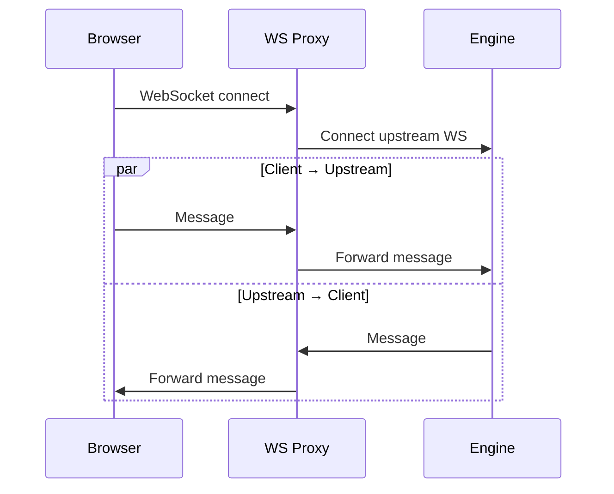

# Backend — Rust axum Server, Proxies, Static Embedding

**The console backend is a Rust axum server that serves the React SPA, proxies HTTP/WebSocket traffic to the engine, and registers as an iii-sdk worker.**

## Server Architecture

Source: `console-rust/src/server.rs` (244 lines)

```mermaid
flowchart TD
    A[Browser request] --> B{Route?}
    B -->|/| C[serve_index: inject runtime config]
    B -->|/api/config| D[serve_config: JSON config endpoint]
    B -->|/ws/streams| E[ws_proxy_handler: bidirectional WS proxy]
    B -->|/api/engine/{path}| F[http_proxy_handler: reverse HTTP proxy]
    B -->|/{*path}| G[serve_static_or_index: embedded assets or SPA fallback]
    
    E --> H[engine streams WS]
    F --> I[engine REST API]
    G --> J[rust-embed assets]
```

## Routes

| Route | Handler | Purpose |
|-------|---------|---------|
| `GET /` | `serve_index` | Serve index.html with runtime config injected |
| `GET /api/config` | `serve_config` | JSON config for frontend |
| `ANY /ws/streams` | `ws_proxy_handler` | WebSocket proxy to engine streams |
| `ANY /api/engine/{*path}` | `http_proxy_handler` | HTTP reverse proxy to engine REST API |
| `GET /{*path}` | `serve_static_or_index` | Static files or SPA fallback |

## Static File Embedding

Source: `console-rust/src/server.rs:20-22`

```rust
#[derive(Embed)]
#[folder = "assets/"]
struct Assets;
```

The React build output is embedded at compile time via `rust-embed`. No separate static file server needed — the binary is self-contained.

## Runtime Config Injection

```rust
fn get_index_html(config: &ServerConfig) -> String {
    let runtime_config = json!({
        "engineHost": config.engine_host,
        "enginePort": config.engine_port,
        "wsPort": config.ws_port,
        "enableFlow": config.enable_flow,
    });
    // Inject as window.__CONSOLE_CONFIG__ before </head>
}
```

**Aha:** The runtime config is injected into index.html at serve time, not build time. This means the same binary can connect to any engine — just change `--engine-host` and `--engine-port` CLI args. No rebuild needed.

## WebSocket Proxy

Source: `console-rust/src/proxy/ws.rs` (102 lines)

Bidirectional proxy using two tokio tasks:



The proxy translates between axum's WebSocket types and tokio-tungstenite's types — they use the same underlying Bytes types, so `.into()` conversion works seamlessly.

## HTTP Proxy

Source: `console-rust/src/proxy/http.rs` (129 lines)

Reverse proxy to the engine REST API (`engine_host:engine_port`):

- Forwards all methods (GET, POST, PUT, PATCH, DELETE)
- Preserves headers and query strings
- No proxy loop: uses `no_proxy()` on the HTTP client

## Engine Bridge

Source: `console-rust/src/bridge/functions.rs` (1,570 lines)

The console registers as an iii-sdk worker and provides function inspection capabilities:

- Registers functions for console-specific operations
- Registers triggers for engine events
- Provides OTEL integration for console's own telemetry

## CLI Arguments

| Argument | Default | Purpose |
|----------|---------|---------|
| `--port` | 3113 | Console server port |
| `--host` | 127.0.0.1 | Bind address |
| `--engine-host` | 127.0.0.1 | Engine host |
| `--engine-port` | 3111 | Engine REST API port |
| `--ws-port` | 3112 | Engine streams WebSocket port |
| `--bridge-port` | 49134 | Engine worker bridge port |
| `--no-otel` | false | Disable OpenTelemetry |
| `--enable-flow` | false | Enable experimental flow visualization |

## What's Next

- [02 — Frontend](02-frontend.md) — React SPA, routes, components
- [03 — Trace Visualization](03-trace-visualization.md) — FlameGraph, WaterfallChart
- [00 — Overview](00-overview.md) — Return to overview
