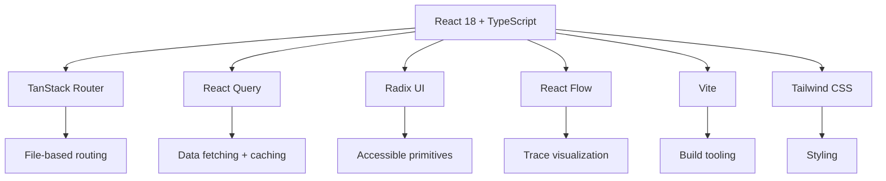
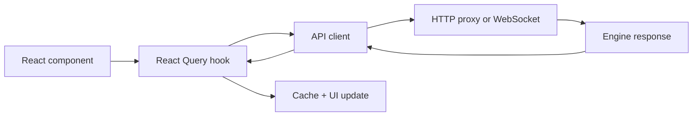

# Frontend — React SPA, Routes, Components

**The console frontend is a React SPA built with Vite, TanStack Router, React Query, and Radix UI components.**

## Tech Stack

| Technology | Purpose |
|------------|---------|
| **React 18** | UI framework |
| **TypeScript** | Type safety |
| **TanStack Router** | File-based routing with type-safe params |
| **React Query** | Server state management, caching |
| **Radix UI** | Accessible component primitives |
| **React Flow** | Graph visualization for trace flows |
| **Vite** | Build tooling |
| **Tailwind CSS** | Utility-first styling |
| **biome** | Linting and formatting |

## Route Structure

Source: `console-frontend/src/routes/`

| Route File | Page | LOC |
|------------|------|-----|
| `__root.tsx` | Root layout | — |
| `index.tsx` | Dashboard | 484 |
| `functions.tsx` | Function registry | 552 |
| `triggers.tsx` | Trigger registry | 1,356 |
| `workers.tsx` | Worker management | 627 |
| `traces.tsx` | Trace viewer | 570 |
| `logs.tsx` | Log viewer | 1,049 |
| `streams.tsx` | Stream viewer | 1,050 |
| `queues.tsx` | Queue inspector | 431 |
| `states.tsx` | KV state viewer | 902 |
| `dead-letter.tsx` | Dead letter queue | — |
| `config.tsx` | Configuration viewer | 944 |
| `flow.tsx` | Experimental flow view | — |

## Key Components

### Command Palette

Source: `components/command-palette.tsx`

Global command palette for quick navigation — search functions, workers, triggers.

### Keyboard Shortcuts

Source: `components/keyboard-shortcut-overlay.tsx`

Overlay showing available keyboard shortcuts, powered by `useKeyboard` hook.

### Trace Components

| Component | Purpose | LOC |
|-----------|---------|-----|
| `FlameGraph.tsx` | CPU-time flame graph for spans | 679 |
| `WaterfallChart.tsx` | Timeline waterfall view | 446 |
| `FlowView.tsx` | React Flow graph view | 454 |
| `TraceFilters.tsx` | Filter controls for traces | 726 |

## Data Flow

## API Layer

Source: `api/`

| File | Purpose |
|------|---------|
| `index.ts` | API client base URL setup |
| `config.ts` | Runtime config loading from `window.__CONSOLE_CONFIG__` |
| `config-provider.tsx` | React context for config |
| `queries.ts` | React Query hooks for all data fetching |
| `websocket.ts` | WebSocket connection to engine streams |
| `utils.ts` | URL building, error handling |

## Hooks

| Hook | Purpose |
|------|---------|
| `useTheme` | Dark/light theme toggle with localStorage |
| `useKeyboard` | Global keyboard shortcut handling |
| `useTraceData` | Trace data fetching and transformation |
| `useTraceFilters` | Trace filter state management |
| `useResizablePanels` | Resizable panel layout |
| `useResizableSplitPane` | Split pane resizing |

**Aha:** The frontend reads runtime config from `window.__CONSOLE_CONFIG__` — injected by the Rust backend at serve time. This means the frontend never needs to know the engine address at build time. The same build artifact works with any engine.

## What's Next

- [03 — Trace Visualization](03-trace-visualization.md) — FlameGraph, WaterfallChart, OTEL data
- [01 — Backend](01-backend.md) — Return to backend
- [00 — Overview](00-overview.md) — Return to overview
