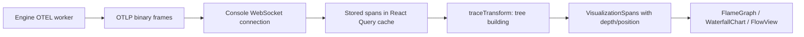
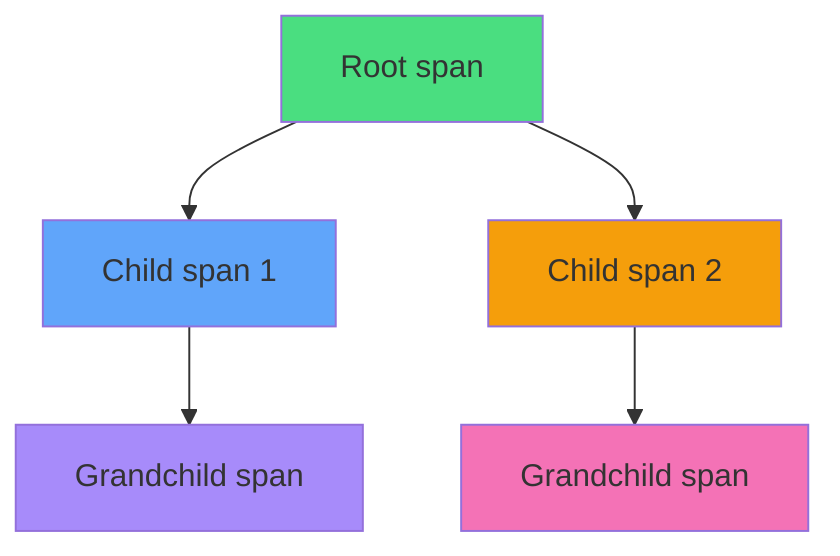
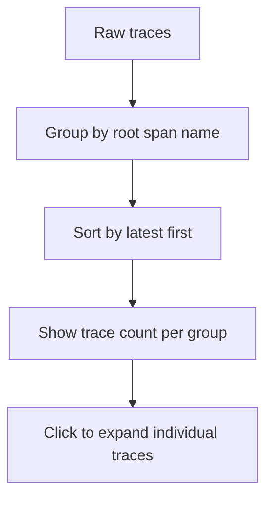

# Trace Visualization — FlameGraph, WaterfallChart, OTEL Data

**The console visualizes OpenTelemetry traces as flame graphs, waterfall charts, and flow graphs — powered by React Flow and custom transformation utilities.**

## Trace Data Flow



## Span Transformation

Source: `lib/traceTransform.ts`

The transformation converts raw OTEL spans into visualization-ready data:

```typescript
interface VisualizationSpan {
  name: string
  span_id: string
  parent_span_id?: string
  duration_ms: number
  status: 'ok' | 'error' | 'unset'
  depth: number              // Tree depth for indentation
  start_percent: number      // X-axis position in waterfall
  width_percent: number      // Bar width relative to total trace
  attributes: Record<string, unknown>
  events: ...
  links: ...
}
```

**Aha:** The `start_percent` and `width_percent` fields enable the waterfall chart to render spans as proportional bars without any DOM measurement. All positioning is pre-computed from span timestamps.

## FlameGraph

Source: `components/traces/FlameGraph.tsx` (679 lines)



The flame graph shows:
- **Width** = duration (proportional)
- **Color** = status (green=ok, red=error, gray=unset)
- **Stacking** = parent-child relationships

## WaterfallChart

Source: `components/traces/WaterfallChart.tsx` (446 lines)

Timeline view showing span start times and durations as horizontal bars:

| Span | Timeline |
|------|----------|
| Root | ████████████████████████████████████ |
| ├ Child 1 | ████████████████ |
| │ └ Grandchild | ████████ |
| └ Child 2 | ████████████████████████ |

## Trace Grouping

Source: `lib/traceGroups.ts`

Traces are grouped by root span name for the trace list view:



## OTEL Utilities

Source: `lib/otel-utils.ts`

| Function | Purpose |
|----------|---------|
| `formatDuration` | Human-readable duration (ms, s, m) |
| `formatTimestamp` | Human-readable timestamp |
| `getAttributeValue` | Extract attribute from span |
| `getStatusColor` | Map status to color |
| `flattenAttributes` | Flatten nested attribute objects |

## Trace Colors

Source: `lib/traceColors.ts`

Consistent color assignment for span names across the UI — the same span name always gets the same color.

## What's Next

- [04 — Cross-Cutting](04-cross-cutting.md) — Build, deployment, testing
- [01 — Backend](01-backend.md) — Return to backend
- [00 — Overview](00-overview.md) — Return to overview
