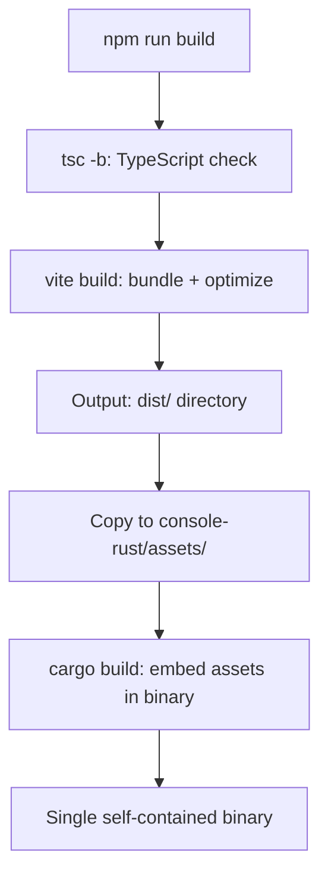
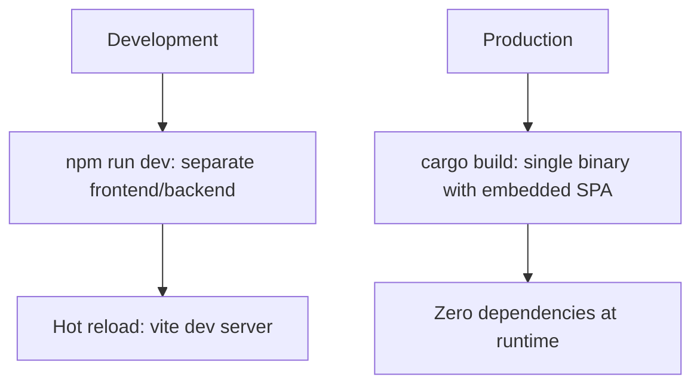

# Cross-Cutting — Build, Deployment, Testing

**This document covers the build system, deployment modes, and testing strategy for iii-console.**

## Build System

### Frontend Build



The `build:binary` mode builds for embedding:
```bash
cd console-frontend
npm run build:binary  # --mode binary
cp -r dist ../console-rust/assets/
cd ../console-rust
cargo build --release
```

### Backend Build

```bash
cd console-rust
cargo build --release
```

Output: a single binary with the React SPA embedded.

## Deployment Modes



## Runtime Configuration

| Method | Purpose |
|--------|---------|
| CLI args | `--port`, `--engine-host`, `--engine-port`, etc. |
| Env vars | `OTEL_DISABLED`, `OTEL_SERVICE_NAME`, `III_ENABLE_FLOW` |
| Runtime config | `window.__CONSOLE_CONFIG__` injected at serve time |

**Aha:** The console is a single binary with zero external dependencies at runtime. The React SPA is compiled and embedded at build time. Deploy by copying one binary to any machine.

## CORS Configuration

Source: `server.rs:169-213`

CORS is restricted to console origins only:
- `http://127.0.0.1:{port}`
- `http://localhost:{port}`
- `https://127.0.0.1:{port}`
- `https://localhost:{port}`
- Custom host if `--host` is not localhost

## Testing

### Frontend Tests

Source: `console-frontend/src/lib/traceGroups.test.ts`

| Test Type | Framework | Purpose |
|-----------|-----------|---------|
| Unit tests | Vitest | Trace grouping, transform utilities |
| Linting | Biome | Code quality, formatting |

### Backend Tests

Source: `console-rust/tests/`

| Test Type | Framework | Purpose |
|-----------|-----------|---------|
| Integration tests | Rust test framework | Proxy behavior, function bridge |

## What's Next

- [00 — Overview](00-overview.md) — Return to overview
- [01 — Backend](01-backend.md) — Return to backend
- [02 — Frontend](02-frontend.md) — Return to frontend
