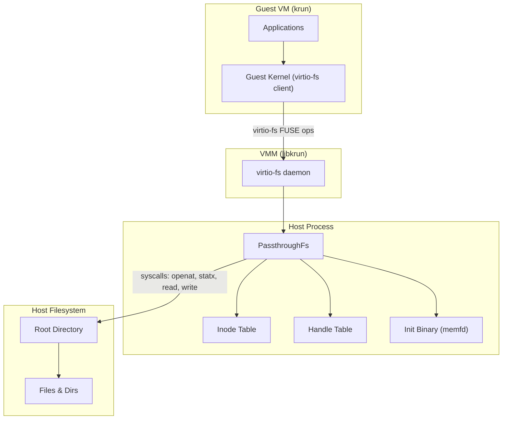
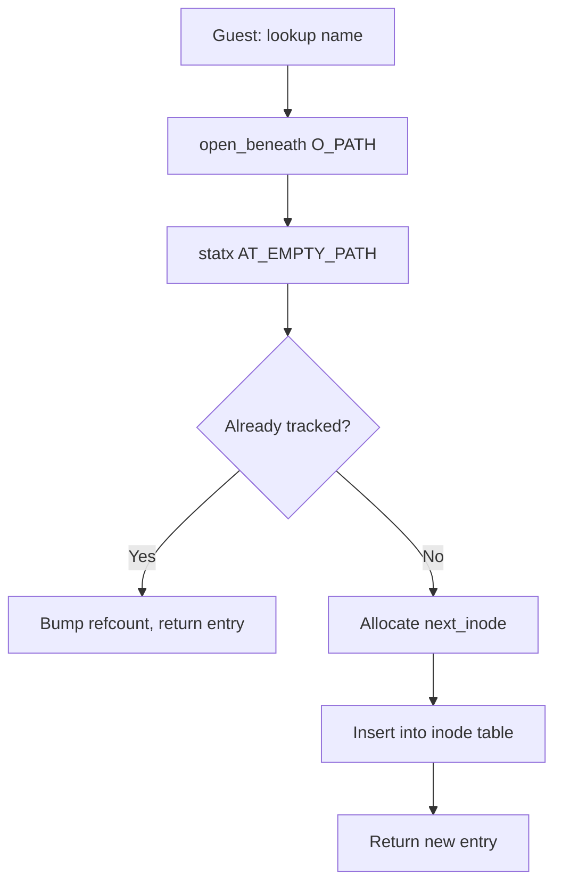

# iii-filesystem — VFS for Worker VM Sandboxes

**iii-filesystem exposes host directories to guest VMs via virtio-fs, with init binary injection and kernel-enforced path containment.** It provides the filesystem backend that iii worker sandboxes use to access host files from inside a krun-based VM.

## What It Does

The `PassthroughFs` backend implements the `DynFileSystem` trait from `msb_krun`, mapping guest FUSE operations (lookup, open, read, write, mkdir, unlink, rename, readdir, etc.) to host filesystem syscalls. The guest VM sees a directory tree that directly mirrors a host directory, with one addition: a virtual `/init.krun` file at inode 2 that provides the VM's init binary.

**Aha:** PassthroughFs doesn't virtualize file contents or permissions — it passes through raw host stat data and syscalls directly. The only virtualization is the `/init.krun` file and the inode number mapping (guest sees synthetic FUSE inodes, host sees real inodes).

## Architecture at a Glance



## Crate Structure

```
iii-filesystem/
├── Cargo.toml              # Package manifest: edition 2024, msb_krun dep
├── build.rs                # Embeds iii-init binary when embed-init feature enabled
├── src/
│   ├── lib.rs              # Re-exports from msb_krun and PassthroughFs
│   ├── init.rs             # INIT_BYTES: embedded init binary (compile-time)
│   └── backends/
│       ├── mod.rs
│       ├── passthroughfs/
│       │   ├── mod.rs          # PassthroughFs struct + DynFileSystem impl (810 lines)
│       │   ├── builder.rs      # PassthroughFsBuilder (228 lines)
│       │   ├── inode.rs        # Lookup, forget, fd management (702 lines)
│       │   ├── file_ops.rs     # Open, read, write, flush, release (194 lines)
│       │   ├── dir_ops.rs      # Opendir, readdir, readdirplus (363 lines)
│       │   ├── create_ops.rs   # Create, mkdir, symlink, link (216 lines)
│       │   ├── remove_ops.rs   # Unlink, rmdir, rename (201 lines)
│       │   ├── metadata.rs     # Getattr, setattr, access (199 lines)
│       │   └── special.rs      # Fsync, fsyncdir, statfs (103 lines)
│       └── shared/
│           ├── mod.rs
│           ├── inode_table.rs  # MultikeyBTreeMap, InodeData (227 lines)
│           ├── handle_table.rs # HandleData (16 lines)
│           ├── init_binary.rs  # Virtual init.krun serving (197 lines)
│           ├── platform.rs     # Linux↔macOS errno translation, stat helpers (839 lines)
│           └── name_validation.rs # Path traversal protection (77 lines)
└── tests/
    └── filesystem_integration.rs # Integration tests (684 lines)
```

## Key Design Decisions

| Decision | Why |
|----------|-----|
| No xattr stat overrides (D-02) | Files created with real permissions, no metadata virtualization |
| RESOLVE_BENEATH (Linux 5.6+) | Kernel-enforced containment blocks `..`, symlinks, magic links atomically |
| Inode table with dual-key lookup | Deduplicate by host identity (ino+dev+mnt_id) to avoid synthetic inode collisions |
| Leaked readdir buffers with destroy reclaim | `'static` lifetime required by FUSE trait; tracked leaks reclaimed at shutdown |
| Zero-copy I/O | `preadv64`/`pwritev64` with explicit offsets, no seek position modification |
| Compile-time init binary | `include_bytes!` with feature flag; dead branches optimized away |

## Inode Allocation Flow



## Dependencies

| Dependency | Purpose |
|------------|---------|
| `msb_krun = "0.1.9"` | `DynFileSystem` trait, FUSE types, zero-copy I/O |
| `dashmap = "6"` | Lock-free concurrent handle table |
| `libc = "0.2"` | Raw syscalls (open, statx, getdents64, etc.) |
| `scopeguard = "1.2"` | RAII guards for cleanup |
| `tempfile = "3"` (macOS) | Tmpfile for init binary storage |

## What's Next

- [01 — Architecture](01-architecture.md) — FUSE protocol flow, VM integration, component relationships
- [02 — PassthroughFs](02-passthrough-fs.md) — The core struct, configuration, and lifecycle
