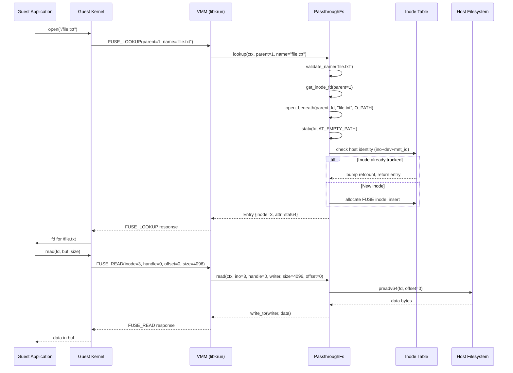
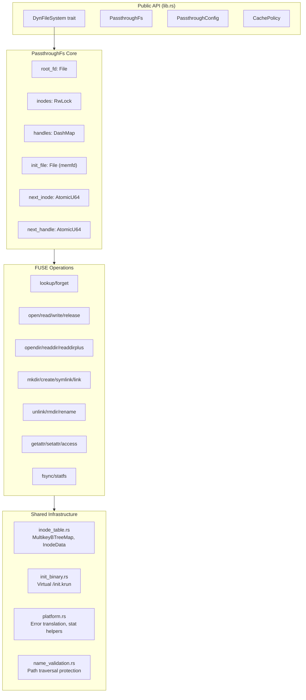
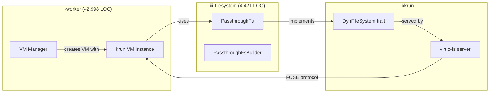

# Architecture — FUSE Protocol, VM Integration, Component Relationships

**iii-filesystem sits between the virtio-fs protocol and the host filesystem, translating guest FUSE operations into host syscalls.** This document covers the full architecture, from the guest kernel's FUSE requests through the VMM to the PassthroughFs backend.

## FUSE Protocol Flow



## Component Architecture



## How It Integrates with iii-worker

The `iii-worker` crate (42,998 LOC) manages krun-based VMs for sandboxed workers. Each VM needs a filesystem backend to access host files. `iii-filesystem` provides that backend:



## Inode Numbering

The FUSE protocol uses synthetic inode numbers that iii-filesystem manages independently from the host:

| Inode | Purpose | Notes |
|-------|---------|-------|
| 1 | Root directory | Always the configured `root_dir` |
| 2 | `/init.krun` | Virtual file with embedded init binary (only when `embed-init` feature enabled) |
| 3+ | Real files/dirs | Monotonically allocated via `next_inode` |

**Aha:** When init is NOT embedded (no `embed-init` feature or binary unavailable), inode 2 and handle 0 are available for real files. The code uses a conditional `start_inode`/`start_handle` to avoid wasting synthetic inode numbers:

Source: `backends/passthroughfs/mod.rs:182-186`
```rust
let (start_inode, start_handle) = if init_binary::has_init() {
    (3u64, 1u64)
} else {
    (2u64, 0u64)
};
```

Since `has_init()` is a const fn checking `INIT_BYTES.len()`, the compiler optimizes away the dead branch entirely.

## What's Next

- [02 — PassthroughFs](02-passthrough-fs.md) — The core struct, configuration, builder, and lifecycle
- [03 — Inode Management](03-inode-management.md) — Dual-key lookup, lookup collapse, reference counting
