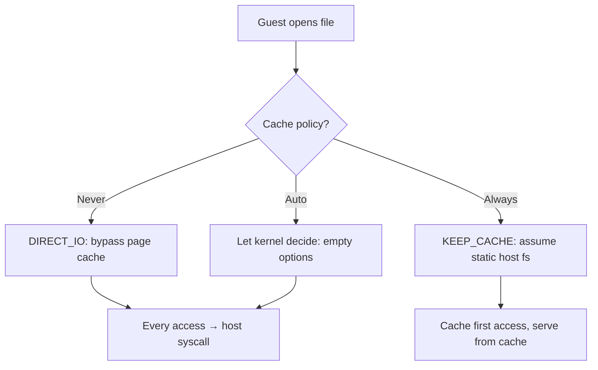
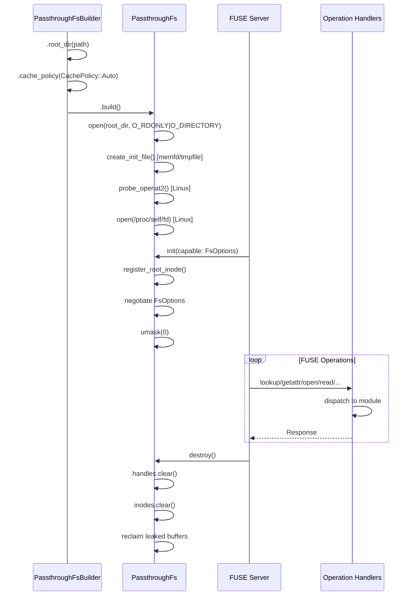

# PassthroughFs — Core Struct, Configuration, Builder, and Lifecycle

**PassthroughFs is the core struct that implements `DynFileSystem` by mapping guest FUSE operations to host syscalls.** It holds all shared state: the root directory fd, inode table, handle table, init binary, and configuration.

## The PassthroughFs Struct

Source: `backends/passthroughfs/mod.rs:90-128`

```rust
pub struct PassthroughFs {
    pub(crate) cfg: PassthroughConfig,
    pub(crate) root_fd: File,                          // Open fd for root directory
    pub(crate) inodes: RwLock<MultikeyBTreeMap<...>>,  // Dual-key inode table
    pub(crate) next_inode: AtomicU64,                  // Next FUSE inode to allocate
    pub(crate) handles: DashMap<u64, Arc<HandleData>>, // Open file handle table
    pub(crate) next_handle: AtomicU64,                 // Next handle to allocate
    pub(crate) writeback: AtomicBool,                  // Writeback caching negotiated
    pub(crate) init_file: File,                        // memfd/tmpfile with init binary
    pub(crate) leaked_readdir_bufs: Mutex<Vec<...>>,   // Tracked leaked buffers
    pub(crate) has_openat2: AtomicBool,                // Linux 5.6+ openat2 available
    pub(crate) proc_self_fd: File,                     // Linux: /proc/self/fd fd
}
```

## Configuration

Source: `backends/passthroughfs/mod.rs:68-84`

```rust
pub struct PassthroughConfig {
    pub root_dir: PathBuf,           // Host directory to expose
    pub entry_timeout: Duration,     // FUSE entry cache timeout (default: 5s)
    pub attr_timeout: Duration,      // FUSE attribute cache timeout (default: 5s)
    pub cache_policy: CachePolicy,   // Caching strategy
    pub writeback: bool,             // Enable writeback caching
}
```

### Cache Policy Decision Flow



### Cache Policy

| Policy | OpenOptions for Files | OpenOptions for Dirs | Behavior |
|--------|----------------------|---------------------|----------|
| `Never` | `DIRECT_IO` | `DIRECT_IO` | Every access goes to host filesystem |
| `Auto` | empty | empty | Let the kernel decide (default) |
| `Always` | `KEEP_CACHE` | `CACHE_DIR` | Aggressively cache (assume static host fs) |

Source: `backends/passthroughfs/mod.rs:57-65`

## Builder Pattern

Source: `backends/passthroughfs/builder.rs`

```rust
PassthroughFs::builder()
    .root_dir("./rootfs")
    .entry_timeout(Duration::from_secs(10))
    .attr_timeout(Duration::from_secs(20))
    .cache_policy(CachePolicy::Never)
    .writeback(true)
    .build()?
```

The `build()` method performs these steps:

1. **Validate root_dir** — Returns error if not set or doesn't exist
2. **Open root directory** — `open(O_RDONLY | O_CLOEXEC | O_DIRECTORY)`
3. **Create init binary file** — memfd (Linux) or tmpfile (macOS) with embedded bytes
4. **Probe openat2** — (Linux only) Test if `openat2(RESOLVE_BENEATH)` is available
5. **Open /proc/self/fd** — (Linux only) For efficient procfd reopen path
6. **Construct PassthroughFs** — With all fields initialized

Source: `backends/passthroughfs/builder.rs:87-157`

## Lifecycle: init → Operations → destroy

### init()

Source: `backends/passthroughfs/mod.rs:304-347`

Called by the FUSE server after connection. Performs:

1. **Register root inode** — Insert inode 1 into the inode table (required before any FUSE operations)
2. **Negotiate FUSE options** — Check `FsOptions::capable` and return negotiated set:

| Option | Negotiated When | Purpose |
|--------|----------------|---------|
| `DONT_MASK` | If capable | We handle umask ourselves in create/mkdir/mknod |
| `BIG_WRITES` | If capable | Allow writes larger than page size |
| `ASYNC_READ` | If capable | Allow async read operations |
| `PARALLEL_DIROPS` | If capable | Allow parallel directory operations |
| `MAX_PAGES` | If capable | Use max_readahead/max_pages for buffer sizing |
| `HANDLE_KILLPRIV_V2` | If capable | Clear SUID/SGID on write |
| `DO_READDIRPLUS` + `READDIRPLUS_AUTO` | If capable | Return attrs with readdir entries |
| `WRITEBACK_CACHE` | If capable + cfg.writeback | Enable kernel writeback cache |

3. **Clear umask** — `libc::umask(0)` so the client can set all mode bits

### destroy()

Source: `backends/passthroughfs/mod.rs:349-366`

Cleans up all state:

1. **Clear handles** — `self.handles.clear()` drops all `HandleData`, closing all fds
2. **Clear inodes** — `self.inodes.write().unwrap().clear()` removes all tracked inodes
3. **Reclaim leaked buffers** — Reconstructs and drops `Box<[u8]>` from tracked raw pointers

**Aha:** The leaked readdir buffer strategy solves the FUSE trait's `'static` lifetime requirement for directory entry names. Instead of leaking individual buffers (one per readdir call) with no way to free them, we:
1. Collect all names into a single `Vec<u8>` per readdir call
2. `Box::leak` it to get `&'static [u8]` slices
3. Track `(ptr, len)` in `leaked_readdir_bufs`
4. Reclaim all in `destroy()` by reconstructing and dropping the `Box`

### DynFileSystem Implementation

Source: `backends/passthroughfs/mod.rs:303-629`

The trait implementation maps each FUSE operation to the appropriate module:

| FUSE Operation | Module | Function |
|---------------|--------|----------|
| `lookup` | inode | `do_lookup` |
| `forget` / `batch_forget` | inode | `forget_one` / `forget_one_locked` |
| `getattr` | metadata | `do_getattr` |
| `setattr` | metadata | `do_setattr` |
| `open` | file_ops | `do_open` |
| `read` | file_ops | `do_read` |
| `write` | file_ops | `do_write` |
| `flush` | file_ops | `do_flush` |
| `release` | file_ops | `do_release` |
| `opendir` | dir_ops | `do_opendir` |
| `readdir` | dir_ops | `do_readdir` |
| `readdirplus` | dir_ops | `do_readdirplus` |
| `releasedir` | dir_ops | `do_releasedir` |
| `create` | create_ops | `do_create` |
| `mkdir` | create_ops | `do_mkdir` |
| `symlink` | create_ops | `do_symlink` |
| `link` | create_ops | `do_link` |
| `unlink` | remove_ops | `do_unlink` |
| `rmdir` | remove_ops | `do_rmdir` |
| `rename` | remove_ops | `do_rename` |
| `access` | metadata | `do_access` |
| `readlink` | inode | (inline in mod.rs) |
| `fsync` / `fsyncdir` | special | `do_fsync` |
| `statfs` | special | `do_statfs` |

Skipped operations (return ENOSYS from trait defaults): `mknod`, `fallocate`, `lseek`, xattr ops, `copy_file_range`.

## PassthroughFs Lifecycle Flow



## What's Next

- [03 — Inode Management](03-inode-management.md) — Dual-key lookup, lookup collapse, reference counting
- [04 — File Operations](04-file-operations.md) — Open, read, write, flush, release
- [05 — Directory Operations](05-directory-operations.md) — Opendir, readdir, readdirplus
