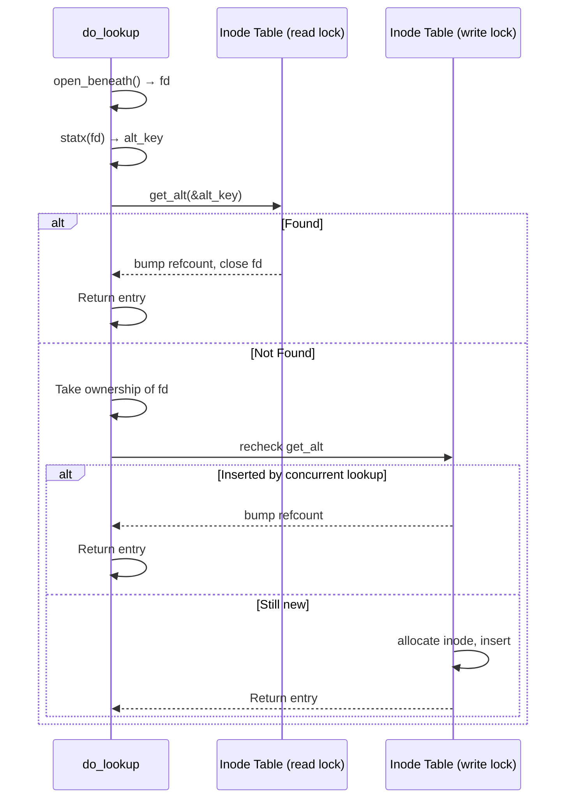

# Inode Management — Dual-Key Lookup, Lookup Collapse, Reference Counting

**The inode table maps synthetic FUSE inode numbers to host filesystem identities using a dual-key B-tree.** This document covers the `MultikeyBTreeMap`, the Linux lookup collapse optimization, and the atomic reference counting that prevents inode leaks.

## The MultikeyBTreeMap

Source: `backends/shared/inode_table.rs:22-29`

```rust
pub(crate) struct MultikeyBTreeMap<K1, K2, V> {
    main: BTreeMap<K1, (K2, V)>,  // Primary: FUSE inode → (alt_key, data)
    alt: BTreeMap<K2, K1>,        // Alternate: host identity → FUSE inode
}
```

There is a 1:1 relationship between the two keys. For each FUSE inode number (K1), there is exactly one host identity key (K2) and vice versa. This enables efficient lookup from both directions:

| Lookup Direction | Method | Use Case |
|-----------------|--------|----------|
| FUSE inode → data | `get(&fuse_inode)` | getattr, read, write (guest knows FUSE inode) |
| Host identity → data | `get_alt(&alt_key)` | Lookup (guest provides name, we stat and check if already tracked) |

### Dual-Key Insert/Remove Flow

```mermaid
flowchart TD
    A[insert(k1, k2, v)] --> B{alt has k2?}
    B -->|Yes| C[Remove old main entry for old k1]
    B -->|No| D[Insert (k2, k1) into alt]
    C --> D
    D --> E[Insert (k1, (k2, v)) into main]

    F[remove(k1)] --> G{main has k1?}
    G -->|Yes| H[Get k2 from main entry]
    G -->|No| I[Return None]
    H --> J[Remove k2 from alt]
    J --> K[Remove k1 from main, return v]
```

| Lookup Direction

Source: `backends/shared/inode_table.rs:35-42`

```rust
pub(crate) struct InodeAltKey {
    pub ino: u64,
    pub dev: u64,
    #[cfg(target_os = "linux")]
    pub mnt_id: u64,  // From statx to prevent cross-mount collisions
}
```

**Aha:** Linux includes `mnt_id` from `statx` to prevent cross-mount collisions. Two files on different mount points could have the same `(ino, dev)` pair. Bind mounts and overlay filesystems make this a real concern. macOS uses `(ino, dev)` alone since there are no bind mounts.

## InodeData: Per-Inode State

Source: `backends/shared/inode_table.rs:46-74`

```rust
pub(crate) struct InodeData {
    pub inode: u64,           // Synthetic FUSE inode (monotonically increasing, never reused)
    pub ino: u64,             // Host inode number
    pub dev: u64,             // Host device ID
    pub refcount: AtomicU64,  // FUSE lookup reference count
    pub file: File,           // O_PATH fd pinning this inode (Linux only)
    pub mnt_id: u64,          // Mount ID from statx (Linux only)
    // macOS: unlinked_fd: AtomicI64 (fd preserved before unlink)
}
```

## Linux Lookup Collapse: 2 Syscalls Instead of 4

Source: `backends/passthroughfs/inode.rs:241-334`

The Linux lookup is the most optimized path:

```
Traditional path (4 syscalls):
1. fstatat(parent_fd, name, &st, AT_SYMLINK_NOFOLLOW)
2. statx(parent_fd, name, AT_EMPTY_PATH, &stx)       // Get mnt_id
3. openat(parent_fd, name, O_PATH | O_NOFOLLOW)       // Pin inode
4. ...

Collapsed path (2 syscalls):
1. open_beneath(parent_fd, name, O_PATH | O_NOFOLLOW)  // Pin inode
2. statx(fd, "", AT_EMPTY_PATH)                        // Stat the opened fd
```

**Aha:** The stat is on the *opened* fd, not the name. This eliminates TOCTOU between stat and open — if a concurrent rename moves the file between steps, we still get consistent data because both operations target the same pinned inode.

Source: `backends/passthroughfs/inode.rs:244-275`
```rust
// Syscall 1: Open with RESOLVE_BENEATH containment.
let fd = platform::open_beneath(parent_fd, name.as_ptr(),
    libc::O_PATH | libc::O_NOFOLLOW, fs.has_openat2.load(Ordering::Relaxed));

// Syscall 2: statx with AT_EMPTY_PATH on the opened fd.
let mut stx: libc::statx = unsafe { std::mem::zeroed() };
libc::statx(fd, c"".as_ptr(),
    libc::AT_EMPTY_PATH | libc::AT_SYMLINK_NOFOLLOW | libc::AT_STATX_SYNC_AS_STAT,
    libc::STATX_BASIC_STATS | libc::STATX_MNT_ID, &mut stx);
```

## Concurrent Registration Race Prevention

The lookup uses a double-check pattern:



## Reference Counting and Forget

Source: `backends/passthroughfs/inode.rs:400-442`

The FUSE kernel increments the refcount on each lookup and sends FORGET messages when inodes are no longer needed:

```rust
pub(crate) fn forget_one_locked(
    inodes: &mut MultikeyBTreeMap<...>, inode: u64, count: u64,
) {
    if let Some(data) = inodes.get(&inode) {
        loop {
            let old = data.refcount.load(Ordering::Relaxed);
            let new = old.saturating_sub(count);  // Prevent underflow
            if data.refcount.compare_exchange(old, new,
                Ordering::Release, Ordering::Relaxed).is_ok()
            {
                if new == 0 {
                    inodes.remove(&inode);  // Remove when refcount reaches 0
                }
                break;
            }
        }
    }
}
```

**Aha:** The CAS loop handles the race where a concurrent `lookup` may increment the refcount between our load and compare_exchange. `saturating_sub` prevents underflow if the kernel sends a forget count larger than the current refcount (which can happen during error recovery).

## Linux open_inode_fd: Procfd Reopen

Source: `backends/passthroughfs/inode.rs:524-540`

For I/O operations that need a real file fd (not O_PATH), the code reopens via `/proc/self/fd`:

```rust
pub(crate) fn open_inode_fd(fs: &PassthroughFs, inode: u64, flags: i32) -> io::Result<i32> {
    let inode_fd = get_inode_fd(fs, inode)?;

    // Fstat the O_PATH fd first to check if it's a real symlink
    let st = platform::fstat(inode_fd.raw())?;
    if st.st_mode & libc::S_IFMT == libc::S_IFLNK {
        return Err(platform::eloop());  // Reject real host symlinks
    }

    // Reopen via procfd: openat(proc_self_fd, "N", flags)
    // Must NOT add O_NOFOLLOW because /proc/self/fd/N IS a symlink
    let reopen_flags = (flags & !libc::O_NOFOLLOW) | libc::O_CLOEXEC;
    let fd = libc::openat(fs.proc_self_fd.as_raw_fd(), fd_str, reopen_flags);
}
```

**Aha:** `/proc/self/fd/N` is itself a symlink to the real file. Adding `O_NOFOLLOW` to the reopen would fail every time with `ELOOP`. Instead, the code fstat's the O_PATH fd first and rejects real host symlinks *before* the reopen. This way we never follow symlinks through procfd.

## macOS Lookup: /.vol Path

Source: `backends/passthroughfs/inode.rs:336-396`

macOS doesn't support `O_PATH` or `openat2`. Lookup uses:

1. `fstatat(parent_fd, name, AT_SYMLINK_NOFOLLOW)` — Get stat data
2. Check inode table by `(ino, dev)`
3. If new, allocate FUSE inode (macOS doesn't store O_PATH fds)

For reopening inodes, macOS uses `/.vol/<dev>/<ino>` — a special path that resolves to the file by inode number:

```rust
pub(crate) fn vol_path(dev: u64, ino: u64) -> CString {
    CString::new(format!("/.vol/{dev}/{ino}")).unwrap()
}
```

The `open_macos_path_hardened` function tries multiple flag combinations to handle macOS's hardened runtime restrictions:

```rust
let attempts = [
    (flags | O_CLOEXEC | O_NOFOLLOW_ANY | O_RESOLVE_BENEATH, true),
    (flags | O_CLOEXEC | O_NOFOLLOW_ANY, false),
    (flags | O_CLOEXEC | O_NOFOLLOW, false),
];
```

## Linux Flag Translation on macOS

Source: `backends/passthroughfs/inode.rs:120-148`

When running on macOS, the guest sends Linux flag values which have different numeric meanings:

| Flag | Linux Value | macOS Value |
|------|------------|-------------|
| `O_TRUNC` | 0x200 | 0x400 |
| `O_CREAT` | 0x40 | 0x200 |
| `O_APPEND` | 0x400 | 0x8 |

**Aha:** Without translation, Linux `O_TRUNC` (0x200) becomes macOS `O_CREAT` (0x200), and Linux `O_APPEND` (0x400) becomes macOS `O_TRUNC` (0x400). This would cause data corruption — opening a file to append would truncate it instead.

## What's Next

- [04 — File Operations](04-file-operations.md) — Open, read, write, flush, release
- [05 — Directory Operations](05-directory-operations.md) — Opendir, readdir, readdirplus
- [07 — Platform Abstraction](07-platform-abstraction.md) — Errno translation, stat helpers
