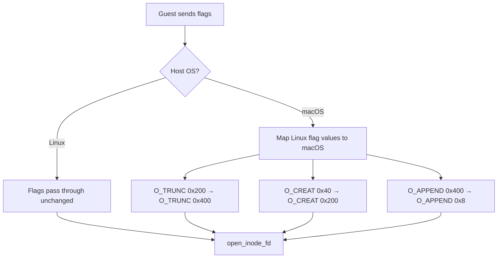

# File Operations — Open, Read, Write, Flush, Release

**File I/O in PassthroughFs uses zero-copy transfer via `ZeroCopyWriter`/`ZeroCopyReader` traits, with `preadv64`/`pwritev64` for position-independent operations that don't modify the fd seek position.**

## Open

Source: `backends/passthroughfs/file_ops.rs:36-70`

```rust
pub(crate) fn do_open(
    fs: &PassthroughFs, _ctx: Context, ino: u64, _kill_priv: bool, flags: u32,
) -> io::Result<(Option<u64>, OpenOptions)> {
    // Init binary: return reserved handle 0, no fd opened
    if init_binary::has_init() && ino == init_binary::INIT_INODE {
        return Ok((Some(init_binary::INIT_HANDLE), OpenOptions::empty()));
    }

    let mut open_flags = inode::translate_open_flags(flags as i32);

    // Writeback cache: widen O_WRONLY→O_RDWR, strip O_APPEND
    if fs.writeback.load(Ordering::Relaxed) {
        if open_flags & libc::O_WRONLY != 0 {
            open_flags = (open_flags & !libc::O_WRONLY) | libc::O_RDWR;
        }
        open_flags &= !libc::O_APPEND;
    }

    let fd = inode::open_inode_fd(fs, ino, open_flags)?;
    let file = unsafe { std::fs::File::from_raw_fd(fd) };

    let handle = fs.next_handle.fetch_add(1, Ordering::Relaxed);
    fs.handles.insert(handle, Arc::new(HandleData { file: RwLock::new(file) }));
    Ok((Some(handle), fs.cache_open_options()))
}
```

## Open

Source: `backends/passthroughfs/file_ops.rs:36-70`

```rust
pub(crate) fn do_open(
    fs: &PassthroughFs, _ctx: Context, ino: u64, _kill_priv: bool, flags: u32,
) -> io::Result<(Option<u64>, OpenOptions)> {
    // Init binary: return reserved handle 0, no fd opened
    if init_binary::has_init() && ino == init_binary::INIT_INODE {
        return Ok((Some(init_binary::INIT_HANDLE), OpenOptions::empty()));
    }

    let mut open_flags = inode::translate_open_flags(flags as i32);

    // Writeback cache: widen O_WRONLY→O_RDWR, strip O_APPEND
    if fs.writeback.load(Ordering::Relaxed) {
        if open_flags & libc::O_WRONLY != 0 {
            open_flags = (open_flags & !libc::O_WRONLY) | libc::O_RDWR;
        }
        open_flags &= !libc::O_APPEND;
    }

    let fd = inode::open_inode_fd(fs, ino, open_flags)?;
    let file = unsafe { std::fs::File::from_raw_fd(fd) };

    let handle = fs.next_handle.fetch_add(1, Ordering::Relaxed);
    fs.handles.insert(handle, Arc::new(HandleData { file: RwLock::new(file) }));
    Ok((Some(handle), fs.cache_open_options()))
}
```

### Open Flag Translation Flow



**Aha:** When writeback caching is negotiated, the kernel may read from write-only file descriptors for cache coherency. So `do_open` widens `O_WRONLY` to `O_RDWR`. It also strips `O_APPEND` because the append flag races with the kernel's cached view of the file position.

## Read: Zero-Copy via ZeroCopyWriter

Source: `backends/passthroughfs/file_ops.rs:76-96`

```rust
pub(crate) fn do_read(
    fs: &PassthroughFs, _ctx: Context, ino: u64, handle: u64,
    w: &mut dyn ZeroCopyWriter, size: u32, offset: u64,
) -> io::Result<usize> {
    // Virtual init.krun: zero-copy from pre-created memfd
    if init_binary::has_init() && handle == init_binary::INIT_HANDLE {
        return init_binary::read_init(w, &fs.init_file, size, offset);
    }

    let data = fs.handles.get(&handle).ok_or_else(platform::ebadf)?.clone();
    let f = data.file.read().unwrap();  // Read lock (preadv doesn't modify seek)
    w.write_from(&f, size as usize, offset)
}
```

The `ZeroCopyWriter::write_from` trait method bridges the FUSE transport buffer directly to the file via `preadv64`, avoiding intermediate copies.

## Write: Zero-Copy via ZeroCopyReader

Source: `backends/passthroughfs/file_ops.rs:106-146`

```rust
pub(crate) fn do_write(
    fs: &PassthroughFs, _ctx: Context, ino: u64, handle: u64,
    r: &mut dyn ZeroCopyReader, size: u32, offset: u64, kill_priv: bool,
) -> io::Result<usize> {
    if init_binary::has_init() && handle == init_binary::INIT_HANDLE {
        return Err(platform::eperm());  // Init is read-only
    }

    let data = fs.handles.get(&handle).ok_or_else(platform::ebadf)?.clone();
    let f = data.file.read().unwrap();  // Read lock (pwritev doesn't modify seek)
    let written = r.read_to(&f, size as usize, offset)?;

    // Clear SUID/SGID after write when kill_priv requested
    if kill_priv && fs.writeback.load(Ordering::Relaxed) {
        let fd = f.as_raw_fd();
        let st = platform::fstat(fd)?;
        let mode = platform::mode_u32(st.st_mode);
        if mode & (MODE_SETUID | MODE_SETGID) != 0 {
            unsafe { libc::fchmod(fd, mode & !(MODE_SETUID | MODE_SETGID)) };
        }
    }

    Ok(written)
}
```

**Aha:** The `DashMap` shard lock is released immediately after cloning the `Arc<HandleData>`. This means blocking syscalls in the `kill_priv` path (fstat/fchmod) don't hold the concurrent map lock.

## Flush: POSIX Close Semantics

Source: `backends/passthroughfs/file_ops.rs:152-174`

```rust
pub(crate) fn do_flush(fs: &PassthroughFs, _ctx: Context, ino: u64, handle: u64) -> io::Result<()> {
    let data = fs.handles.get(&handle).ok_or_else(platform::ebadf)?.clone();
    let f = data.file.read().unwrap();

    let newfd = unsafe { libc::dup(f.as_raw_fd()) };
    let ret = unsafe { libc::close(newfd) };
}
```

Flush emulates POSIX close semantics by duplicating and closing the fd. This is called on every guest `close()`, which may fire multiple times if the fd was `dup`'d.

## Release

Source: `backends/passthroughfs/file_ops.rs:179-194`

```rust
pub(crate) fn do_release(fs: &PassthroughFs, _ctx: Context, ino: u64, handle: u64) -> io::Result<()> {
    fs.handles.remove(&handle);  // HandleData drop closes the fd
    Ok(())
}
```

Simply removes the handle from the table. The `HandleData` drop closes the underlying fd.

## HandleData: RwLock for Concurrent I/O

Source: `backends/shared/handle_table.rs:14-16`

```rust
pub(crate) struct HandleData {
    pub file: RwLock<File>,
}
```

The `RwLock` allows concurrent reads (via `read().unwrap()`) because `preadv64`/`pwritev64` take explicit offsets and don't modify the seek position. Write locks are only needed for operations that modify fd state: `lseek`, `fsync`, `ftruncate`.

## Lock Ordering

| Operation | Lock Type | Reason |
|-----------|-----------|--------|
| `do_read` | Read lock | `write_from` with offset, no seek modification |
| `do_write` | Read lock | `read_to` with offset, no seek modification |
| `do_flush` | Read lock | `dup`/`close` on raw fd, no seek modification |
| `do_fsync` | Write lock | `fsync`/`fdatasync` modify fd state |
| `do_setattr` (SIZE) | Write lock | `ftruncate` modifies fd state |

## HandleData Lifecycle Flow

```mermaid
flowchart TD
    A[do_open called] --> B[open_inode_fd → real fd]
    B --> C[Wrap in File]
    C --> D[Create HandleData {RwLock<File>}]
    D --> E[handles.insert(handle, Arc<HandleData>)]
    E --> F[Return handle to guest]

    G[do_read/do_write] --> H[handles.get(handle)]
    H --> I[Arc::clone HandleData]
    I --> J[Read lock on RwLock<File>]
    J --> K[preadv64/pwritev64]

    L[do_release] --> M[handles.remove(handle)]
    M --> N[Arc drop]
    N --> O[File drop closes fd]
```

## What's Next

- [05 — Directory Operations](05-directory-operations.md) — Opendir, readdir, readdirplus
- [06 — Init Binary](06-init-binary.md) — Virtual /init.krun serving
- [02 — PassthroughFs](02-passthrough-fs.md) — Return to PassthroughFs core
