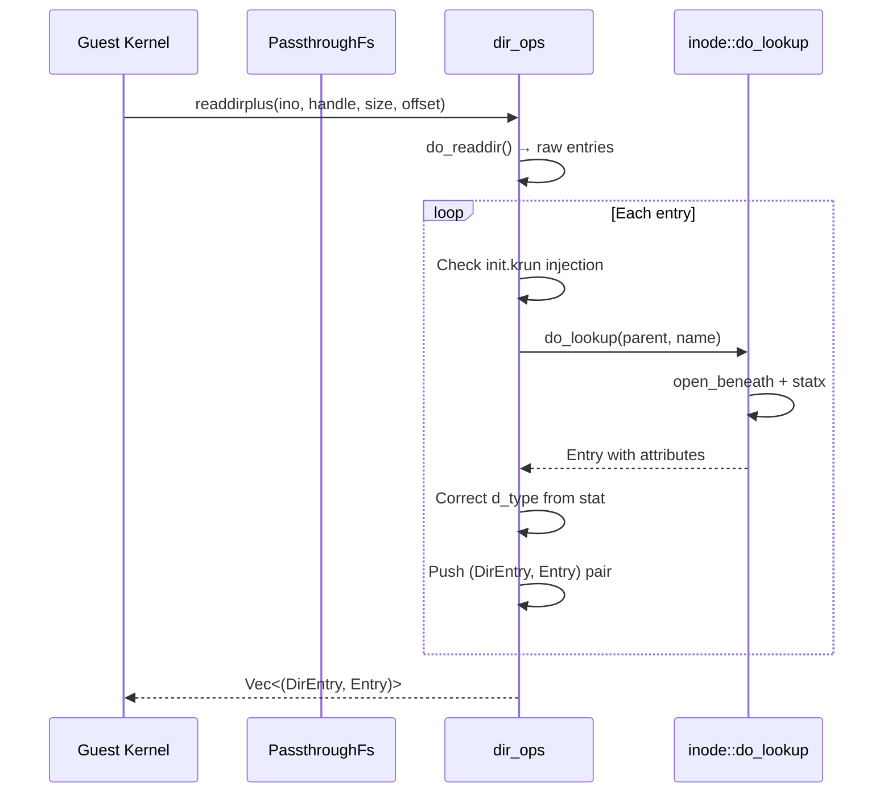

# Directory Operations — Opendir, Readdir, Readdirplus, Tracked Leak

**Directory operations in PassthroughFs use platform-specific strategies: `getdents64` on Linux and `fdopendir`+`readdir` on macOS, both with a contiguous leaked buffer strategy for `'static` lifetime directory entries.**

## Opendir

Source: `backends/passthroughfs/dir_ops.rs:29-45`

```rust
pub(crate) fn do_opendir(
    fs: &PassthroughFs, _ctx: Context, ino: u64, _flags: u32,
) -> io::Result<(Option<u64>, OpenOptions)> {
    let fd = inode::open_inode_fd(fs, ino, libc::O_RDONLY | libc::O_DIRECTORY)?;
    let file = unsafe { std::fs::File::from_raw_fd(fd) };

    let handle = fs.next_handle.fetch_add(1, Ordering::Relaxed);
    fs.handles.insert(handle, Arc::new(HandleData { file: RwLock::new(file) }));
    Ok((Some(handle), fs.cache_dir_options()))
}
```

Opens the inode as a directory fd and stores it in the handle table.

## Readdir: The Tracked Leak Strategy

Source: `backends/passthroughfs/dir_ops.rs:47-76`

The `DynFileSystem::readdir` trait requires `Vec<DirEntry<'static>>` — names must be `'static` references. Since we can't return borrowed data, we use a tracked leak strategy:

```mermaid
flowchart TD
    A[readdir called] --> B[Collect raw entries from getdents64/readdir]
    B --> C[Collect all names into single Vec<u8>]
    C --> D[Box::leak the Vec → &'static mut [u8]]
    D --> E[Create &str slices from leaked buffer]
    E --> F[Build Vec<DirEntry<'static>>]
    F --> G[Track (ptr, len) in leaked_readdir_bufs]
    G --> H[Return entries]
    I[destroy called] --> J[Reclaim all leaked buffers]
    J --> K[Reconstruct Box from ptr+len, drop]
```

### Linux: getdents64

Source: `backends/passthroughfs/dir_ops.rs:169-254`

```rust
fn read_dir_entries(fs: &PassthroughFs, fd: i32, offset: u64, size: u32)
    -> io::Result<Vec<DirEntry<'static>>> {

    if offset > 0 { libc::lseek64(fd, offset as i64, SEEK_SET); }

    let buf_size = (size as usize).clamp(1024, 65536);  // FUSE size as hint
    let mut buf = vec![0u8; buf_size];

    loop {
        let nread = libc::syscall(SYS_getdents64, fd, buf.as_mut_ptr(), buf.len());
        if nread <= 0 { break; }

        // Parse raw linux_dirent64 structs from buffer
        // Collect names into contiguous names_buf
    }

    // Leak one contiguous buffer for all names
    let boxed = names_buf.into_boxed_slice();
    let leaked: &'static mut [u8] = Box::leak(boxed);
    fs.leaked_readdir_bufs.lock().unwrap().push((LeakedBufPtr(ptr), len));

    // Build DirEntry with &str slices from leaked buffer
}
```

### macOS: fdopendir + readdir

Source: `backends/passthroughfs/dir_ops.rs:270-363`

macOS uses `fdopendir`/`readdir` instead of `getdents64`:

```rust
fn read_dir_entries(fs: &PassthroughFs, fd: i32, offset: u64, _size: u32)
    -> io::Result<Vec<DirEntry<'static>>> {

    // macOS pitfall: seekdir/telldir cookies are NOT portable across fdopendir sessions
    // Workaround:
    // 1. lseek(fd, 0) to rewind before dup/fdopendir
    // 2. Use sequential entry index (1-based) as d_off instead of telldir
    // 3. Skip entries before requested offset

    libc::lseek(fd, 0, SEEK_SET);  // Rewind
    let dup_fd = libc::dup(fd);
    let dirp = libc::fdopendir(dup_fd);

    let mut entry_index: u64 = 0;
    loop {
        let ent = libc::readdir(dirp);
        if ent.is_null() { break; }
        entry_index += 1;
        if entry_index <= offset { continue; }  // Skip to offset
        // ... collect entry
    }
}
```

**Aha:** macOS `seekdir`/`telldir` cookies are NOT portable across different `fdopendir` sessions. After one session reads to EOF, the shared fd position is at the end, and a new `fdopendir(dup(fd))` starts there. `seekdir` with a cookie from the old session silently fails. The workaround uses `lseek` to rewind and sequential indices instead of telldir cookies.

## Readdirplus

Source: `backends/passthroughfs/dir_ops.rs:82-125`

`readdirplus` returns directory entries WITH attributes, saving the kernel from issuing separate `GETATTR` calls for each entry:



## Init Binary Injection

Source: `backends/passthroughfs/dir_ops.rs:146-163`

```rust
fn inject_init_entry(entries: &mut Vec<DirEntry<'static>>) {
    if !init_binary::has_init() { return; }

    let already_present = entries.iter().any(|e| e.name == init_binary::INIT_FILENAME);
    if !already_present {
        entries.push(DirEntry {
            ino: init_binary::INIT_INODE,
            offset: entries.last().map(|e| e.offset + 1).unwrap_or(1),
            type_: platform::DIRENT_REG,
            name: init_binary::INIT_FILENAME,
        });
    }
}
```

The init binary is injected into the root directory listing. Only injects when the init binary is embedded; otherwise the real file on disk appears naturally.

## What's Next

- [06 — Init Binary](06-init-binary.md) — Virtual /init.krun serving
- [08 — Cross-Cutting](08-cross-cutting.md) — Security, build system, testing
- [02 — PassthroughFs](02-passthrough-fs.md) — Return to PassthroughFs core
