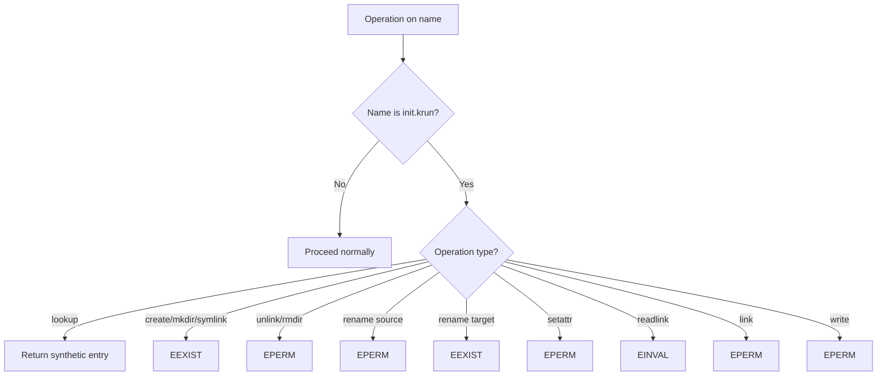

# Init Binary — Virtual /init.krun File Serving

**Every PassthroughFs instance serves a virtual `/init.krun` file at inode 2 that provides the VM's init binary, stored in a memfd (Linux) or tmpfile (macOS) and served via zero-copy reads.**

## Virtual File Design

Source: `backends/shared/init_binary.rs`

The init binary appears at the root of every filesystem backend as `/init.krun`. It is:
- **Read-only** — Writes return `EPERM`
- **Cannot be deleted** — Unlink/rmdir return `EPERM`
- **Cannot be renamed** — Rename targeting init name returns `EPERM`
- **Immune to whiteouts** — Protected by name checks before all creation operations

## Init.krun Protection Across Operations



## Constants

Source: `backends/shared/init_binary.rs:22-28`

```rust
pub(crate) const INIT_FILENAME: &[u8] = b"init.krun";
pub(crate) const INIT_INODE: u64 = 2;       // ROOT_ID + 1
pub(crate) const INIT_HANDLE: u64 = 0;       // Reserved handle for init reads
```

## Build.rs: Embedding Logic

```mermaid
flowchart TD
    A[cargo build --features embed-init] --> B[build.rs runs]
    B --> C{Is CARGO_CFG_TARGET_ARCH set?}
    C -->|x86_64| D[Target: x86_64-unknown-linux-musl]
    C -->|aarch64| E[Target: aarch64-unknown-linux-musl]
    C -->|other| F[Empty triple → placeholder]

    D --> G[Check target/release/iii-init exists]
    E --> G
    G -->|Exists| H[Copy to OUT_DIR/iii-init]
    G -->|Missing| I[Write [0u8] placeholder]

    H --> J{Binary > 1 byte?}
    I --> J
    J -->|Yes| K[Set has_init_binary cfg]
    J -->|No| L[No cfg set]

    K --> M[INIT_BYTES = include_bytes! real binary]
    L --> N[INIT_BYTES = empty slice]
```

## Compile-Time Embedding

Source: `src/init.rs`

```rust
#[cfg(has_init_binary)]
pub const INIT_BYTES: &[u8] = include_bytes!(concat!(env!("OUT_DIR"), "/iii-init"));

#[cfg(not(has_init_binary))]
pub const INIT_BYTES: &[u8] = &[];
```

The `has_init_binary` cfg is set by `build.rs` when a real binary (>1 byte) was copied to `OUT_DIR`. Since `INIT_BYTES` is a compile-time constant, `has_init()` is a const fn that the compiler optimizes away entirely:

```rust
pub const fn has_init() -> bool {
    !INIT_BYTES.is_empty()
}
```

## Build.rs: Embedding Logic

Source: `build.rs`

```rust
if cfg!(feature = "embed-init") {
    let arch = std::env::var("CARGO_CFG_TARGET_ARCH").unwrap_or_default();
    let triple = match arch.as_str() {
        "x86_64" => "x86_64-unknown-linux-musl",
        "aarch64" => "aarch64-unknown-linux-musl",
        _ => "",
    };

    // VMs always run Linux guests, so init is always a Linux musl binary
    let workspace_root = PathBuf::from(env!("CARGO_MANIFEST_DIR")).join("../..");
    let binary_path = workspace_root.join("target").join(triple).join("release").join("iii-init");

    // Track the cross-compiled binary itself (not the source tree)
    println!("cargo:rerun-if-changed={}", binary_path.display());

    if !triple.is_empty() && binary_path.is_file() {
        std::fs::copy(&binary_path, &dest)?;
    } else {
        std::fs::write(&dest, [0u8])?;  // Placeholder
    }
}
```

**Aha:** The build.rs tracks the cross-compiled binary itself, NOT the iii-init source tree. This avoids the bug described in the comments: "the linux-musl iii-init was rebuilt by `make sandbox`, but this build.rs never re-ran, the OUT_DIR snapshot stayed frozen at a pre-fix copy, and iii-worker embedded the stale bytes."

## Init File Creation

Source: `backends/shared/init_binary.rs:92-128`

```rust
pub(crate) fn create_init_file() -> io::Result<File> {
    #[cfg(target_os = "linux")]
    {
        let fd = libc::memfd_create(c"init.krun".as_ptr(), libc::MFD_CLOEXEC);
        let written = libc::write(fd, INIT_BYTES.as_ptr(), INIT_BYTES.len());
        Ok(unsafe { File::from_raw_fd(fd) })
    }

    #[cfg(target_os = "macos")]
    {
        let mut file = tempfile::tempfile()?;
        file.write_all(INIT_BYTES)?;
        Ok(file)
    }
}
```

On Linux, uses `memfd_create` for an anonymous in-memory file descriptor. On macOS, uses `tempfile()` (which creates an unlinked temp file).

## Zero-Copy Read

Source: `backends/shared/init_binary.rs:134-148`

```rust
pub(crate) fn read_init(
    w: &mut dyn ZeroCopyWriter, init_file: &File, size: u32, offset: u64,
) -> io::Result<usize> {
    let data_len = INIT_BYTES.len() as u64;
    if offset >= data_len { return Ok(0); }

    let count = std::cmp::min(size as u64, data_len - offset) as usize;
    w.write_from(init_file, count, offset)  // Zero-copy from memfd to FUSE buffer
}
```

Uses `ZeroCopyWriter::write_from` to transfer bytes from the backing memfd/tmpfile directly to the FUSE response buffer, avoiding intermediate copies.

## Synthetic Stat

Source: `backends/shared/init_binary.rs:45-73`

```rust
pub(crate) fn init_stat() -> stat64 {
    let mut st: stat64 = unsafe { std::mem::zeroed() };
    st.st_ino = INIT_INODE;          // 2
    st.st_nlink = 1;
    st.st_mode = MODE_REG | 0o755;   // Regular file, rwxr-xr-x
    st.st_uid = 0;
    st.st_gid = 0;
    st.st_size = INIT_BYTES.len() as i64;
    st.st_blocks = ((INIT_BYTES.len() as i64) + 511) / 512;
    st.st_blksize = 4096;
    st
}
```

The init binary has a synthetic `stat64` that doesn't correspond to any host file. Size reflects `INIT_BYTES.len()` (0 when not embedded).

## Protection Across All Operations

| Operation | Check | Result |
|-----------|-------|--------|
| `lookup` | `parent == 1 && name == "init.krun"` | Return synthetic entry |
| `create` | `parent == 1 && name == "init.krun"` | Return `EEXIST` |
| `mkdir` | `parent == 1 && name == "init.krun"` | Return `EEXIST` |
| `symlink` | `parent == 1 && name == "init.krun"` | Return `EEXIST` |
| `link` | `inode == INIT_INODE` | Return `EPERM` |
| `unlink` | `parent == 1 && name == "init.krun"` | Return `EPERM` |
| `rmdir` | `parent == 1 && name == "init.krun"` | Return `EPERM` |
| `rename` | `olddir == 1 || newdir == 1` with init name | Return `EPERM` |
| `setattr` | `ino == INIT_INODE` | Return `EPERM` |
| `readlink` | `ino == INIT_INODE` | Return `EINVAL` |

## What's Next

- [07 — Platform Abstraction](07-platform-abstraction.md) — Errno translation, stat helpers, openat2
- [05 — Directory Operations](05-directory-operations.md) — Return to directory operations
- [08 — Cross-Cutting](08-cross-cutting.md) — Security, build system, testing
