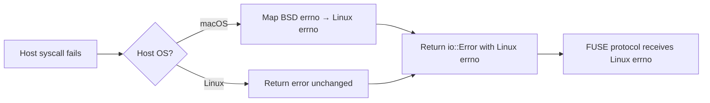
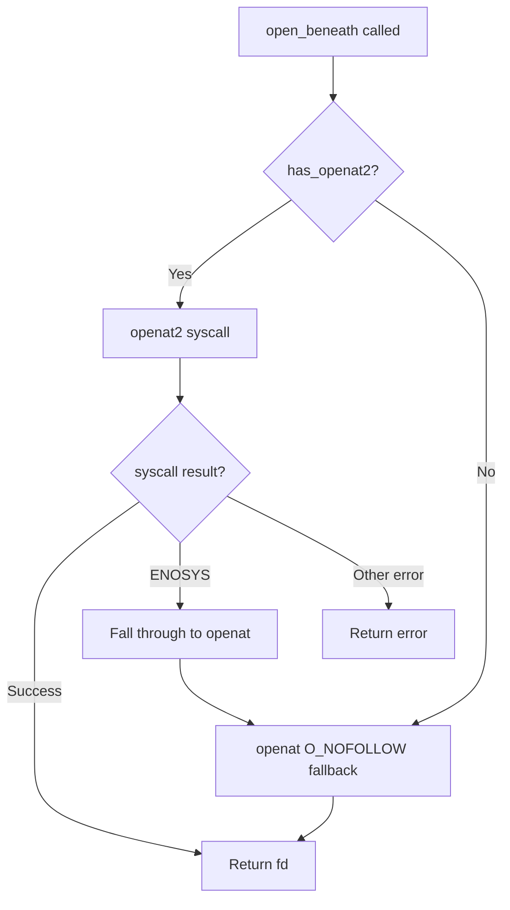

## Platform Abstraction — Errno Translation, Stat Helpers, openat2

**The platform module provides cross-platform abstractions for Linux and macOS, translating BSD errno values to Linux errno, wrapping stat syscalls, and implementing `openat2(RESOLVE_BENEATH)` for kernel-enforced path containment.**

## Errno Translation Flow



**Aha:** The entire errno translation table has 80+ mappings because macOS uses different errno numbers than Linux. For example, macOS `ENOATTR` (attribute not found) maps to Linux `ENODATA` (61), and `EOPNOTSUPP` is 102 on macOS but 95 on Linux. Without this translation, the guest kernel would receive invalid errno values and misinterpret errors.

## Errno Translation

Source: `backends/shared/platform.rs:224-327`

The FUSE protocol always expects Linux errno values. On Linux, errors pass through unchanged. On macOS, BSD errno values are mapped to their Linux equivalents:

```rust
#[cfg(target_os = "macos")]
fn linux_errno_raw(errno: i32) -> i32 {
    match errno {
        libc::EPERM => LINUX_EPERM,        // 1
        libc::ENOENT => LINUX_ENOENT,      // 2
        libc::EIO => LINUX_EIO,            // 5
        libc::EBADF => LINUX_EBADF,        // 9
        libc::EACCES => LINUX_EACCES,      // 13
        libc::EINVAL => LINUX_EINVAL,      // 22
        libc::ELOOP => LINUX_ELOOP,        // 40
        libc::ENOATTR => LINUX_ENODATA,    // 61 (macOS-specific)
        // ... 80+ mappings
    }
}
```

All filesystem operations must wrap OS errors with `linux_error()`:

```rust
let ret = unsafe { libc::openat(...) };
if ret < 0 {
    return Err(platform::linux_error(io::Error::last_os_error()));
}
```

## Error Helper Functions

Source: `backends/shared/platform.rs:330-432`

Convenience functions create `io::Error` with the correct Linux errno:

```rust
pub(crate) fn eio() -> io::Error { io::Error::from_raw_os_error(LINUX_EIO) }
pub(crate) fn ebadf() -> io::Error { io::Error::from_raw_os_error(LINUX_EBADF) }
pub(crate) fn einval() -> io::Error { io::Error::from_raw_os_error(LINUX_EINVAL) }
pub(crate) fn eperm() -> io::Error { io::Error::from_raw_os_error(LINUX_EPERM) }
pub(crate) fn enoent() -> io::Error { io::Error::from_raw_os_error(LINUX_ENOENT) }
pub(crate) fn eacces() -> io::Error { io::Error::from_raw_os_error(LINUX_EACCES) }
pub(crate) fn eloop() -> io::Error { io::Error::from_raw_os_error(LINUX_ELOOP) }
// ... 15+ more
```

## openat2 and RESOLVE_BENEATH

Source: `backends/shared/platform.rs:530-620`

`openat2` (Linux 5.6+) provides kernel-enforced path containment:



```rust
#[repr(C)]
pub(crate) struct OpenHow {
    flags: u64,
    mode: u64,
    resolve: u64,
}

pub(crate) const RESOLVE_BENEATH: u64 = 0x08;           // Block .. traversal
pub(crate) const RESOLVE_NO_SYMLINKS: u64 = 0x04;       // Block symlink traversal
pub(crate) const RESOLVE_NO_MAGICLINKS: u64 = 0x02;     // Block procfs magic links

const OPENAT2_RESOLVE_FLAGS: u64 =
    RESOLVE_BENEATH | RESOLVE_NO_SYMLINKS | RESOLVE_NO_MAGICLINKS;
```

Availability is probed at init time:

```rust
pub(crate) fn probe_openat2() -> bool {
    let how = OpenHow { flags: O_CLOEXEC | O_PATH, mode: 0, resolve: OPENAT2_RESOLVE_FLAGS };
    let ret = libc::syscall(SYS_OPENAT2, AT_FDCWD, c".".as_ptr(), &how, size_of::<OpenHow>());
    if ret >= 0 { unsafe { libc::close(ret as i32) }; true }
    else { !matches!(io::Error::last_os_error().raw_os_error(), Some(ENOSYS | EINVAL)) }
}
```

Fallback path when `openat2` is unavailable:

```rust
pub(crate) fn open_beneath(dirfd: RawFd, name: *const c_char, flags: i32,
    use_openat2: bool) -> RawFd {
    if use_openat2 {
        // Try openat2 first
        let ret = libc::syscall(SYS_OPENAT2, dirfd, name, &how, size_of::<OpenHow>());
        if ret >= 0 || io::Error::last_os_error().raw_os_error() != Some(ENOSYS) {
            return ret as i32;
        }
    }
    // Fall back to regular openat(O_NOFOLLOW)
    unsafe { libc::openat(dirfd, name, flags | libc::O_CLOEXEC) }
}
```

## statx to stat64 Conversion

Source: `backends/shared/platform.rs:627-646`

Used in the Linux lookup collapse optimization:

```rust
pub(crate) fn statx_to_stat64(stx: &libc::statx) -> stat64 {
    let mut st: stat64 = unsafe { std::mem::zeroed() };
    st.st_dev = makedev(stx.stx_dev_major, stx.stx_minor);
    st.st_ino = stx.stx_ino;
    st.st_nlink = stx.stx_nlink as _;
    st.st_mode = stx.stx_mode as _;
    st.st_uid = stx.stx_uid;
    st.st_gid = stx.stx_gid;
    st.st_rdev = makedev(stx.stx_rdev_major, stx.stx_rdev_minor);
    st.st_size = stx.stx_size as _;
    st.st_blksize = stx.stx_blksize as _;
    st.st_blocks = stx.stx_blocks as _;
    st.st_atime = stx.stx_atime.tv_sec;
    st.st_atime_nsec = stx.stx_atime.tv_nsec as _;
    st.st_mtime = stx.stx_mtime.tv_sec;
    st.st_mtime_nsec = stx.stx_mtime.tv_nsec as _;
    st.st_ctime = stx.stx_ctime.tv_sec;
    st.st_ctime_nsec = stx.stx_ctime.tv_nsec as _;
    st
}
```

The `makedev` function uses the Linux glibc formula:

```rust
fn makedev(major: u32, minor: u32) -> u64 {
    ((major as u64 & 0xfffff000) << 32)
        | ((major as u64 & 0x00000fff) << 8)
        | ((minor as u64 & 0xffffff00) << 12)
        | (minor as u64 & 0x000000ff)
}
```

## Platform Constants

Source: `backends/shared/platform.rs:116-185`

All mode bits, dirent types, and access constants are defined with platform-specific casting:

```rust
#[cfg(target_os = "linux")]
pub(crate) const MODE_TYPE_MASK: u32 = libc::S_IFMT;
#[cfg(target_os = "macos")]
pub(crate) const MODE_TYPE_MASK: u32 = libc::S_IFMT as u32;

pub(crate) const MODE_REG: u32 = libc::S_IFREG;    // Regular file
pub(crate) const MODE_DIR: u32 = libc::S_IFDIR;    // Directory
pub(crate) const MODE_LNK: u32 = libc::S_IFLNK;    // Symlink
pub(crate) const MODE_SETUID: u32 = libc::S_ISUID; // SUID bit
pub(crate) const MODE_SETGID: u32 = libc::S_ISGID; // SGID bit

pub(crate) const DIRENT_REG: u32 = libc::DT_REG as u32;
pub(crate) const DIRENT_DIR: u32 = libc::DT_DIR as u32;
pub(crate) const DIRENT_LNK: u32 = libc::DT_LNK as u32;
```

## Setattr Timespec Building

Source: `backends/shared/platform.rs:192-217`

Builds a `futimens`-compatible timespec array from FUSE setattr flags:

```rust
pub(crate) fn build_timespecs(attr: stat64, valid: SetattrValid) -> [libc::timespec; 2] {
    let mut times = [libc::timespec { tv_sec: 0, tv_nsec: libc::UTIME_OMIT }; 2];

    if valid.contains(SetattrValid::ATIME) {
        if valid.contains(SetattrValid::ATIME_NOW) {
            times[0].tv_nsec = libc::UTIME_NOW;
        } else {
            times[0].tv_sec = attr.st_atime;
            times[0].tv_nsec = attr.st_atime_nsec;
        }
    }
    // ... MTIME handling
    times
}
```

## What's Next

- [08 — Cross-Cutting](08-cross-cutting.md) — Security, build system, testing
- [03 — Inode Management](03-inode-management.md) — Return to inode management
- [00 — Overview](00-overview.md) — Return to overview
