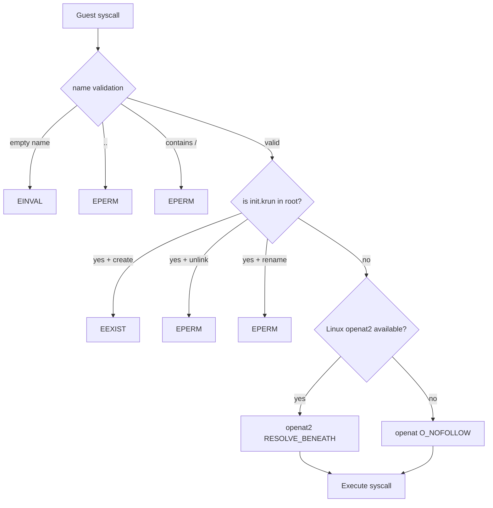

# Cross-Cutting Concerns — Security, Build System, Testing, Integration

**This document covers the security model, build system, testing strategy, and integration points for iii-filesystem.**

## Security Model



### Name Validation

Source: `backends/shared/name_validation.rs`

Every operation that accepts a guest-provided name validates it first:

```rust
pub(crate) fn validate_name(name: &CStr) -> io::Result<()> {
    let bytes = name.to_bytes();
    if bytes.is_empty() { return Err(platform::einval()); }
    if bytes == b".." { return Err(platform::eperm()); }
    if bytes.contains(&b'/') { return Err(platform::eperm()); }
    Ok(())
}
```

**Aha:** Backslash is intentionally allowed — it is a valid filename character on Linux. The filesystem operates on raw bytes, not path-separator-aware strings. Rejecting backslash would break legitimate filenames like `a\b` on Linux.

### Path Containment (Linux)

`openat2(RESOLVE_BENEATH | RESOLVE_NO_SYMLINKS | RESOLVE_NO_MAGICLINKS)` provides atomic kernel-enforced containment:

| Attack Vector | Mitigation |
|--------------|------------|
| `../` traversal | `RESOLVE_BENEATH` blocks escape from root dir |
| Symlink to outside | `RESOLVE_NO_SYMLINKS` rejects all symlinks |
| `/proc/self/fd/N` magic link | `RESOLVE_NO_MAGICLINKS` blocks procfs links |
| Concurrent rename race | `RESOLVE_BENEATH` is atomic with the open |

On older kernels (pre-5.6), falls back to `openat(O_NOFOLLOW)`.

### Init Binary Protection

The virtual `/init.krun` file is protected across all operations:

| Operation | Protection |
|-----------|-----------|
| Create/mkdir/symlink | `EEXIST` if name is "init.krun" in root |
| Unlink/rmdir | `EPERM` if name is "init.krun" in root |
| Rename (source or target) | `EPERM` if name is "init.krun" in root |
| Setattr | `EPERM` if inode is INIT_INODE (2) |
| Link | `EPERM` if linking INIT_INODE |
| Write | `EPERM` if handle is INIT_HANDLE (0) |
| Readlink | `EINVAL` if inode is INIT_INODE |

### Writeback Cache: SUID/SGID Clearing

Source: `backends/passthroughfs/file_ops.rs:129-143`

When `kill_priv` is true (HANDLE_KILLPRIV_V2 negotiation) and writeback cache is active:

```rust
if kill_priv && fs.writeback.load(Ordering::Relaxed) {
    let st = platform::fstat(fd)?;
    let mode = platform::mode_u32(st.st_mode);
    if mode & (MODE_SETUID | MODE_SETGID) != 0 {
        unsafe { libc::fchmod(fd, mode & !(MODE_SETUID | MODE_SETGID)) };
    }
}
```

Clears SUID/SGID bits after a write to prevent privilege escalation via cached writes.

## Build System

### Features

Source: `Cargo.toml:20-22`

```toml
[features]
default = []
embed-init = []  # Embeds iii-init binary into the crate
```

When `embed-init` is enabled, `build.rs` copies the cross-compiled `iii-init` binary (Linux musl) into `OUT_DIR` and sets the `has_init_binary` cfg flag.

### Cross-Platform Builds

| Host | Guest Arch | Init Binary |
|------|-----------|-------------|
| macOS x86_64 | x86_64-unknown-linux-musl | `target/x86_64-unknown-linux-musl/release/iii-init` |
| macOS aarch64 | aarch64-unknown-linux-musl | `target/aarch64-unknown-linux-musl/release/iii-init` |
| Linux x86_64 | x86_64-unknown-linux-musl | `target/x86_64-unknown-linux-musl/release/iii-init` |
| Linux aarch64 | aarch64-unknown-linux-musl | `target/aarch64-unknown-linux-musl/release/iii-init` |

**Aha:** VMs always run Linux guests, so the init binary is always a Linux musl binary regardless of the host OS. Even on macOS, the guest sees a Linux environment via krun.

## Build System Flow

```mermaid
flowchart TD
    A[cargo build] --> B{embed-init feature?}
    B -->|No| C[Write [0u8] placeholder]
    B -->|Yes| D[Determine target arch]
    D --> E[Check target/release/iii-init]
    E -->|Exists| F[Copy to OUT_DIR]
    E -->|Missing| C
    F --> G{Binary > 1 byte?}
    G -->|Yes| H[Set has_init_binary cfg]
    G -->|No| I[No cfg set]
    H --> J[include_bytes! real binary]
    I --> K[include_bytes! empty slice]
    C --> K
```

### Rerun Triggers

Source: `build.rs:4-5, 41`

```rust
println!("cargo:rerun-if-changed=build.rs");
println!("cargo:rerun-if-changed={}", binary_path.display());
```

The build.rs tracks the cross-compiled binary itself, not the iii-init source tree. This ensures the embedded binary is updated whenever `make sandbox` rebuilds it, even if the iii-init source hasn't changed (because a transitive dependency like iii-supervisor changed).

## Testing Strategy

### Unit Tests

Embedded in source files via `#[cfg(test)]` modules:

| Module | Test Count | Coverage |
|--------|-----------|----------|
| `passthroughfs/mod.rs` | 8 | Cache policy, config defaults, destroy reclamation |
| `passthroughfs/builder.rs` | 9 | Builder validation, defaults, custom settings |
| `passthroughfs/inode.rs` | 9 | Flag translation, vol_path, InodeFd |
| `shared/inode_table.rs` | 5 | MultikeyBTreeMap insert/get/remove |
| `shared/init_binary.rs` | 4 | has_init, init_stat, is_init_name |
| `shared/name_validation.rs` | 5 | Normal names, empty, dotdot, slash, backslash |
| `shared/platform.rs` | 22 | Errno helpers, dirent types, timespecs, fstat |

### Integration Tests

Source: `tests/filesystem_integration.rs` (684 lines)

Tests exercise real filesystem operations via the `DynFileSystem` trait:

| Test | What It Verifies |
|------|-----------------|
| `lookup_existing_file` | Lookup returns non-zero inode |
| `lookup_nonexistent_returns_error` | ENOENT for missing files |
| `getattr_root` | Root is a directory |
| `getattr_file_size` | stat size matches file content |
| `mkdir_and_lookup` | Directory creation and lookup |
| `create_write_read_roundtrip` | Full create→write→read cycle |
| `unlink_removes_file` | Unlink removes directory entry |
| `rmdir_removes_directory` | Rmdir removes empty directory |
| `opendir_readdir_readdirplus` | Directory listing with attributes |
| `rename_file` | Rename preserves inode |
| `symlink_and_readlink` | Symlink creation and target reading |
| `statfs_returns_ok` | Filesystem statistics |
| `open_read_existing_file` | Open and read pre-existing file |
| `readdir_pagination_with_nonzero_offset` | Pagination via offset |
| `nested_directory_lookup_open_read_python_encodings` | Deep nested tree traversal |

### Test Harness

Source: `tests/filesystem_integration.rs:24-50`

```rust
struct FsHarness {
    fs: PassthroughFs,
    _dir: tempfile::TempDir,  // Auto-cleanup on drop
}

fn setup_fs() -> FsHarness {
    let dir = tempfile::tempdir().unwrap();
    let fs = PassthroughFs::builder()
        .root_dir(dir.path())
        .cache_policy(CachePolicy::Never)  // Never cache for test isolation
        .build()
        .unwrap();
    fs.init(FsOptions::empty()).unwrap();
    FsHarness { fs, _dir: dir }
}
```

### Zero-Copy Test Doubles

Source: `tests/filesystem_integration.rs:53-97`

Test implementations of `ZeroCopyWriter` and `ZeroCopyReader` use `FileExt::read_at`/`write_at` (position-independent) to capture data in memory:

```rust
impl ZeroCopyWriter for TestWriter {
    fn write_from(&mut self, f: &File, count: usize, off: u64) -> io::Result<usize> {
        let mut tmp = vec![0u8; count];
        let n = f.read_at(&mut tmp, off)?;
        self.buf.extend_from_slice(&tmp[..n]);
        Ok(n)
    }
}
```

## Integration with iii-worker

The `iii-worker` crate (42,998 LOC) uses `iii-filesystem` to provide filesystem access to sandboxed VMs:

```rust
use iii_filesystem::{PassthroughFs, PassthroughConfig, CachePolicy};

let fs = PassthroughFs::builder()
    .root_dir(sandbox_root)
    .cache_policy(CachePolicy::Auto)
    .build()?;

// Pass to krun VM as the filesystem backend
vm.add_filesystem(fs)?;
```

## What's Next

- [00 — Overview](00-overview.md) — Return to overview
- [01 — Architecture](01-architecture.md) — Return to architecture
- [02 — PassthroughFs](02-passthrough-fs.md) — Return to PassthroughFs core
