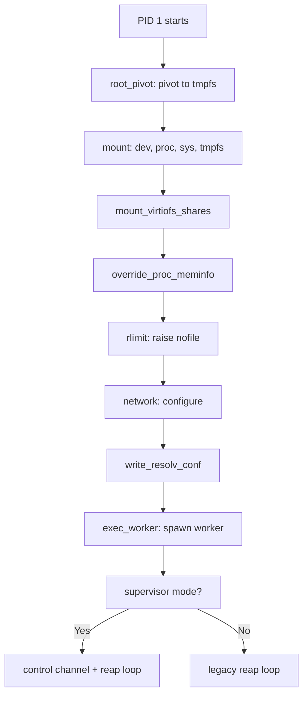
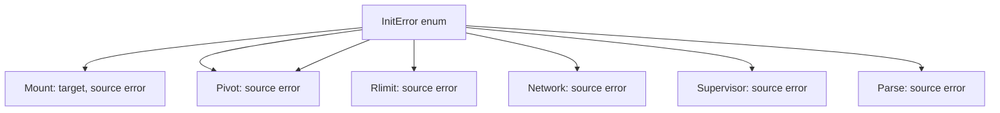

# iii-init — PID 1 Init Binary for iii microVM Workers

**iii-init is the PID 1 init binary that boots every iii microVM worker.** It sets up the guest filesystem, mounts essential kernel filesystems, configures networking, and then execs the user worker process.

## What It Does



## Boot Sequence

Source: `main.rs:18-41`

```rust
fn run() -> Result<(), InitError> {
    iii_init::root_pivot::pivot_to_tmpfs_root()?;
    iii_init::mount::mount_filesystems()?;
    iii_init::mount::mount_virtiofs_shares();
    iii_init::mount::override_proc_meminfo();
    iii_init::rlimit::raise_nofile()?;
    iii_init::network::configure_network()?;
    if let Err(e) = iii_init::network::write_resolv_conf() {
        eprintln!("iii-init: warning: {e} (DNS may use existing resolv.conf)");
    }
    iii_init::supervisor::exec_worker()?;
    Ok(())
}
```

**Aha:** The entire init binary is Linux-only — it won't even compile on macOS. The `main.rs` has a `#[cfg(target_os = "linux")]` guard that prints a helpful error message for cross-compilation mistakes.

## Crate Structure

```
iii-init/
├── Cargo.toml              # Package: "PID 1 init binary for iii microVM workers"
├── src/
│   ├── main.rs             # Entry point: 41 lines
│   ├── lib.rs              # Library facade: 36 lines
│   ├── error.rs            # InitError enum: 56 lines
│   ├── root_pivot.rs       # Root filesystem pivot: 606 lines
│   ├── mount.rs            # Mount sequence: 418 lines
│   ├── rlimit.rs           # File descriptor limits: 75 lines
│   ├── network.rs          # Network configuration: 336 lines
│   ├── supervisor.rs       # PID-1 supervision: 407 lines
│   ├── shell_dispatcher.rs # Shell channel dispatcher: 1,604 lines
│   ├── fs_handler.rs       # Filesystem ops dispatcher: 74 lines
│   │   ├── ops.rs          # Native fs operations: 907 lines
│   │   ├── streaming.rs    # Streaming read/write: 308 lines
│   │   └── tests.rs        # Integration tests: 1,288 lines
│   ├── parse.rs            # Command-line parsing: 129 lines
│   └── child_exits.rs      # Child exit code handling: 144 lines
```

## Dependencies

| Dependency | Purpose |
|------------|---------|
| `nix = "0.31"` | Linux syscalls: mount, signal, process, fs |
| `libc = "0.2"` | Raw syscall access |
| `iii-supervisor` | Control channel RPC |
| `iii-shell-proto` | Shell protocol message types |
| `base64 = "0.22"` | Binary encoding in shell frames |
| `regex = "1"` | Native grep/sed regex matching |
| `walkdir = "2"` | Recursive chmod/tree walking |
| `uuid = "1"` | Temp file naming for streaming writes |

## Key Design Decisions

| Decision | Why |
|----------|-----|
| Root pivot to tmpfs | libkrun virtiofs has readdir bug that OOM-kills `ls /` |
| `/proc/meminfo` override | Bun's Zig allocator reads MemTotal directly, ignores cgroups |
| Sync-only fs_handler | No tokio runtime — keeps binary cross-compilable to linux-musl |
| Supervisor in init binary | Removes extra binary, extra exec hop, install plumbing |
| Library target | Integration tests can import real types instead of redefining |

## Error Types



## What's Next

- [01 — Boot Sequence](01-boot-sequence.md) — Step-by-step boot walkthrough
- [02 — Root Pivot](02-root-pivot.md) — The virtiofs readdir workaround
- [03 — Mount Sequence](03-mount-sequence.md) — Essential filesystem mounts
