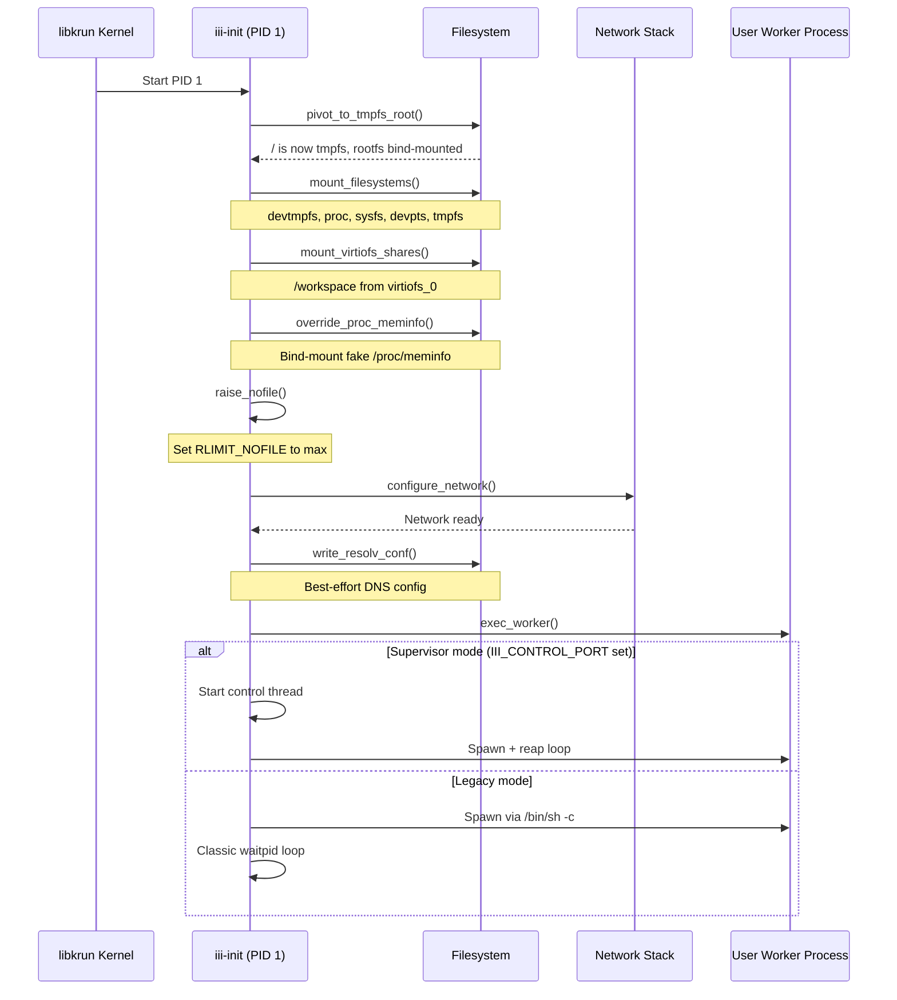
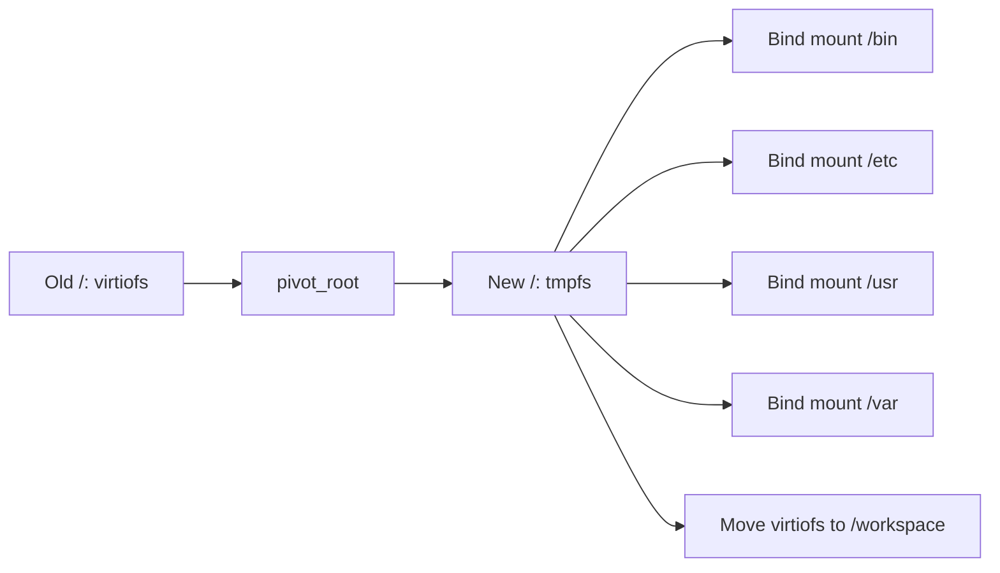

# Boot Sequence — Step-by-step PID 1 Initialization

**iii-init follows a strict boot sequence, each step depending on the previous one.** This document walks through each step.

## Complete Boot Flow

## Step 1: Root Pivot

Replaces `/` (virtiofs) with a tmpfs, then bind-mounts rootfs content back. See [02 — Root Pivot](02-root-pivot.md).

**Aha:** The pivot uses `pivot_root()` syscall — it's not a chroot. The old root becomes a mount point inside the new root (`/workspace`), so the virtiofs content is still accessible through bind mounts but `ls /` never sees the buggy readdir path again.

## Step 2: Mount Filesystems

Mounts devtmpfs, proc, sysfs, devpts, tmpfs on `/dev/shm`, `/tmp`, `/run`. See [03 — Mount Sequence](03-mount-sequence.md).

## Step 3: Mount virtiofs Shares

Bind-mounts the libkrun virtiofs shares (rootfs content) into the new tmpfs root.

## Step 4: Override /proc/meminfo

Fakes `/proc/meminfo::MemTotal` to the per-worker memory cap. See below.

## Step 5: Raise File Descriptor Limits

Sets `RLIMIT_NOFILE` to the maximum allowed value.

## Step 6: Configure Network

Sets up networking inside the VM. See [07 — Network](07-network.md).

## Step 7: Write resolv.conf

Best-effort DNS configuration. If this fails, DNS uses existing config.

## Step 8: Exec Worker

Spawns the user worker process. Two modes:

| Mode | Trigger | Behavior |
|------|---------|----------|
| Legacy | `III_CONTROL_PORT` unset | `/bin/sh -c $III_WORKER_CMD`, classic reap |
| Supervisor | `III_CONTROL_PORT` set | Control channel + respawn on restart |

See [04 — Supervisor](04-supervisor.md).

## What's Next

- [02 — Root Pivot](02-root-pivot.md) — The virtiofs readdir workaround
- [03 — Mount Sequence](03-mount-sequence.md) — Essential filesystem mounts
- [04 — Supervisor](04-supervisor.md) — PID-1 supervision modes
