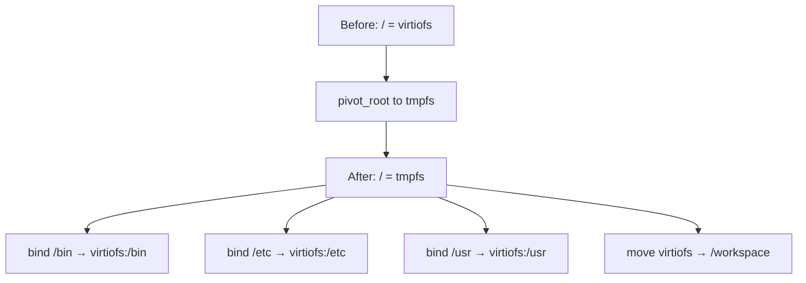
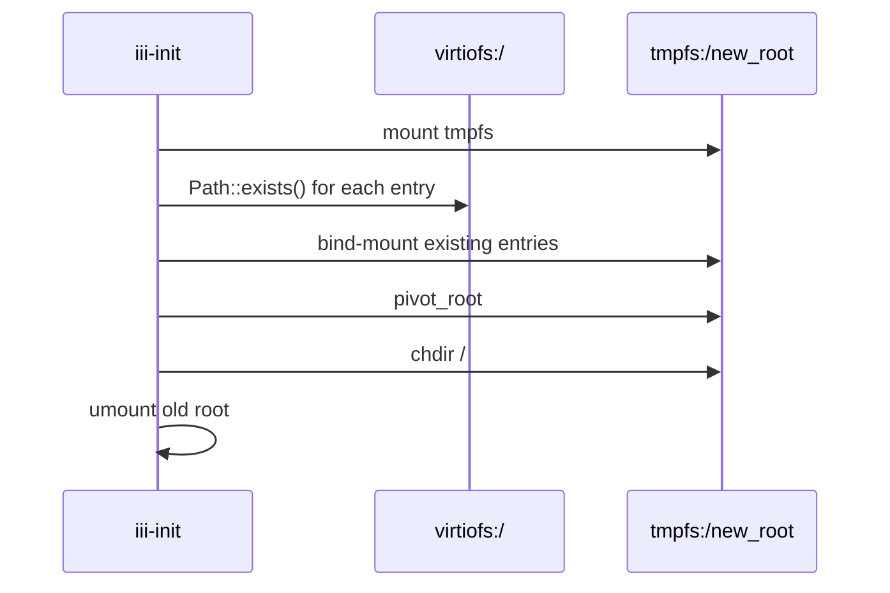

# Root Pivot — virtiofs Readdir Workaround

**iii-init pivots the guest root off libkrun's virtiofs share onto a tmpfs to work around a readdir bug that OOM-kills any process listing the root directory.**

## The Problem

Source: `root_pivot.rs:12-25`

libkrun's virtiofs has a bug on the shared directory's root: `getdents64` returns duplicate or looping entries for `/`. This causes `ls /` to accumulate ~90+ MiB of dirent state before the guest OOM-kills it:

```
$ ls /
Killed  (SIGKILL, exit 137)
```

The bug is localized to the virtiofs mount's top-level directory. Deeper paths (`/etc`, `/usr/bin`) work correctly.

## The Fix: tmpfs Root + Bind Mounts

Source: `root_pivot.rs:27-44`



**Aha:** The old virtiofs root stays pinned in the kernel's mount table (referenced by the bind mounts) but is never exposed in any namespace path. `ls /` can never touch it again.

## Pivot Sequence

Source: `root_pivot.rs:94-130`



The pivot uses a curated allowlist of rootfs entries — it CANNOT enumerate the rootfs via `readdir` (that's what triggers the bug). Instead, it uses `Path::exists()` which is a single stat call, not a readdir:

```rust
const ROOTFS_ENTRIES: &[(&str, bool)] = &[
    ("app", true),      // Docker convention
    ("bin", true),      // FHS
    ("boot", true),
    ("etc", true),
    ("home", true),
    ("lib", true),
    ("lib64", true),
    ("media", true),
    ("mnt", true),
    ("opt", true),
    ("root", true),
    ("run", true),
    ("sbin", true),
    ("srv", true),      // FHS: service data
    ("tmp", true),
    ("usr", true),
    ("var", true),
    ("workspace", true), // iii convention
    ("init.krun", false), // File, not directory
    // ... more
];
```

## Caveats

1. Any top-level entry not in the allowlist is unreachable post-pivot
2. If pivot fails part-way, the VM is left in a partially constructed state
3. The dynamic workdir from `III_WORKER_WORKDIR` is appended at runtime

## What's Next

- [03 — Mount Sequence](03-mount-sequence.md) — Essential filesystem mounts
- [01 — Boot Sequence](01-boot-sequence.md) — Return to boot sequence
- [00 — Overview](00-overview.md) — Return to overview
