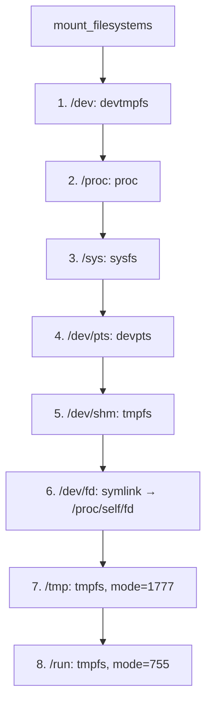

# Mount Sequence — Essential Linux Filesystems

**iii-init mounts essential Linux filesystems in a specific order to create a functional guest environment.**

## Mount Sequence

Source: `mount.rs:39-49`

| Step | Target | Filesystem | Flags | Purpose |
|------|--------|-----------|-------|---------|
| 1 | `/dev` | devtmpfs | `MS_RELATIME` | Device nodes |
| 2 | `/proc` | proc | `MS_NODEV|MS_NOEXEC|MS_NOSUID` | Process info |
| 3 | `/sys` | sysfs | `MS_NODEV|MS_NOEXEC|MS_NOSUID` | Kernel interfaces |
| 4 | `/dev/pts` | devpts | `MS_NOEXEC|MS_NOSUID` | Pseudo-terminals |
| 5 | `/dev/shm` | tmpfs | `MS_NOEXEC|MS_NOSUID` | Shared memory |
| 6 | `/dev/fd` | symlink | → `/proc/self/fd` | File descriptor access |
| 7 | `/tmp` | tmpfs | `MS_NOSUID|MS_NODEV, mode=1777` | Temp files |
| 8 | `/run` | tmpfs | `MS_NOSUID|MS_NODEV, mode=755` | Runtime data |

## /proc/meminfo Override

Source: `mount.rs` — `override_proc_meminfo()`

**Aha:** Bun's Zig allocator reads `MemTotal` from `/proc/meminfo` directly and ignores cgroup v2 `memory.max`. The override bind-mounts a fake `/proc/meminfo` with the correct `MemTotal` value so Bun sees the per-worker memory cap.

## virtiofs Shares

Source: `mount.rs` — `mount_virtiofs_shares()`

Bind-mounts the libkrun virtiofs shares (rootfs content) into the new tmpfs root after the pivot.

## What's Next

- [04 — Supervisor](04-supervisor.md) — PID-1 supervision modes
- [02 — Root Pivot](02-root-pivot.md) — Return to root pivot
- [07 — Network](07-network.md) — Network configuration
