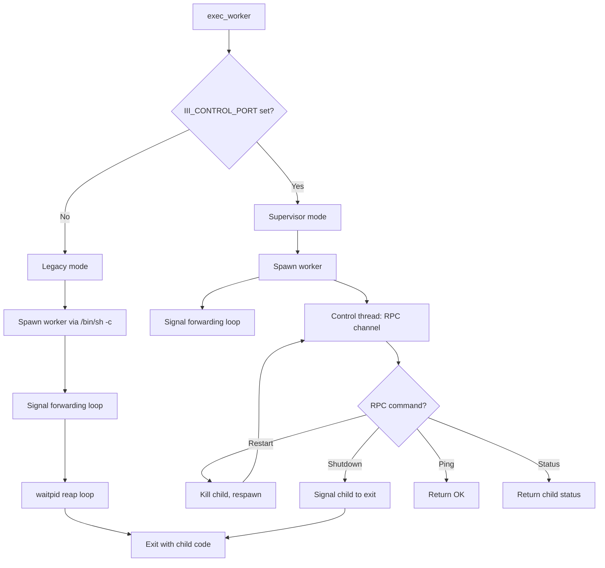
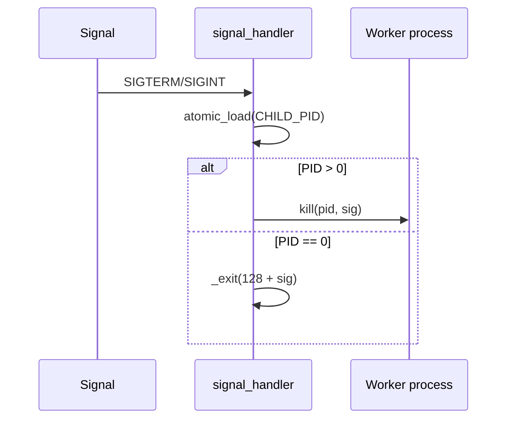

# Supervisor — PID-1 Supervision of Worker Processes

**iii-init's supervisor mode manages the user worker process with host-driven restart capability via a virtio-console control channel.**

## Two Modes

Source: `supervisor.rs:9-32`

**Aha:** Supervisor mode replaced the earlier architecture where a separate `iii-supervisor` binary lived at `/opt/iii/supervisor` inside the rootfs. The init binary already runs as PID 1, so absorbing the control-channel loop removes the extra binary, the extra exec hop, and the install plumbing.

## Signal Forwarding

Source: `supervisor.rs:67-80`

Only calls async-signal-safe functions: atomic load, `libc::kill`, `libc::_exit`.

## Environment Variables

| Variable | Purpose |
|----------|---------|
| `III_CONTROL_PORT` | Virtio-console port name for control channel (triggers supervisor mode) |
| `III_WORKER_WORKDIR` | Working directory for supervisor mode (defaults to `/workspace`) |
| `III_SHELL_PORT` | Virtio-console port for `iii worker exec` shell channel |
| `III_WORKER_CMD` | Command to execute (legacy mode) |

## What's Next

- [05 — Shell Dispatcher](05-shell-dispatcher.md) — virtio-console shell channel
- [01 — Boot Sequence](01-boot-sequence.md) — Return to boot sequence
- [00 — Overview](00-overview.md) — Return to overview
