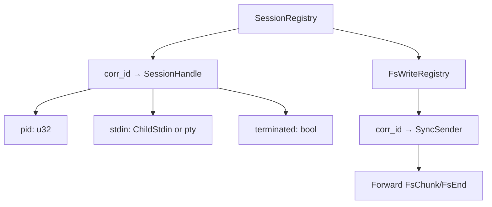

# Shell Dispatcher — virtio-console Shell Channel

**The shell dispatcher handles `iii worker exec` commands inside the VM, multiplexing concurrent exec sessions over a single virtio-console port.**

## Architecture

Source: `shell_dispatcher.rs:7-28`

```mermaid
flowchart TB
    subgraph Host["Host (iii worker exec)"]
        H1["Shell client sends frames"]
    end

    subchild["Child Process"]
        C1["stdin/stdout/stderr or pty"]
    end

    subgraph Dispatcher["Guest shell_dispatcher"]
        R1["Reader thread"]
        D1["Route by corr_id"]
        S1["stdout reader"]
        S2["stderr reader"]
        S3["Wait thread"]
        W1["Writer (shared mutex)"]
    end

    H1 -->|"Frames"| R1
    R1 --> D1
    D1 -->|"Spawn"| C1
    C1 --> S1 & S2 & S3
    S1 & S2 & S3 -->|"Output"| W1
    W1 -->|"Frames"| H1
    D1 -->|"stdin"| C1
```

**Aha:** All writes funnel through `Arc<Mutex<File>>` so frames don't interleave on the wire. The dispatcher uses correlation IDs (`corr_id`) to multiplex many concurrent exec sessions over a single port.

## Threading Model

| Thread | Purpose |
|--------|---------|
| Reader (one per port) | Reads frames, dispatches by `corr_id` |
| Per-session stdout reader | Streams child output back |
| Per-session stderr reader | Streams child error output back |
| Per-session wait thread | Observes child exit, sends `Exited` frame |
| Writer (one shared) | Drains channel onto virtio-console port |

## TTY Mode

Source: `shell_dispatcher.rs:13-17`

TTY mode allocates a pseudo-terminal via `openpty(3)` and points the child's stdin/stdout/stderr at the slave so `isatty(3)` says yes. This is needed for:
- Interactive shells
- Line editors
- Programs that toggle buffering based on terminal detection

## Session Registry

Source: `shell_dispatcher.rs:47-68`



**Aha:** The only state kept per session is the pid and the open stdin handle. The stdout/stderr reader threads and the waiter thread own their own `Child` pieces and finish independently — the waiter removes the entry from the registry after emitting the terminal frame.

## What's Next

- [06 — FS Handler](06-fs-handler.md) — Native filesystem operations
- [04 — Supervisor](04-supervisor.md) — Return to supervisor
- [01 — Boot Sequence](01-boot-sequence.md) — Return to boot sequence
