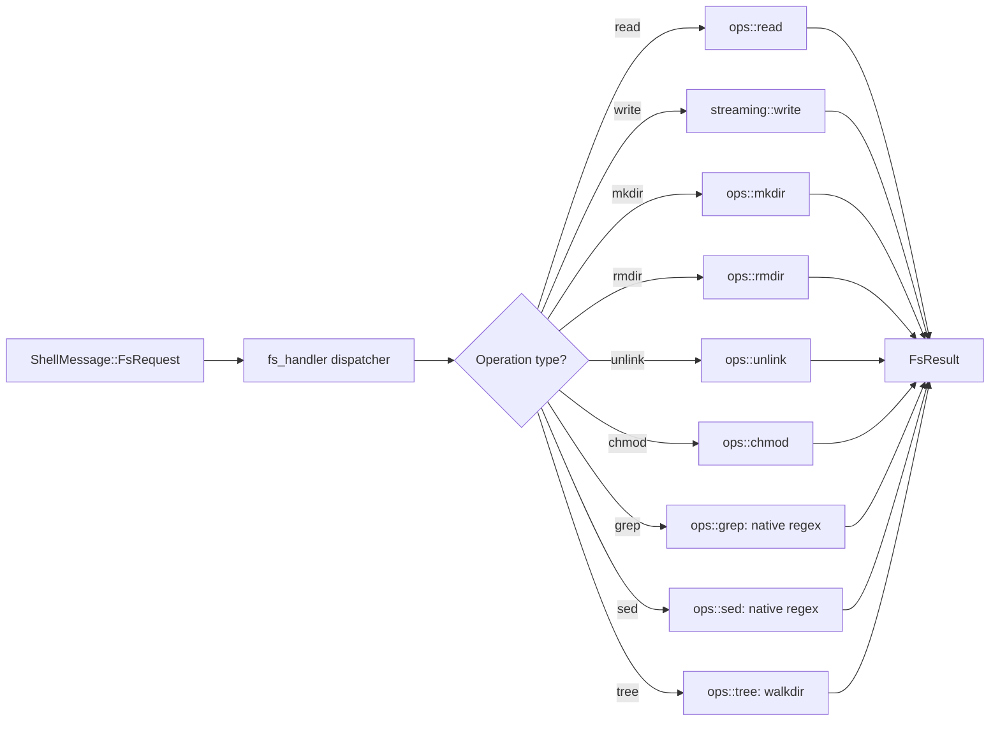
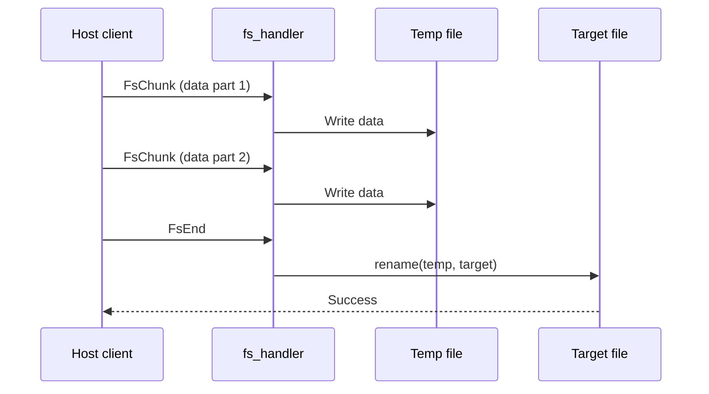

# FS Handler — Native Filesystem Operations

**The fs_handler provides native Rust filesystem operations inside the VM — no child processes, no shell-outs.**

## Architecture

Source: `fs_handler.rs:7-22`

**Aha:** The fs_handler is sync-only — no `tokio`, no `async fn`, no `AsyncRead`/`AsyncWrite`. All I/O uses `std::fs` and `std::io`. This keeps the binary cross-compilable to linux-musl without a tokio runtime.

## Error Codes

Source: `fs_handler.rs:37-62`

Error codes mirror the worker-side `SandboxError` codes for consistent serialization:

| Code | Meaning | Trigger |
|------|---------|---------|
| `S210` | Invalid input (e.g., bad octal mode) | Invalid parameters |
| `S211` | Path not found | `io::ErrorKind::NotFound` |
| `S213` | Path already exists | `io::ErrorKind::AlreadyExists` |
| `S215` | Permission denied | `io::ErrorKind::PermissionDenied` |
| `S216` | Other I/O error | All other error kinds |

## Key Operations

| Operation | Implementation | Dependencies |
|-----------|---------------|-------------|
| `read` | `std::fs::read` | — |
| `write` | Streaming via `FsChunk` frames | `uuid` for temp file naming |
| `mkdir` | `std::fs::create_dir_all` | — |
| `chmod` | `nix::sys::stat::chmod` (+ recursive via `walkdir`) | `walkdir` |
| `grep` | Native regex matching | `regex` |
| `sed` | Native regex substitution | `regex` |
| `tree` | Recursive directory listing | `walkdir` |

## Streaming Writes

Source: `fs_handler/streaming.rs` (308 lines)

Streaming writes use temp files with UUID-based naming to avoid partial writes on disk:

1. Receive `FsChunk` frames with correlation ID
2. Write to temp file
3. On `FsEnd`, rename temp file to target (atomic on same filesystem)
4. On error, delete temp file

## What's Next

- [07 — Network](07-network.md) — Network configuration inside the VM
- [05 — Shell Dispatcher](05-shell-dispatcher.md) — Return to shell dispatcher
- [00 — Overview](00-overview.md) — Return to overview
