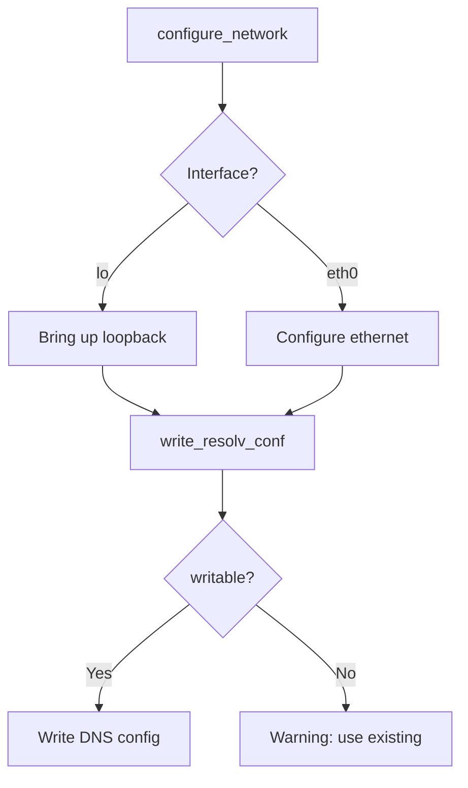
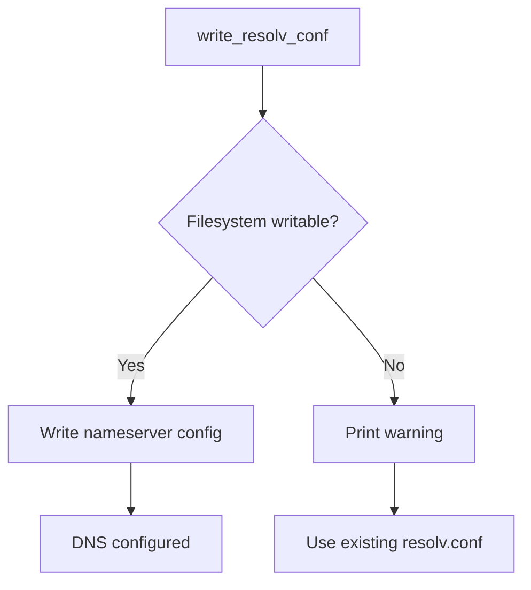

# Network — Network Configuration Inside the VM

**iii-init configures networking inside the microVM so the worker process can make outbound connections.**

## Network Configuration

Source: `network.rs` (336 lines)



**Aha:** The network configuration runs inside the isolated microVM — it's not the host network. The VM gets its own network namespace with loopback and a virtio-net interface provided by libkrun.

## resolv.conf

Source: `network.rs` — `write_resolv_conf()`



Best-effort DNS configuration. If writing fails (e.g., read-only filesystem), a warning is printed and DNS uses any existing `resolv.conf`.

```rust
if let Err(e) = iii_init::network::write_resolv_conf() {
    eprintln!("iii-init: warning: {e} (DNS may use existing resolv.conf)");
}
```

## What's Next

- [08 — Cross-Cutting](08-cross-cutting.md) — Testing, cross-compilation, parse module
- [03 — Mount Sequence](03-mount-sequence.md) — Return to mount sequence
- [00 — Overview](00-overview.md) — Return to overview
