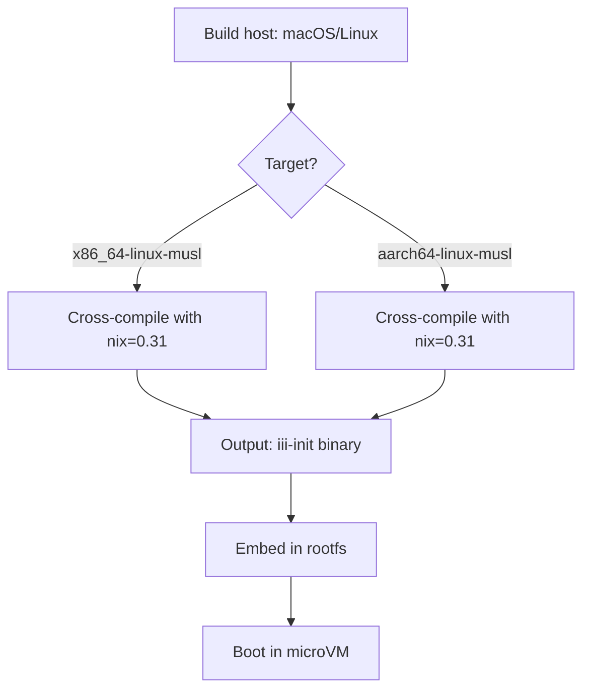
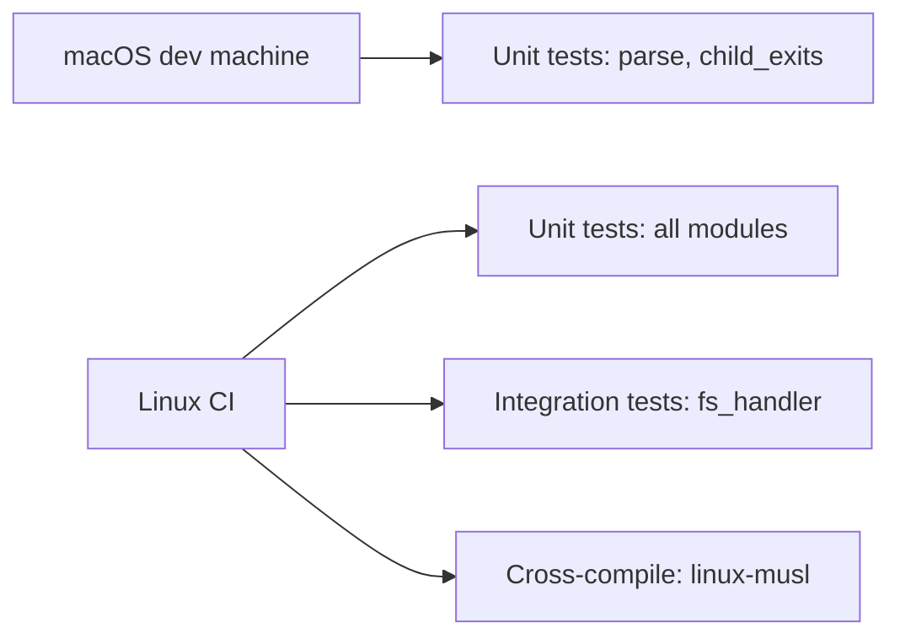

# Cross-Cutting — Testing, Cross-Compilation, Parsing

**This document covers cross-cutting concerns: testing strategy, cross-compilation design, and the parse module.**

## Cross-Compilation Design

Source: `Cargo.toml`, `lib.rs`

iii-init is a **Linux-guest-only** binary. It cross-compiles to `*-unknown-linux-musl` targets:



**Aha:** The crate uses `#[cfg(target_os = "linux")]` guards extensively so the library target can be unit-tested on macOS developer machines for the platform-agnostic modules (`parse.rs`, `child_exits.rs`).

### Platform-Agnostic Modules

| Module | Platform | Why |
|--------|----------|-----|
| `parse.rs` | All | Pure parser, no syscalls |
| `child_exits.rs` | All | In-memory registry + channels |
| `fs_handler/tests.rs` | Linux only | Uses Linux-specific APIs |



## Testing Strategy

Source: `Cargo.toml` — `dev-dependencies`

| Test Type | Location | Purpose |
|-----------|----------|---------|
| Unit tests | `#[cfg(test)]` modules | Module-level testing |
| Integration | `fs_handler/tests.rs` (1,288 lines) | Full filesystem ops testing |

### Tempdir-Based Testing

Source: `root_pivot.rs` tests

The root_pivot tests use `tempfile` to build a fake rootfs and exercise `enumerate_rootfs_entries` without Linux mount privileges.

## Parse Module

Source: `parse.rs` (129 lines)

Pure parser for command-line arguments inside the VM. No Linux syscalls — compiled on every platform for unit testing.

## Child Exit Codes

Source: `child_exits.rs` (144 lines)

Handles child exit code interpretation. Platform-agnostic — runs on macOS for unit tests.

## Error Types

Source: `error.rs` (56 lines)

```rust
pub enum InitError {
    // Mount errors
    // Directory creation failures
    // Signal handling errors
    // Process spawn failures
    // etc.
}
```

## What's Next

- [00 — Overview](00-overview.md) — Return to overview
- [01 — Boot Sequence](01-boot-sequence.md) — Return to boot sequence
- [04 — Supervisor](04-supervisor.md) — Return to supervisor
