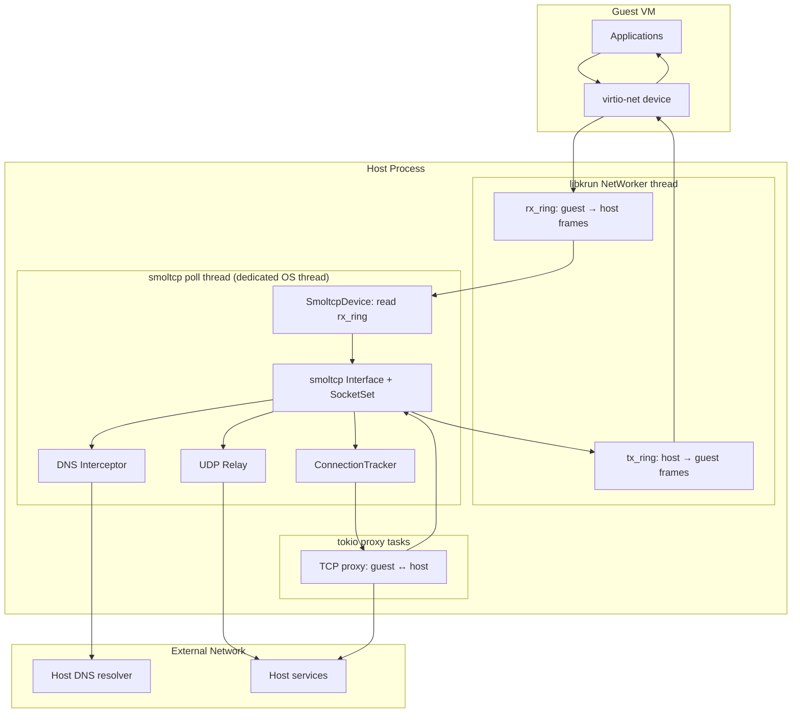
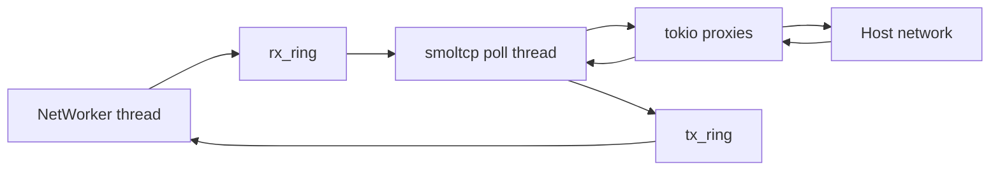

# iii-network — Userspace TCP/IP for VM Sandboxes

**iii-network provides a userspace TCP/IP stack for iii worker VM sandboxes using smoltcp, bridging guest ethernet frames through shared memory to proxy tasks.**

## What It Does



**Aha:** The entire TCP/IP stack runs in userspace via smoltcp — no kernel networking, no TUN/TAP devices, no root privileges needed. This is critical for sandboxed VMs where the host doesn't want to expose its network stack.

## Crate Structure

```
iii-network/
├── Cargo.toml              # smoltcp 0.13, hickory-resolver 0.25, tokio
├── src/
│   ├── lib.rs              # Library facade (31 lines)
│   ├── config.rs           # NetworkConfig (35 lines)
│   ├── shared.rs           # SharedState: shared-memory queue (123 lines)
│   ├── device.rs           # SmoltcpDevice: smoltcp Device impl (258 lines)
│   ├── conn.rs             # ConnectionTracker: track TCP connections (377 lines)
│   ├── dns.rs              # DnsInterceptor: guest DNS hijack (249 lines)
│   ├── udp_relay.rs        # UdpRelay: non-DNS UDP outside smoltcp (309 lines)
│   ├── proxy.rs            # TCP proxy: guest ↔ host (159 lines)
│   ├── stack.rs            # smoltcp poll loop (602 lines)
│   ├── network.rs          # SmoltcpNetwork: top-level orchestrator (172 lines)
│   ├── backend.rs          # SmoltcpBackend: poll thread runner (197 lines)
│   └── wake_pipe.rs        # WakePipe: tokio-wake for poll thread (149 lines)
```

## Dependencies

| Dependency | Purpose |
|------------|---------|
| `smoltcp = "0.13"` | Userspace TCP/IP stack |
| `msb_krun = "0.1.9"` | virtio-net ring buffers |
| `tokio` | Async proxy tasks |
| `hickory-resolver = "0.25"` | DNS resolution |
| `crossbeam-queue = "0.3"` | Lock-free frame queues |
| `libc = "0.2"` | Raw syscalls |
| `bytes = "1"` | Buffer management |

## Threading Model



## Key Design Decisions

| Decision | Why |
|----------|-----|
| smoltcp in userspace | No kernel networking, no root, full sandbox isolation |
| Dedicated OS thread for poll loop | smoltcp is sync-only, no async runtime |
| Pre-inspection of frames | Create TCP sockets before smoltcp sees SYN (prevents auto-RST) |
| DNS interceptor | Hijack guest DNS queries, resolve on host |
| UDP relay | Handle non-DNS UDP outside smoltcp |

## What's Next

- [01 — Architecture](01-architecture.md) — Shared memory, device, poll loop
- [02 — Stack Poll Loop](02-stack-poll-loop.md) — Frame classification, smoltcp integration
- [03 — TCP Proxy](03-tcp-proxy.md) — Guest ↔ host TCP bridging
