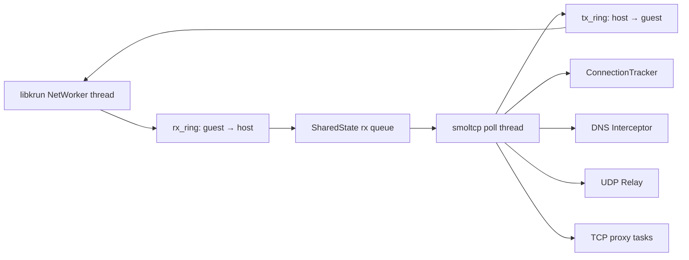
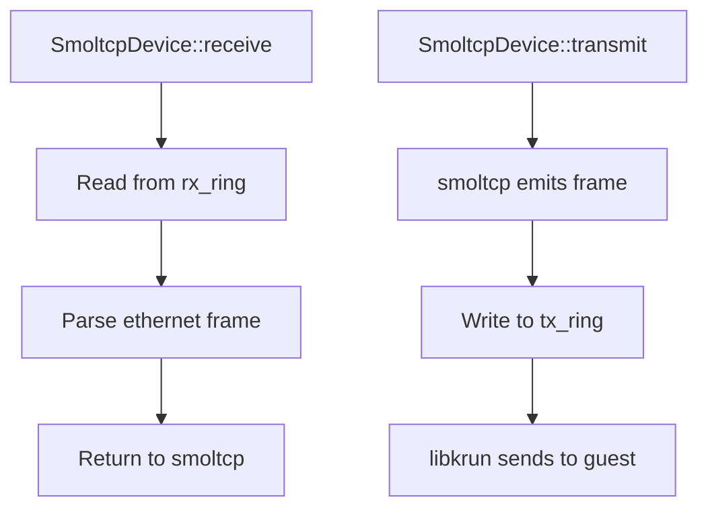

# Architecture — Shared Memory, Device, Poll Loop

**iii-network bridges guest ethernet frames from libkrun's NetWorker thread through shared-memory queues to a smoltcp poll thread.**

## Shared Memory Architecture

Source: `shared.rs` (123 lines)



### SharedState

```rust
pub struct SharedState {
    rx_ring: Arc<crossbeam_queue::ArrayQueue<Vec<u8>>>,
    tx_ring: Arc<crossbeam_queue::ArrayQueue<Vec<u8>>>,
    // ...
}
```

The `DEFAULT_QUEUE_CAPACITY` controls the frame queue size.

## SmoltcpDevice

Source: `device.rs` (258 lines)

Implements smoltcp's `Device` trait, reading frames from `rx_ring` and writing to `tx_ring`:

**Aha:** The `SmoltcpDevice` implements smoltcp's `Device` trait by wrapping crossbeam queues — no actual network hardware involved. The "device" is just a shared-memory bridge between the libkrun NetWorker thread and the smoltcp poll thread.



## WakePipe

Source: `wake_pipe.rs` (149 lines)

Provides a tokio-compatible wake mechanism for the poll thread. When the NetWorker thread has new frames, it signals the poll thread to wake up and process them.

## NetworkConfig

Source: `config.rs` (35 lines)

Configuration for the network stack:

| Field | Purpose |
|-------|---------|
| `gateway_mac` | Gateway MAC address |
| `guest_mac` | Guest MAC address |
| `gateway_ipv4` | Gateway IPv4 address |
| `guest_ipv4` | Guest IPv4 address |
| `mtu` | Maximum transmission unit |

## What's Next

- [02 — Stack Poll Loop](02-stack-poll-loop.md) — Frame classification, smoltcp integration
- [03 — TCP Proxy](03-tcp-proxy.md) — Guest ↔ host TCP bridging
- [04 — DNS Interceptor](04-dns-interceptor.md) — Guest DNS hijack
