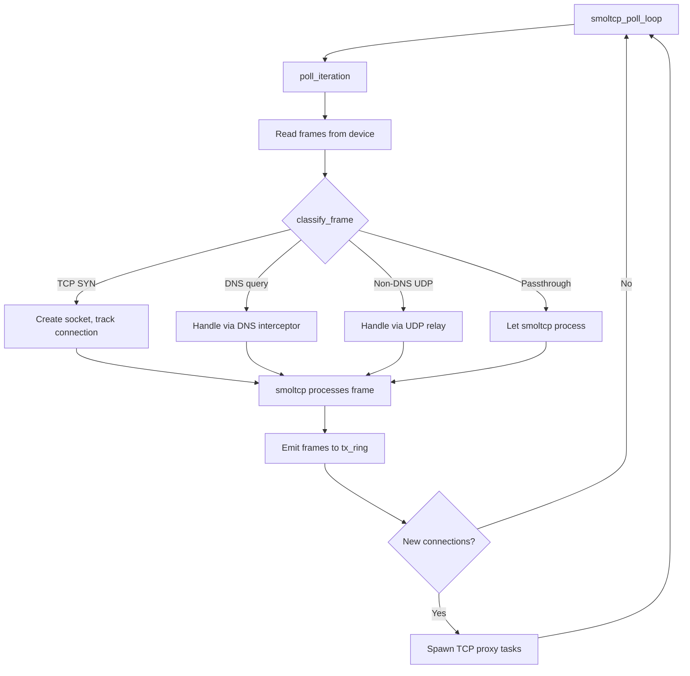
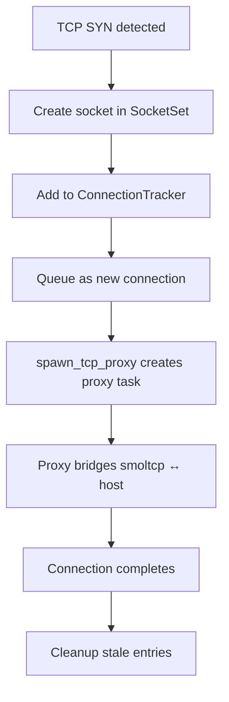

# Stack Poll Loop — Frame Classification and smoltcp Integration

**The smoltcp poll loop is the core of iii-network — it runs on a dedicated OS thread, classifies incoming frames, and services TCP/IP connections.**

## Poll Loop

Source: `stack.rs` (602 lines)



**Aha:** Pre-inspection of frames before smoltcp processes them is critical. Without it, smoltcp would auto-RST TCP SYN packets to destinations it doesn't have sockets for. By creating sockets preemptively, we let smoltcp complete the TCP handshake normally.

## Frame Classification

Source: `stack.rs:30-49`

```rust
pub enum FrameAction {
    TcpSyn { src: SocketAddr, dst: SocketAddr },  // Create socket before smoltcp
    UdpRelay { src: SocketAddr, dst: SocketAddr }, // Handle outside smoltcp
    Dns,                                           // Hijack DNS query
    Passthrough,                                   // Let smoltcp process
}
```

## PollLoopState

```rust
pub struct PollLoopState {
    pub device: SmoltcpDevice,
    pub iface: Interface,         // smoltcp interface
    pub sockets: SocketSet,       // TCP/UDP sockets
    pub conn_tracker: ConnectionTracker,
    pub dns_interceptor: DnsInterceptor,
    pub udp_relay: UdpRelay,
    pub last_cleanup: Instant,
}
```

## ConnectionTracker

Source: `conn.rs` (377 lines)



Tracks TCP connections:

| Field | Purpose |
|-------|---------|
| `new_connections` | Queue of connections ready for proxy spawning |
| `active_connections` | Map of (src, dst) → socket index |
| `last_cleanup` | Timestamp for periodic stale connection cleanup |

## What's Next

- [03 — TCP Proxy](03-tcp-proxy.md) — Guest ↔ host TCP bridging
- [04 — DNS Interceptor](04-dns-interceptor.md) — Guest DNS hijack
- [01 — Architecture](01-architecture.md) — Return to architecture
