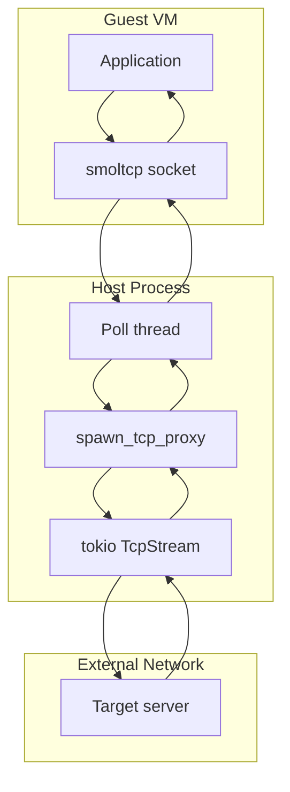

# TCP Proxy — Guest ↔ Host TCP Bridging

**The TCP proxy bridges TCP connections from the guest VM to the host network, running as tokio tasks alongside the smoltcp poll thread.**

## Proxy Architecture

Source: `proxy.rs` (159 lines)



## spawn_tcp_proxy

Source: `proxy.rs`

```mermaid
sequenceDiagram
    participant Poll as smoltcp poll thread
    participant Proxy as TCP proxy task
    participant Host as Host TcpStream
    target as Target server

    Poll->>Proxy: NewConnection (src, dst)
    Proxy->>Host: Connect(dst)
    Host-->>target: TCP SYN
    target-->>Host: TCP SYN-ACK
    Host-->>Proxy: Connected
    loop Data flow
        Poll->>Proxy: smoltcp data
        Proxy->>Host: Write to TcpStream
        Host-->>Proxy: Read from TcpStream
        Proxy->>Poll: Write to smoltcp socket
    end
    Proxy->>Proxy: Connection close, cleanup
```

The proxy:
1. Connects to the target host via tokio `TcpStream`
2. Bidirectionally copies data between the smoltcp socket and the host stream
3. Handles connection close gracefully

**Aha:** The proxy runs as a tokio task, not on the poll thread. This keeps the poll thread responsive — it only classifies frames and dispatches to smoltcp, while heavy I/O happens in the async runtime.

## What's Next

- [04 — DNS Interceptor](04-dns-interceptor.md) — Guest DNS hijack
- [05 — UDP Relay](05-udp-relay.md) — Non-DNS UDP handling
- [02 — Stack Poll Loop](02-stack-poll-loop.md) — Return to poll loop
