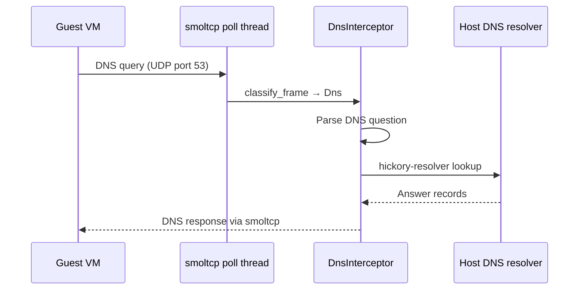
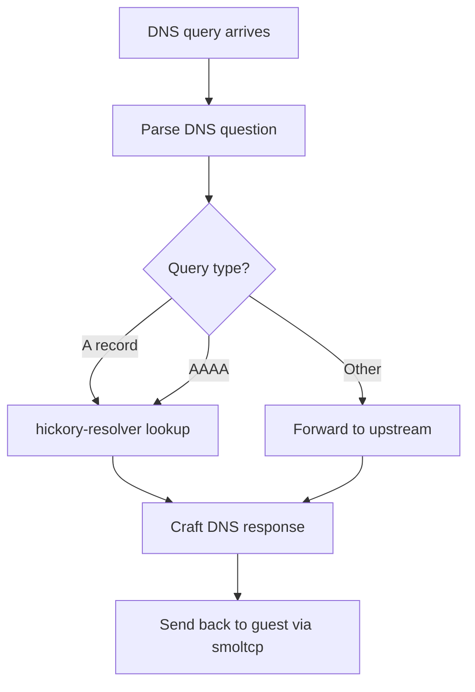

# DNS Interceptor — Guest DNS Hijack

**The DNS interceptor hijacks guest DNS queries (UDP port 53) and resolves them using the host's DNS resolver via hickory-resolver.**

## DNS Interception Flow

Source: `dns.rs` (249 lines)

**Aha:** The guest doesn't need its own DNS configuration. All DNS queries are intercepted and resolved on the host, ensuring the guest can reach any hostname the host can resolve — no /etc/resolv.conf needed inside the VM.

## Implementation

| Method | Purpose |
|--------|---------|
| `DnsInterceptor::new` | Create with hickory-resolver config |
| `handle_dns_query` | Parse query, resolve, craft response |
| `craft_response` | Build DNS response packet |

## What's Next

- [05 — UDP Relay](05-udp-relay.md) — Non-DNS UDP handling
- [02 — Stack Poll Loop](02-stack-poll-loop.md) — Return to poll loop
- [00 — Overview](00-overview.md) — Return to overview
