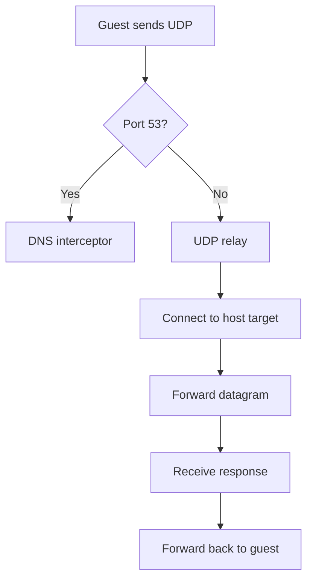
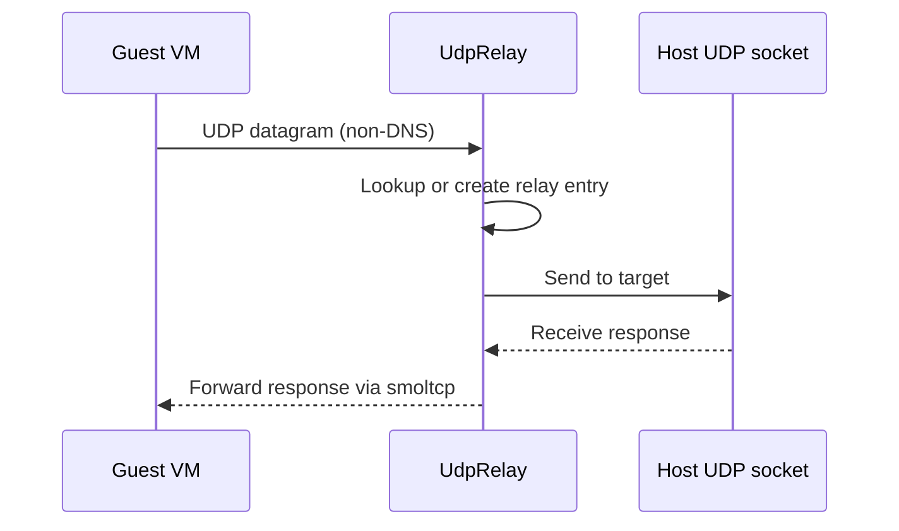

# UDP Relay — Non-DNS UDP Outside smoltcp

**The UDP relay handles non-DNS UDP datagrams outside smoltcp, bridging them directly to the host network.**

## UDP Relay Flow

Source: `udp_relay.rs` (309 lines)

**Aha:** smoltcp's UDP support is limited — it doesn't handle dynamic socket creation well. By handling non-DNS UDP outside smoltcp via the relay, we avoid socket management complexity while still providing full UDP connectivity to the guest.

## Implementation

| Method | Purpose |
|--------|---------|
| `UdpRelay::new` | Create relay with tokio runtime |
| `handle_udp_datagram` | Forward to host, receive response |
| `cleanup` | Remove stale relay entries |

## What's Next

- [06 — Cross-Cutting](06-cross-cutting.md) — Backend, network orchestrator
- [03 — TCP Proxy](03-tcp-proxy.md) — Return to TCP proxy
- [00 — Overview](00-overview.md) — Return to overview
