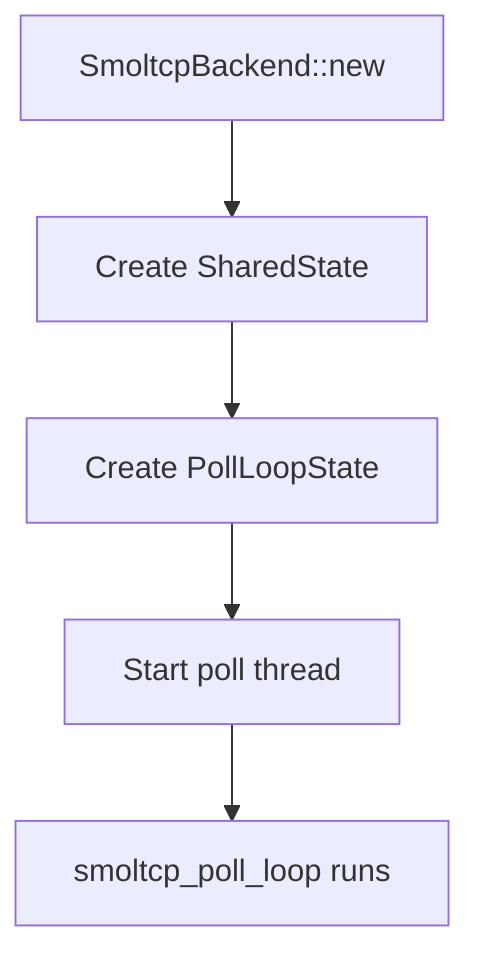
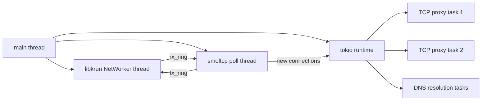

# Cross-Cutting — Backend, Network Orchestrator, Threading

**This document covers the SmoltcpBackend poll thread runner, SmoltcpNetwork orchestrator, and threading model.**

## SmoltcpBackend

Source: `backend.rs` (197 lines)

The backend runs the smoltcp poll loop on a dedicated OS thread, separate from the tokio runtime.

## SmoltcpNetwork

Source: `network.rs` (172 lines)

Top-level orchestrator that:

1. Parses `NetworkConfig`
2. Creates `PollLoopConfig`
3. Spawns `SmoltcpBackend`
4. Returns handle for cleanup

## Threading Model

| Thread | Purpose |
|--------|---------|
| NetWorker (libkrun) | virtio-net ring buffer management |
| smoltcp poll (dedicated OS thread) | Frame classification, smoltcp processing |
| tokio runtime (async) | TCP proxy tasks, DNS resolution |

**Aha:** The smoltcp poll thread is sync-only — no tokio, no async. This matches smoltcp's design (it's a synchronous stack) and keeps the poll loop predictable. Heavy I/O (proxying TCP streams, DNS resolution) happens in the tokio runtime.

## What's Next

- [00 — Overview](00-overview.md) — Return to overview
- [01 — Architecture](01-architecture.md) — Return to architecture
- [02 — Stack Poll Loop](02-stack-poll-loop.md) — Return to poll loop
