# iii-shell-proto + iii-shell-client — Shell Exec Channel

**iii-shell-proto defines the wire protocol and iii-shell-client provides the host-side async client for `iii worker exec` — multiplexed command execution inside VM sandboxes.**

## Wire Protocol Frame Format

Source: `iii-shell-proto/src/lib.rs:17-35`

```
┌──────────┬──────────┬───────┬──────────────────┐
│ frame_len│ corr_id  │ flags │  JSON payload    │
│  u32     │  u32     │  u8   │  frame_len-5 B   │
└──────────┴──────────┴───────┴──────────────────┘
  4 bytes    4 bytes   1 byte    variable
```

**Aha:** The shell channel uses length-prefixed binary frames (not newline-delimited JSON like the control channel) because exec sessions need multiplexing — several concurrent sessions interleave on the same virtio-console port, requiring a correlation ID on every frame.

## Shell Message Types

```mermaid
flowchart TD
    A[ShellMessage] --> B[WriteStart: begin streaming write]
    A --> C[WriteChunk: stream data]
    A --> D[WriteEnd: end streaming write]
    A --> E[ReadStart: begin streaming read]
    A --> F[ReadChunk: stream data]
    A --> G[ReadEnd: end streaming read]
    A --> H[Exec: run command]
    A --> I[Signal: send signal]
    A --> J[Stdin: input bytes]
    A --> K[Stdout: output bytes]
    A --> L[Stderr: error bytes]
    A --> M[Exited: process exited]
    A --> N[Error: error message]
    A --> O[FsRequest: filesystem op]
    A --> P[FsResult: filesystem result]
    A --> Q[FsChunk: streaming data]
    A --> R[FsEnd: streaming end]
    A --> S[FsError: filesystem error]
```



## Key Constants

| Constant | Value | Purpose |
|----------|-------|---------|
| `SHELL_PORT_NAME` | `"iii.exec"` | Virtio-console port name |
| `FRAME_HEADER_SIZE` | 5 | `corr_id` (4) + `flags` (1) |
| `MAX_FRAME_SIZE` | 4 MiB | Hard cap per frame |
| `FLAG_TERMINAL` | 0x01 | Session-ending frame |

## What's Next

- [01 — Wire Protocol](01-wire-protocol.md) — Frame format, encoding, decoding
- [02 — Shell Client](02-shell-client.md) — Async pipe-mode client
- [03 — Filesystem Ops](03-filesystem-ops.md) — FsRequest/FsResult types
