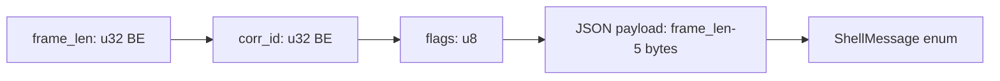
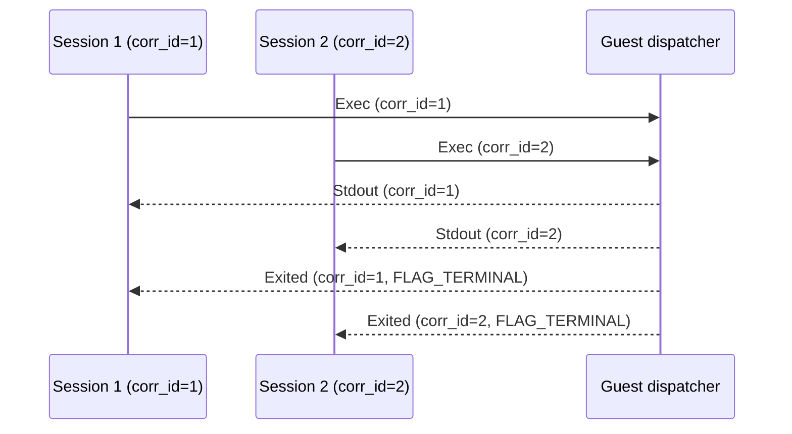

# Wire Protocol — Frame Format, Encoding, Decoding

**The shell protocol uses length-prefixed binary frames with a JSON payload for multiplexed command execution.**

## Frame Wire Format

Source: `iii-shell-proto/src/lib.rs:17-54`



| Field | Size | Purpose |
|-------|------|---------|
| `frame_len` | 4 bytes (big-endian) | Total length of corr_id + flags + payload |
| `corr_id` | 4 bytes (big-endian) | Correlation ID for multiplexing |
| `flags` | 1 byte | Bitfield (FLAG_TERMINAL = 0x01) |
| payload | variable | UTF-8 JSON: one ShellMessage per frame |

**Aha:** `MAX_FRAME_SIZE` is 4 MiB — matching microsandbox's ceiling so a wedged session can't OOM the host relay. The 5-byte fixed header (`FRAME_HEADER_SIZE`) means the payload length is `frame_len - 5`.

## Encoding

Source: `iii-shell-proto/src/lib.rs`

```rust
pub fn encode_frame(corr_id: u32, flags: u8, msg: &ShellMessage) -> Vec<u8>
```

Steps:
1. Serialize `ShellMessage` to JSON
2. Prepend `corr_id` (4 bytes BE) + `flags` (1 byte)
3. Prepend `frame_len` (4 bytes BE = corr_id + flags + json.len())

## Decoding

Source: `iii-shell-proto/src/lib.rs`

```rust
pub fn decode_frame(data: &[u8]) -> Result<(u32, u8, ShellMessage), DecodeError>
```

Steps:
1. Read `frame_len` (4 bytes BE)
2. Read `corr_id` (4 bytes BE) + `flags` (1 byte)
3. Read JSON payload (`frame_len - 5` bytes)
4. Deserialize `ShellMessage` from JSON

## Multiplexing

Multiple sessions share the same virtio-console port, distinguished by `corr_id`:



## What's Next

- [02 — Shell Client](02-shell-client.md) — Async pipe-mode client
- [03 — Filesystem Ops](03-filesystem-ops.md) — FsRequest/FsResult types
- [00 — Overview](00-overview.md) — Return to overview
