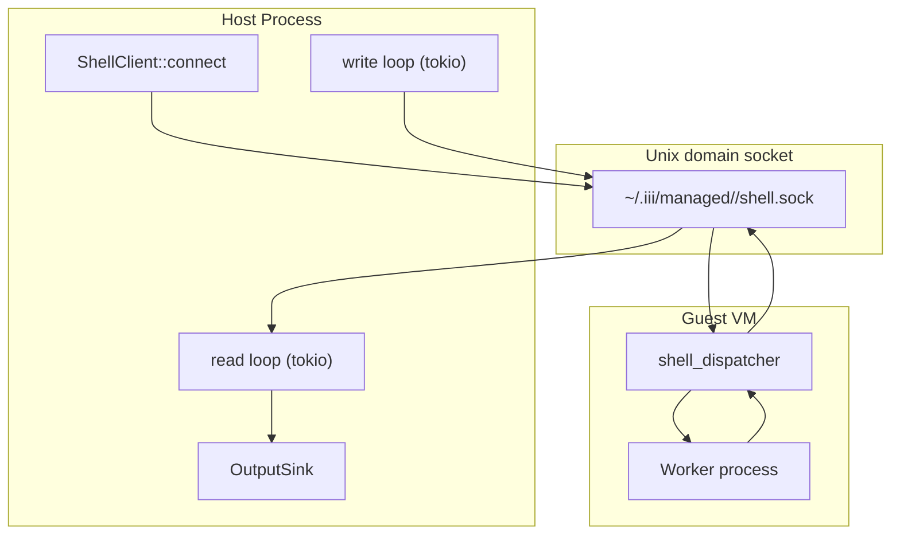

# Shell Client — Async Pipe-Mode Client

**iii-shell-client is the host-side async client that connects to the sandbox's shell socket and streams output through a caller-supplied OutputSink.**

## Client Architecture

Source: `iii-shell-client/src/lib.rs` (1,157 lines)



**Aha:** The client is pipe-mode only — TTY/SIGWINCH support lives in consumer binaries (like the iii-worker CLI). This keeps the library minimal and lets higher layers decide whether to allocate a pseudo-terminal.

## OutputSink

The client streams output through a caller-supplied `OutputSink` trait:

```rust
pub trait OutputSink {
    fn stdout(&mut self, data: &[u8]);
    fn stderr(&mut self, data: &[u8]);
    fn exited(&mut self, code: i32);
    fn error(&mut self, message: &str);
}
```

This lets callers decide how to handle output — print to terminal, write to file, buffer for later, etc.

## Connection Flow

1. **Connect** to `~/.iii/managed/<name>/shell.sock` via Unix domain socket
2. **Send** `Exec` frame with command and working directory
3. **Stream** stdin via `Stdin` frames
4. **Receive** `Stdout`/`Stderr` frames through OutputSink
5. **Receive** `Exited` frame with exit code (FLAG_TERMINAL set)

## What's Next

- [03 — Filesystem Ops](03-filesystem-ops.md) — FsRequest/FsResult types
- [04 — Cross-Cutting](04-cross-cutting.md) — Base64 encoding, dependencies
- [00 — Overview](00-overview.md) — Return to overview
