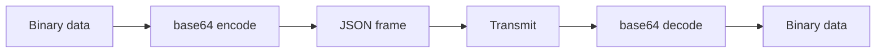

# Cross-Cutting — Base64 Encoding, Dependencies, Consumers

**This document covers shared concerns: base64 encoding for binary payloads, dependency versions, and the three consumers of the shell protocol.**

## Base64 Encoding

Source: `Cargo.toml` — `base64 = "0.22"`

The shell-channel stdout/stderr/stdin frames encode binary payloads as base64 strings inside JSON. Version `0.22` matches the engine's version so cargo resolves one copy.

## Protocol Consumers

| Consumer | Role | Source |
|----------|------|--------|
| iii-supervisor | Re-exports shell protocol types | `shell_protocol.rs` |
| iii-init (guest) | Dispatches FsRequest, runs commands | `shell_dispatcher.rs` |
| iii-shell-client (host) | Async client for exec commands | `iii-shell-client/src/lib.rs` |

**Aha:** Three consumers share one protocol definition. The shell protocol is the single source of truth for frame types, ensuring host and guest always speak the same language regardless of which side initiates the connection.

## Dependencies

### iii-shell-proto

| Dependency | Purpose |
|------------|---------|
| `serde/serde_json` | JSON serialization for frame payloads |
| `thiserror = "2"` | Error types |
| `schemars = "0.8"` | JSON Schema generation |

### iii-shell-client

| Dependency | Purpose |
|------------|---------|
| `iii-shell-proto` | Wire protocol types and codec |
| `tokio` | Async I/O, Unix socket, time |
| `base64 = "0.22"` | Binary payload encoding |
| `anyhow/thiserror` | Error handling |
| `tracing` | Structured logging |
| `libc` | Unix socket credentials (SO_PEERCRED) |
| `dirs = "5"` | Home directory resolution |

## What's Next

- [00 — Overview](00-overview.md) — Return to overview
- [01 — Wire Protocol](01-wire-protocol.md) — Return to wire protocol
- [02 — Shell Client](02-shell-client.md) — Return to shell client
