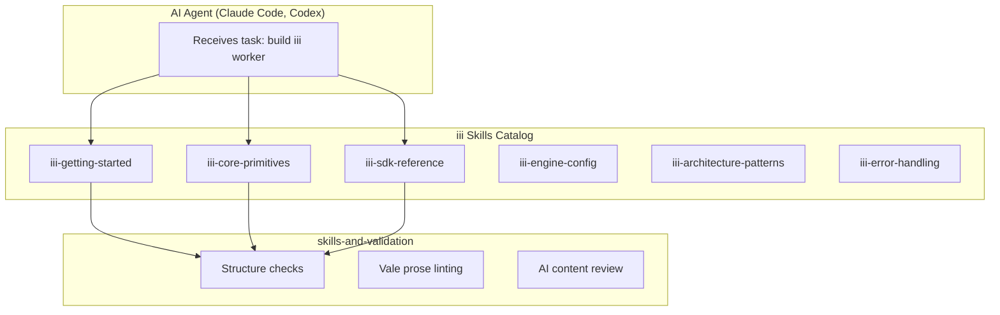
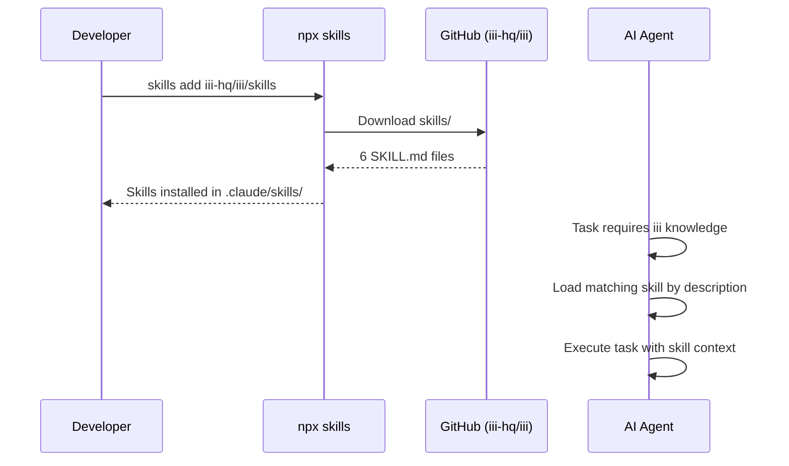

# iii Skills — Agent-Readable Reference Material

**iii Skills are agent-readable reference documents in SKILL.md format — teaching AI agents how to build with the iii engine through installable knowledge packages.**

## What Skills Are



## Skill Installation Flow



**Aha:** Skills are designed for AI agents, not humans. Each SKILL.md is a compact, structured reference that agents can load into context when writing iii code. The catalog is intentionally small — 6 skills covering the essentials — while worker-backed capability skills stay with their respective worker documentation.

## SKILL.md Format

Each skill follows the SKILL.md format defined by the skills-and-validation system:

```markdown
---
name: iii-core-primitives
description: >-
  Use when registering iii functions, binding triggers, selecting sync/void/enqueue invocation...
---

# Core Primitives

iii has three top-level primitives:
- **Function**: a named unit of work such as `orders::validate`
- **Trigger**: an event source bound to a function
- **Worker**: a process that connects to the engine and executes functions
```

### Frontmatter Fields

| Field | Purpose |
|-------|---------|
| `name` | Unique skill identifier |
| `description` | When the agent should load this skill |

## Skill Installation

```bash
# Install all skills
npx skills add iii-hq/iii/skills

# Install a single skill
npx skills add iii-hq/iii/skills --skill iii-core-primitives
```

## What's Next

- [01 — Skill Catalog](01-skill-catalog.md) — The 6 skills in detail
- [02 — Skill Format](02-skill-format.md) — SKILL.md structure, validation
- [03 — Skill Validation](03-skill-validation.md) — Three-layer validation
