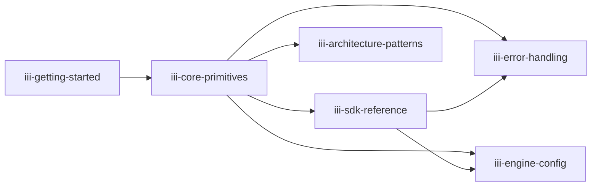
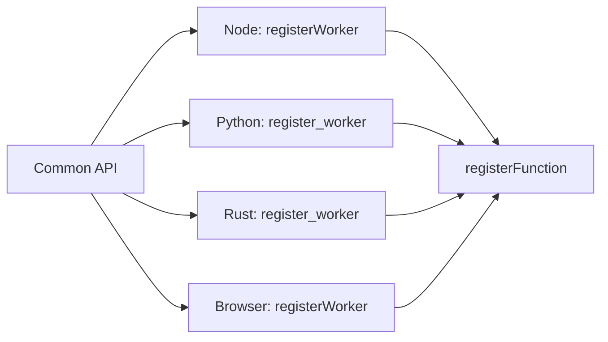

# Skill Catalog — The 6 iii Skills

**iii ships with 6 top-level skills, each covering a specific aspect of building with the engine.**

## Skill Cross-Reference Map

## iii-getting-started (226 lines)

Source: `skills/iii-getting-started/SKILL.md`

The onboarding skill — teaches agents to:

| Step | What it covers |
|------|---------------|
| Install iii | `curl -fsSL https://install.iii.dev/iii/main/install.sh \| sh` |
| Create a project | `iii init my-project` |
| Write first worker | Register function, bind trigger, invoke |
| Add registry workers | `iii worker add shell`, `iii worker add database` |

## iii-core-primitives (241 lines)

Source: `skills/iii-core-primitives/SKILL.md`

The reference skill — covers all core concepts:

| Concept | Details |
|---------|---------|
| Functions | `registerFunction(id, handler)`, `registerFunction(id, HttpInvocationConfig)` |
| Triggers | `registerTrigger({type, function_id, config})`, trigger schemas |
| Workers | `registerWorker()`, manifest (`iii.worker.yaml`), registry access |
| Invocation | sync, void, enqueue modes |
| Channels | `createChannel()`, moving data between workers |
| Custom triggers | Authoring trigger types |

## iii-sdk-reference (148 lines)

Source: `skills/iii-sdk-reference/SKILL.md`

Language-specific SDK usage:

| SDK | Package | Key caveat |
|-----|---------|-----------|
| Node.js | `iii-sdk` | Supports custom headers, Logger, OpenTelemetry |
| Browser | `iii-browser-sdk` | Connect through RBAC-protected listener; keep secrets server-side |
| Python | `iii-sdk` | Use `trigger_async` inside async handlers |
| Rust | `iii-sdk` | Handler error type should map into `IIIError` |

## iii-engine-config (229 lines)

Source: `skills/iii-engine-config/SKILL.md`

Engine configuration reference:

| Section | What it configures |
|---------|-------------------|
| Ports | HTTP, WebSocket, streams, worker manager |
| Workers | Built-in workers (http, state, queue, cron, pubsub, stream, observability) |
| Adapters | Redis, RabbitMQ for queue and state |
| Queue | max_retries, concurrency, DLQ |
| Worker Manager | Port, external worker spawning |
| RBAC | Session-based access control |
| Observability | OTEL export, metrics, traces, logs |

## iii-architecture-patterns (202 lines)

Source: `skills/iii-architecture-patterns/SKILL.md`

Design patterns for building on iii:

| Pattern | Description |
|---------|-------------|
| Workflows | Sequential function chains with state checkpoints |
| Reactive Backends | Trigger-based event-driven architecture |
| Agentic Pipelines | AI agents as workers with function access |
| CQRS | Separate read and write workers |
| Effect Pipelines | Side-effect chains via durable topics |
| Automation Chains | Cron-triggered automation flows |

## iii-error-handling (110 lines)

Source: `skills/iii-error-handling/SKILL.md`

Error handling reference:

| Error Type | Cause | Resolution |
|------------|-------|------------|
| Connection refused | Engine not running | `iii` to start engine |
| Function not found | Unregistered function ID | Check function registration |
| RBAC denied | Session restrictions | Check allowlist/forbidden list |
| Timeout | Function took too long | Increase `invocationTimeoutMs` |
| Retryable errors | Transient failures | Implement retry in handler |

**Aha:** Skills are cross-referenced — `iii-sdk-reference` tells agents to also load `iii-core-primitives` for the common model and `iii-error-handling` for exception handling. This creates a linked knowledge graph that agents navigate as needed.

## What's Next

- [02 — Skill Format](02-skill-format.md) — SKILL.md structure, validation
- [00 — Overview](00-overview.md) — Return to overview
- [03 — Skill Validation](03-skill-validation.md) — Three-layer validation
